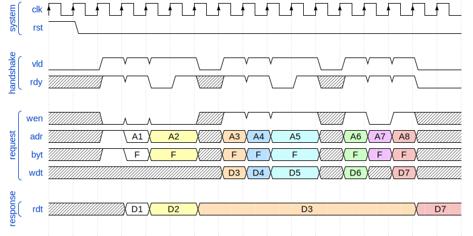

WARNING: this project is in an ALPHA stage, not advertized yet.
It might already be worth looking at,
but the progress status statements are not reliable,
and the API-s are not stable yet.

DOC + LIB + VIP + DEV

# TCB-Lite

This project provides the following parts:
- Tightly Coupled Bus [documentation](doc/lite_doc/TCB-Lite.adoc),
- reference implementation interconnect library,
- reference verification library (VIP),
- reference devices.

## Overview of core features

TCB-Lite (tightly coupled bus lite) is named after TCM (tightly coupled memory),
since it generalizes the SRAM (synchronous static RAM) interface to support peripherals.
The purpose of TCB-Lite is to fill a niche for a low complexity system bus
without unnecessary limitations on throughput.

TCB-Lite is a good fit for small microcontrollers containing processors
with a simple short in-order pipeline and
combinational request signals (address, write data, ...).

TCB-Lite is not a good fit for interconnects with large access delays
(external memory controllers, CDC in the interconnect, ...),
or interconnect where out-of-order access can provide a performance advantage.

**NOTE:** Except for the handshake and response delay (see below),
all features are optional.
To avoid competing non standard solutions
the reference implementation attempts to document, implement, validate and test
as many features as possible.
Still the standard should be flexible enough that that it should be possible
to interface with any custom implementation with minimal glue logic.

### Basic read/write cycles and the VALID/READY handshake

The SRAM interface is designed to allow a read or write access every clock cycle.
Read data output (response) is available in the clock period after
the address input (request) is sampled with the rising edge of the clock.
This would be a 1 clock period request to response delay.
There are no idle clock cycles when switching between read and write accesses.

Control signals use the standard VALID/READY handshake,
which allows developers familiar with AMBA AXI to immediately understand
some requirements without reading any documentation.

Since the request to response delay is fixed,
if the response can't be provided early enough (a different manager is accessing the memory),
the request must be stalled using backpressure (READY).

### Generalization of request to response delay

While the SRAM interface request to response delay is usually one clock cycle,
this can be generalized to any integer delay `DLY` (values `0`, `1`, `2` would be common).

* `DLY=0` is used for peripheral devices (explained below),
* `DLY=1` is used for TCM SRAM, and therefore by the CPU (matched delay maximizes throughput),
* `DLY=2` would be used where the read data clock to output delay
          is high enough to require an additional pipeline stage.

### Matching timing of peripherals to SRAM

Typical ASIC/FPGA SRAM has a low setup time for request inputs (control, address, write data),
most combinational delay is seen as the clock to data delay for response outputs (read data).

While not strictly part of the protocol,
it is recommended to write the TCB-Lite interconnect with similar timing characteristics.
This allows for a good timing balance without the need for register retiming during synthesis,
thus avoiding undesired effects of retiming on signal toggling and consequent power consumption impact.

This can be achieved by writing peripheral devices with `DLY=0`,
where write access is synchronous, but reads are combinational.
A `DLY=1` TCB interface is then achieved by placing a pipeline stage at the request input side.

 TODO

### Logarithmic size mode in addition to byte enable mode

Instead of the common approach of using byte enable signals
to position data smaller than the bus width,
TCB-Lite can use the logarithmic size of data (same as RISC-V ISA).

Byte enable signals and the related data byte multiplexer
(mapping bytes between different positions within the memory bus to the right of CPU registers)
are necessary for interfacing between a CPU and SRAM.
But the data byte multiplexer is not necessary for accessing peripheral devices,
since they are usually only accessed with the full bus width.
Skipping the data byte multiplexer on the path between the CPU and peripheral devices
can improve timing and dynamic power consumption.

When using this approach a RISC-V CPU LSU (load store unit)
can be implemented with just the logarithmic size and signed/unsigned extension.
The data byte multiplexer becomes a part of the system interconnect.

 TODO

### Support for atomic access and arbiter locking

TCB-Lite has basic support for read-modify-write operations.
Simultaneous read/write cycles are supported,
but the encoding of modify operations is not defined.

**NOTE:** For the current version of the protocol,
some details are up to the user to implement.

TCB-Lite can perform RISC-V AMO instruction accesses to peripherals with `DLY=0`
in a single cycle within the interconnect.
This can be used to implement thread safe access to peripheral devices.

For example in a GPIO controller individual
data output and output enable register bit can be set/cleared,
without necessitating a non atomic read modify write sequence (not thread safe),
or custom approaches (for example Xilinx SoC/MPSoC).

The same can't be done with SRAM.
In this case TCB-Lite provides an arbiter locking signal,
Which reserves the arbiter for the current manager
till the manager performs a non locking access.

The same locking approach can be used to implement atomic accesses
for data wider than the bus data width.
For example RISC-V load/store pair instructions
(accessing 64-bit counters on a 32-bit data bus, ...).

Another example would be burst transactions from a DMA.

### Minimizing dynamic power consumption

TCB-Lite utilizes many approaches to reduce dynamic power consumption, the main are:

* Placing pipeline stage registers at the peripheral module inputs,
  this prevents the propagation of address and write data signal toggling
  through the peripheral control logic when it is not accessed,
  thus minimizing dynamic power consumptions in address decoders,
  read data multiplexers, ...
* Only active data bytes should toggle during a read/write access.
  Read data multiplexers have separate select signals for each byte,
  select signals for inactive bytes do not change from the previous access.
  **NOTE:** This is not ideal when the last access was to a volatile location like a counter,
  further research is needed to handle this use case.
  **NOTE:** Unfortunately SRAM implementations usually ignore byte enable signals during reads,
  and instead read the entire read data width.

### Parameterization and parameter validation

Not strictly part of the standard, but a feature of the reference library implementation.

### Miscellaneous optional features

* Support for little/big endian or **bi-endian**.
* Support for **misaligned access** (including single cycle).
* Support for zero overhead sequential misaligned accesses
  (RISC-V instruction fetch with C extension) (research in progress).

### Comparison against competing system bus standards

While having similar complexity as **APB**,
it provides double the throughput and additional features.

Compared to **AHB** and **Wishbone**,
it has a more straight forward handshake and no wasted cycles
when switching access direction.

Compared to **OBI1** (RISC-V Ibex CPU, and other Pulp Platform designs),
the response delay is fixed, thus making the response path logic simpler.
If a peripheral is unable to respond immediately,
OBI1 might delay the response channel ready signal,
while TCB-Lite would apply backpressure to the request handshake.
Since neither provide out of order support,
the throughput should be the same.

**TODO:** For now this clames are just informed guesses.
Perform a proper analysis of OBI1 implementation!

Compared to **AXI-Lite**, a single channel handshake is just much simpler.
AXI4-Lite also does not provide a mechanism for requesting
a read narrower than the data bus width (AXI5-Lite provides this feature).
While the multiple channels in AXI-Lite allow for dynamic power reduction
due to using only the necessary channels,
a similar result can be achieved with TCB-Lite.
The main advantage of AXI-Lite would be throughput in CDC scenarios.

None of the standard busses known to me provide a logarithmic size mode.

### Reference RTL and VIP library implementation

The RTL and VIP library are written in SystemVerilog-2017,
extensively utilizing interfaces and parameterization.
Parameters are validated at compile time,
checking for compatibility between modules and interfaces
(bus width, protocol modes and features, address space size, ...).

Open source tools can be used for simulation synthesis.
The RTL and VIP can be simulated using Verilator.
Yosys with the Slang plugin can synthesize the RTL.

A VHDL-2019 implementation might be an option in the future.

Many features have been validated on 2 RISC-V processors and GPIO and UART peripherals,
many features have not been fully validated yet.

Overall the documentation and reference implementation are a work in progress,
and getting feedback would speed up this process.

### Open questions

While some aspects of the protocol have been validated,
some require further research:

* Handling errors. Should response error codes be standardized?
  Should some errors be detected during the request phase (misalignment)?
* Burst semantics.
* Handling of endianness in data bus width changes (also bursts).
* A proper definition for the read value hold feature.
* Minimizing dynamic power consumption in write/read logic,
  minimizing address changes to reduce decoder and multiplexer power,
  with the additional requirement to avoid volatile data
  (counters, GPIO inputs, ...) from propagating while the bus is idle.
* A systematic approach to parameter validation.
* Assertions for checking features like read hold.
* Validation of features for
  repeated address access, incremental address access,
  partially overlapping incremental access
  (RISC-V instruction fetch with C extension), ...
* ...

## Implementation status

| status | description |
|--------|-------------|
| planed | The component should be a part of project, but there is no implementation yet. |
| VIP    | (Work In Progress) The implementation is partially done, or it might require  

### Common shared code

The interface and package are shared across the RTL and verification code
for the rest of the code.

| module                                    | status | description |
|-------------------------------------------|--------|-------------|
| [`tcb_lite_if` ](hdl/rtl/tcb_lite_if.sv ) | done   | SystemVerilog interface. |
| [`tcb_lite_pkg`](hdl/rtl/tcb_lite_pkg.sv) | done   | SystemVerilog package. |

### VIP (Verification IP)

| module                                                                               | status | description |
|--------------------------------------------------------------------------------------|--------|-------------|
| [`tcb_lite_vip_pkg`             ](hdl/tbn/lite_vip/tcb_lite_vip_pkg.sv)              | VIP    | Package containing miscellaneous code. |
| [`tcb_lite_vip_manager`         ](hdl/tbn/lite_vip/tcb_lite_vip_manager.sv)          | VIP    | Manager device with non-blocking and blocking API. |
| [`tcb_lite_vip_monitor`         ](hdl/tbn/lite_vip/tcb_lite_vip_monitor.sv)          | VIP    | Monitor device with non-blocking API for logging. |
| [`tcb_lite_vip_subordinate`     ](hdl/tbn/lite_vip/tcb_lite_vip_subordinate.sv)      | VIP    | Subordinate device with non-blocking API for responses. |
| [`tcb_lite_vip_protocol_checker`](hdl/tbn/lite_vip/tcb_lite_vip_protocol_checker.sv) | VIP    | Protocol checker with assertions. |
| [`tcb_lite_vip_memory`          ](hdl/tbn/lite_vip/tcb_lite_if_memory.sv)            | VIP    | Multi port memory model. |
| [`tcb_lite_vip_tb`              ](hdl/tbn/lite_vip/tcb_lite_vip_tb.sv )              | VIP    | Testbench for core VIP functionality. |

### Reference implementation library

| module                                                                         | status | description |
|--------------------------------------------------------------------------------|--------|-------------|
| [`tcb_lite_lib_passthrough`  ](hdl/rtl/lite_lib/tcb_lite_lib_pasthrough.sv   ) | done   | Trivial passthrough. |
| [`tcb_lite_lib_register`     ](hdl/rtl/lite_lib/tcb_lite_lib_register.sv     ) | planed | Register for request/response paths. |
| [`tcb_lite_lib_arbiter`      ](hdl/rtl/lite_lib/tcb_lite_lib_arbiter.sv      ) | done   | Priority arbiter. |
| [`tcb_lite_lib_multiplexer`  ](hdl/rtl/lite_lib/tcb_lite_lib_multipleser.sv  ) | done   | Multiplexer of multiple managers. |
| [`tcb_lite_lib_decoder`      ](hdl/rtl/lite_lib/tcb_lite_lib_decoder.sv      ) | done   | Address decoder. |
| [`tcb_lite_lib_demultiplexer`](hdl/rtl/lite_lib/tcb_lite_lib_demultiplexer.sv) | done   | Demultiplexer of multiple subordinates. |
| [`tcb_lite_lib_error`        ](hdl/rtl/lite_lib/tcb_lite_lib_error.sv        ) | done   | Error response leaf subordinate. |

### Peripherals

| module                                                    | status | description |
|-----------------------------------------------------------|--------|-------------|
| [`tcb_lite_gpio`](hdl/rtl/lite_dev/gpio/tcb_lite_gpio.sv) | WIP    | GPIO controller. |
| [`tcb_lite_uart`](hdl/rtl/lite_dev/uart/tcb_lite_uart.sv) | WIP    | UART controller. |

## References

1. QMEM [specification](https://somuch.guru/2016/06/28/qsoc-the-qmem-bus/) and [IP](https://github.com/rkrajnc/or1200-qmem)
1. [Open Core Protocol on Wikipedia](https://en.wikipedia.org/wiki/Open_Core_Protocol)
1. CoreConnect from IBM on Wikipedia](https://web.archive.org/web/20090129183058/http://www-01.ibm.com/chips/techlib/techlib.nsf/products/CoreConnect_Bus_Architecture)
1. [Ibex RISC-V core load/store bus interface](https://ibex-core.readthedocs.io/en/latest/02_user/integration.html)
1. [NeoRV32 RISC-V core bus interface](https://stnolting.github.io/neorv32/#_bus_interface)
1. [AMBA on Wikipedia](https://en.wikipedia.org/wiki/Advanced_Microcontroller_Bus_Architecture)
1. [AMBA on ARM](https://developer.arm.com/Architectures/AMBA)
1. [Wishbone B4](https://cdn.opencores.org/downloads/wbspec_b4.pdf)
1. Pulp Platform Snitch [Reqrsp Interface](https://pulp-platform.github.io/snitch/rm/reqrsp_interface/)
1. OpenHW Group [OBI](https://github.com/openhwgroup/obi) (OpenBus Interface)
1. TileLink [1.8.0](https://github.com/chipsalliance/omnixtend/blob/c192bb6862846a24535b3808dc2f8612d44f2ff8/OmniXtend-1.0.3/spec/TileLink-1.8.0.pdf),
[1.8.1](https://starfivetech.com/uploads/tilelink_spec_1.8.1.pdf)
1. OpenTitan [TileLink IP](https://docs.opentitan.org/hw/ip/tlul/doc/)
1. https://github.com/pulp-platform/obi?tab=readme-ov-file
1. https://github.com/openhwgroup/obi/blob/072d9173c1f2d79471d6f2a10eae59ee387d4c6f/OBI-v1.6.0.pdf
1. [Implementation of a PMP unit in a RISC-V commercial core](https://ddd.uab.cat/pub/tfg/2023/tfg_2485861/FerranRubert_1461144_TFG_Final2.pdf) (PMP/PMA unit)
