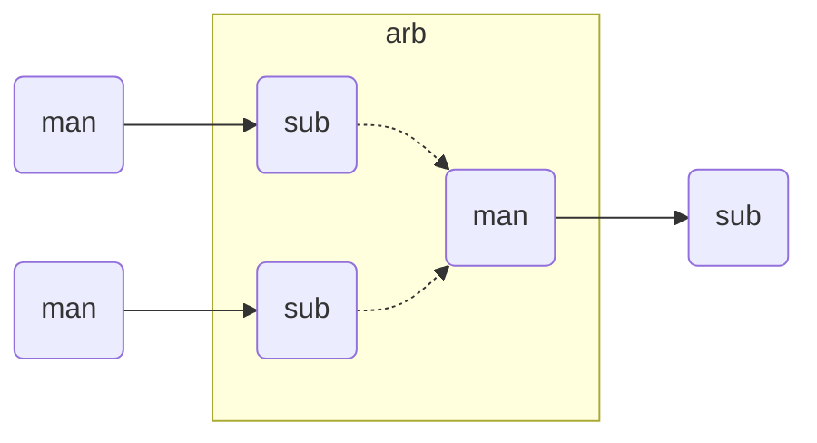
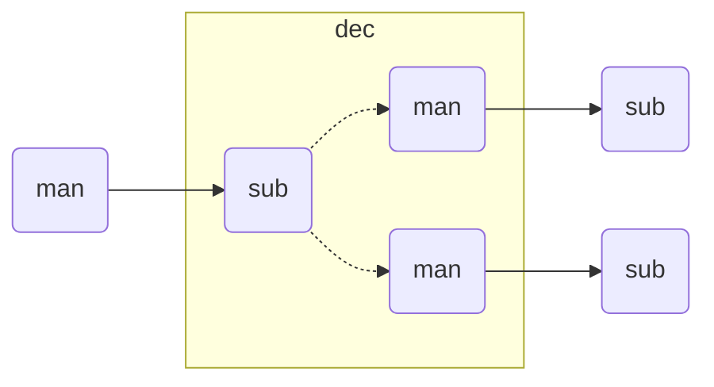
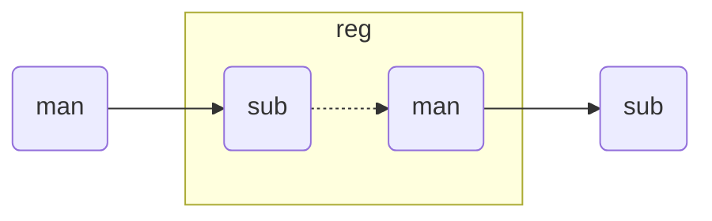
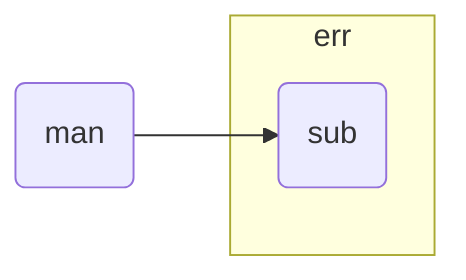
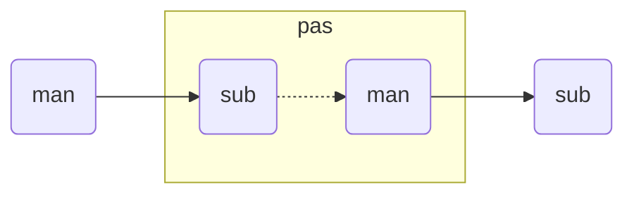
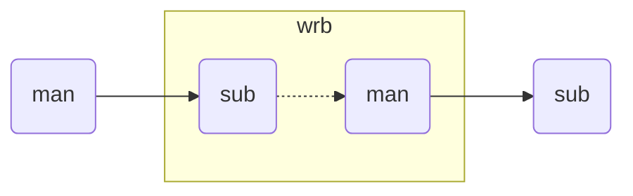
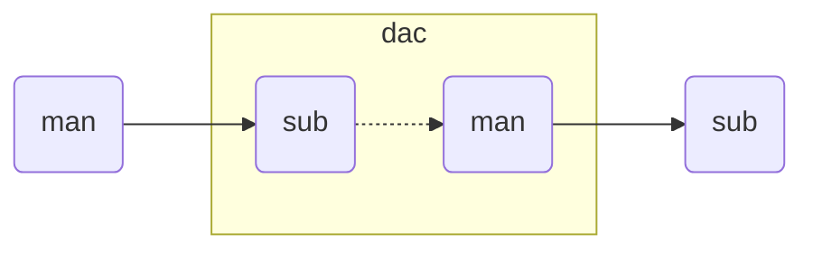

# Reference implementation library

## Coding guidelines

The reference implementation library is written in SystemVerilog
and extensively uses the following SystemVerilog specific features:
- `param`eterized `interface`s with `modport`s, also containing RTL,
- `packed`/unpacked `struc`tures/arrays for signals and parameters,
- `casez` in address decoders
- do-not-care symbol `?` in literals incluing parameters for address masks,
- `module`s using `param`eters from `interface`s connected to them,
- `always_ff`/`always_comb` to distinguish between sequential and combinational RTL,

### RTL components

#### Interface

#### Arbiter

#### Decoder

#### Register

Must be able to enable the clock for each byte separately based on byte enable,
on both the write and read path.

#### Error

The error subordinate module `tcb_err` is used to close unused leaf interconnect manager ports.
The most common use case would be to replace a peripheral device disabled with a parameter.

It will provide an error response to any request.
It does not add backpressure.

#### Passthrough

The passthrough module `tcb_pas` does not provide any synthesizable functionality.
Its main purpose if to allow the connection of two separate `tcb_if` SystemVerilog interfaces.
This is usually necessary for connecting SystemVerilog interface arrays for different lengths.

#### Write buffer

TODO: Consider write ordering principles of RISC-V.

#### Data alignment cache

#### Data alignment splitter

#### Decoupler

Provides on request decoupling (separation) of
manager and subordinate sides of a section of the interconnect.

The main purpose is to allow for safe separation of
clock gating and power gating domains.

If a TCB manager requests a transfer from a decoupled segment of the interconnect,
The decoupler subordinate port shall return an error response.

#### Read hold

#### Prefetch

### Testbench components

NOTE: The testbench code is in an Alpha state.
The aim is for a fully UVM compatible implementation.
The current code just barely covers the documented functionality.

#### Manager

#### Subordinate

## RTL design recommendations

### Parameter validation

### Handling of reset transitions

### Peripherals

The reference TCB implementation is written in SystemVerilog,
therefore this document discusses Verilog parameters.
The VHDL equivalent would be generics,
and other HDL languages also have constructs with equivalent functionality.

| parameter     | type           | default | description |
|---------------|----------------|---------|-------------|
| `HSK.DLY`         | `int unsigned` | `'d1`   | Read delay. |
| `CFG_REQ_REG` | `bit`          | `1'b0`  | Configuration: enable REQest REGister. |
| `CFG_RSP_REG` | `bit`          | `1'b1`  | Configuration: enable ReSPonse REGister. |
| `CFG_ENR_CFG` | `bit`          | `1'b1`  | Configuration: ENable Read access to ConFiGuration registers. |

If both address and 

The [GPIO controller](GPIO.md) is a good example how this parameters can be used
to provide the desired area/timing optimizations for a specific design.

In the default configuration read/write data paths behave as follows:
- In the write path the address is not registered and the decoder delay falls on the request side.
- In the read path the address is not registered and the decoder delay falls on the request side.
  Since the read data bus is registered, there is no decoder delay at the response side.
- Since read access to configuration registers is enabled, it affects the timing on the request side.
