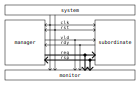
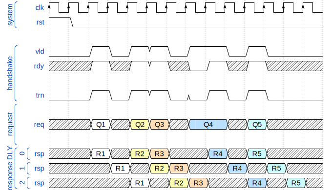
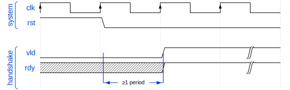
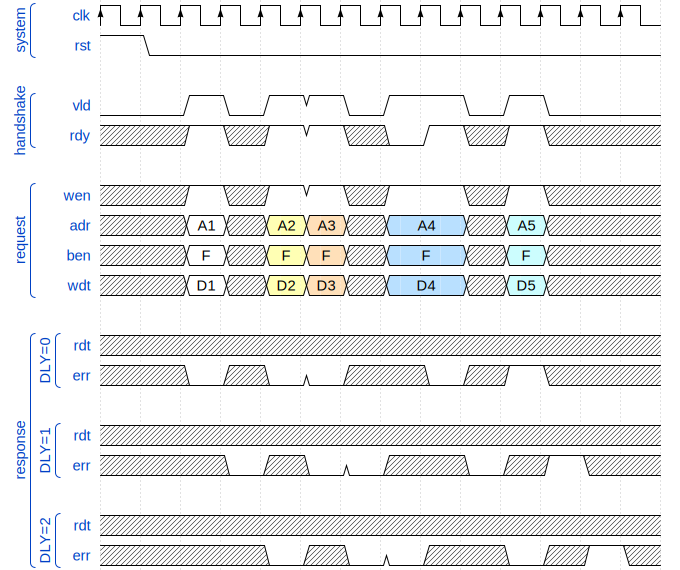
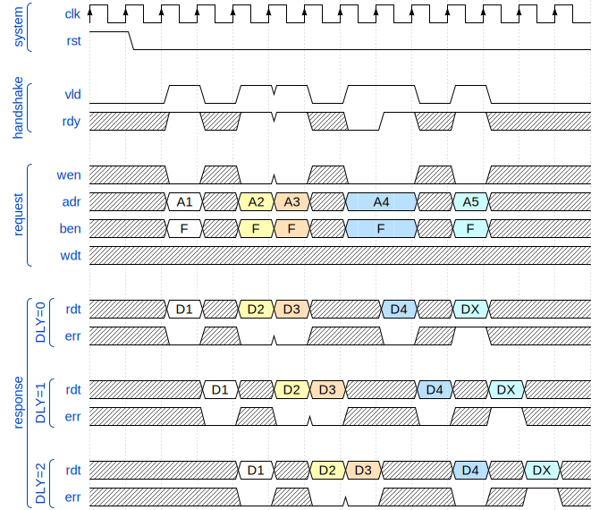

= Tightly Coupled Bus
:toc:
:toclevels: 5

Tightly Coupled Bus is a simple general purpose system bus based on FPGA/ASIC SRAM memory interfaces.

== Introduction

The idea and name comes from tightly coupled memories,
which require a simple interface to avoid complexity impact on timing and area,
and at the same time the full memory interface throughput must be achievable.

This are few alternative naming for tightly coupled memories:

* Tightly Coupled Memory (TCM) used by https://www.kernel.org/doc/Documentation/arm/tcm.txt[ARM],
  https://codasip.com/[Codasip], and https://syntacore.com/[Syntacore],
* https://github.com/chipsalliance/Cores-VeeR-EL2/blob/main/docs/RISC-V_VeeR_EL2_PRM.pdf[Closely Coupled Memory (CCM)] used by https://www.chipsalliance.org/[CHIPS Alliance]
* Tightly Integrated Memory (TIM) used by https://www.sifive.com/[SiFive],
* Local Memory (LM) used by http://www.andestech.com/en/risc-v-andes/[Andes]

A processor native system bus is usually custom designed
to support exactly the features that are present in the processor itself.
This also means there are differences between the protocols
used by instruction fetch and load/store units.

The TCB protocol is designed to fulfill the shared needs of simple CPU/SoC designs and can be used for:

* CPU instruction fetch interface,
* CPU/DMA load/store interface,
* simple cache hierarchies,
* SoC interconnect (crossbar),
* SoC peripheral interface.

The design is based on the following principles:

* Intended for closely coupled memories and caches,
  and therefore based on synchronous/static memory (SRAM) interfaces.
* Minimize latency and maximize throughput.
* Support pipelining for both writes and reads to minimize stalling overhead.
  Meaning the handshake is done during the arbitration phase (explained later).
* Handshake based on the AMBA AXI family of protocols (VALID/READY).
* Low power consumption should be considered by reducing signal toggling and other means.
* Choice of common (half-duplex) or independent (simplex) read/write channels,
  allowing additional trade-off between throughput and complexity.

What it is not intended for:

* It is not optimized for clock domain crossing (CDC), which has a large delay (latency)
  between the start of a request and the response, and the delay has some unpredictability.
* Does not provide out of order access functionality.
* It is not a good fit for managers with a variable pipeline delay in the load/store unit.

The protocol description is split into layers:

* handshake layer,
* bus layer,
* packeting layer.

Except for the handshake layer, the standard gives users the freedom to customize.
Still, the standard attempts to document as many common use cases as possible
to avoid unnecessary non standard customizations.
Implementers are free to only use a subset of features, and define the subset with parameters,
this parameters can then be used for automatic compatibility validation in the RTL code.

== Terminology

TCB terminology and syntax is mostly based on:

* AMBA AXI family of protocols,
* Verilog/SystemVerilog HDL language.

=== Terms

.Interconnect terms
[%autowidth]
|===
| module      | short | description

| manager     | `man` | Managers are modules driving requests toward a subordinate and receiving a response from it. This term is equivalent to _master_.
| subordinate | `sub` | Subordinates are module receiving requests from a manager and responding to it. This term is equivalent to _slave_.
| monitor     | `mon` | Monitors do not drive any protocol signals, they only observe them for error checking, statistics and logging.
|===

.Transfer level terms (protocol timing)
[%autowidth]
|===
| term         | description

| clock period | The term _clock period_ is preferred over _clock cycle_ to avoid confusion with _access cycle_ which can be multiple clock periods long.
| handshake    | Exchange of `valid` and `ready` signals during between manager and subordinate.
| cycle        | A _request cycle_ is one or more clock periods long exchange between a master and a subordinate
                 governed by a valid/ready handshake, and it ends with a transfer.
                 A _response cycle_ starts `HSK_DLY` clock periods after the request cycle and has the same length.
| transfer     | Each access cycle ends in a single clock period long transfer when valid and ready handshake signals are both active.
| request      | The collective value of signals (address, write enable, byte enable, write data) driven by a manager,
                 while valid is active during an access cycle.
                 And sampled by a subordinate during a transfer.
| response     | In the current protocol version, a response is a single clock period delayed by a fixed number of clock periods from each transfer,
                 in it read data and error status are driven by a subordinate and sampled by a manager.
                 Future versions of the protocol might have responses encompassing multiple clock periods.
| backpressure | A subordinate can delay the transfer by driving the ready signal low.
| back-to-back | Performing transfers continuously in each clock period, without idling the bus by waiting the for a response before issuing e new request.
|===

A transaction is the atomic exchange of a desired data length requiring one or more transfers.
The following words can be used to describe a transaction.

**TODO: check for a TLM definition.**

.Transaction level terms
[%autowidth]
|===
| descriptor | description

| write      | Used for CPU store operations.
| read       | Used for CPU load operations.
| aligned    | Address and transaction size or byte enable signals follow CPU ISA alignment rules.
| misaligned | A misaligned transaction can be a single misaligned transfer or be split into multiple aligned transfers.
| split      | A transaction with a size exceeding the data bus width can be split into multiple transfers.
| atomic     | In addition to CPU ISA atomic instructions, atomicity is desired in split transactions.
| burst      | Bursts are intended for communication between cache levels and high latency memories.
|===

While the bus width and transaction sizes are not limited to a finite set,
the the following transaction sizes also have names.

.Transaction size terms
[%autowidth]
|===
| size   | description

| byte   |   8-bit wide data.
| half   |  16-bit wide data.
| word   |  32-bit wide data.
| double |  64-bit wide data.
| long   | 128-bit wide data.
|===

.Peripheral driver terms
[%autowidth]
|===
| term          | Description

| parameter     | Static (compile time) configuration of a HDL/RTL module, `parameter` in Verilog or `generic` in VHDL.
| quasi-static  | Can be driven at runtime during initialization, but is static (not changing) during system operation.
| dynamic       | Can be driven at runtime during system operation, is expected to change.
| volatile      | Can change at runtime during system operation.
| configuration | Peripheral register/field containing configuration information, they are usually quasi-static, never volatile.
| control       | Peripheral register/field used to control system operation at runtime, they are dynamic signals.
| status        | Peripheral register/field used to monitor system operation at runtime, they are volatile signals.
|===

_Parameters_ are used in HDL code.
Terms _quasi-static_, _dynamic_ and _volatile_ are used to describe properties of
_configuration_, _control_ and _status_ registers of a peripheral.

.Acronyms
[%autowidth]
|===
| acronym | definition

| TCB     | Tightly Coupled Bus
| BFM     | https://en.wikipedia.org/wiki/Bus_functional_model[Bus Functional Model]
| TLM     | https://en.wikipedia.org/wiki/Transaction-level_modeling[Transaction-level modeling]

| LSB     | https://en.wikipedia.org/wiki/Bit_numbering[Least Significant Bit/Byte]
| MSB     | https://en.wikipedia.org/wiki/Bit_numbering[Most Significant Bit/Byte]

| HDL     | https://en.wikipedia.org/wiki/Hardware_description_language[Hardware Description Language]
| RTL     | https://en.wikipedia.org/wiki/Register-transfer_level[Register-transfer level]

| ROM     | https://en.wikipedia.org/wiki/Read-only_memory[Read-only memory]
| RAM     | https://en.wikipedia.org/wiki/Random-access_memory[Random-access memory]
|===

=== Naming conventions

Mostly for aesthetic reasons (vertical alignment) all signal and names are
https://en.wikipedia.org/wiki/Three-letter_acronym[three-letter abbreviations (TLA)].

Suffixes specifying the direction of module ports as input/output (`in`/`out`, `i`/`o`) can be avoided.
Instead signals can be organized into sets with a prefix or are grouped into a SystemVerilog interface.
Set names shall use specifiers like manager/subordinate (`man`/`sub`) or request/response (`req`/`rsp`).

== Handshake layer

The TCB protocol most basic layer is comprised of a valid/ready handshake for the request
and a parameterized fixed delay (integer number of clock periods) for the response.
Special considerations should be made for signal values during reset
and reset release and assertion.

=== System signals clock and reset

System signals are propagated globally from a system controller
to managers and subordinates.
Implementations with separate clock/reset/power domains can have
multiple independent system signal sets.

.System signals
[%autowidth]
|===
| signal | description

| `clk`  | Clock (active on rising edge).
| `rst`  | Reset (active high) can be synchronous or asynchronous depending on implementation.
|===

TODO: define clock/reset/power domain functionality.

=== Handshake amd request/response signal groups

The manager initiates a request with the handshake signal `vld` (valid).
Backpressure from the subordinate is supported by the handshake signal `rdy` (ready).

If no backpressure conditions are possible, the `rdy` signal can be omitted,
and the manager shall interpret it as always being active (`rdy==1'b1`).

NOTE: The handshake signals intentionally use names from the AMBA AXI family of protocols,
      since the handshake is governed by compatible (equivalent) rules.
      Otherwise the TCB protocol bears no relation to AMBA.

.Handshake signals
[%autowidth]
|===
| signal | type    | direction      | description

| `vld`  | `logic` | `man` -> `sub` | Handshake valid.
| `rdy`  | `logic` | `sub` -> `man` | Handshake ready (can be omitted if there is no backpressure).
|===

Signals going from manager to subordinate are part of the request group,
signals going in the opposite direction are part of the response group.
This signal groups are used to provide transaction type details, addressing and data.

.Base protocol signal groups
[%autowidth]
|===
| signal | type    | direction      | description

| `req`  | `req_t` | `man` -> `sub` | Request group.
| `rsp`  | `req_t` | `sub` -> `man` | Response group.
|===

While the handshake defines the request transfer,
the response is always provided `HSK_DLY` clock periods after the handshake transfer.

.Base protocol parameter
[%autowidth]
|===
| parameter | type           | description

| `HSK_DLY` | `int unsigned` | Response delay.
|===

=== Handshake rules

Handshake rules and reset sequencing are described in details (with source code)
in a link:../submodules/synthesis-primitives/doc/handshake.adoc[separate document about the VALID/READY handshake].

Handshake signals shall follow the same basic principles as defined for the AMBA AXI family of protocols:

* `vld` shell be inactive during reset.
* While valid is not active all other signals shall be ignored (`X` in timing/waveform diagrams).
* Once the manager asserts `vld`, it must not remove it till the cycle is completed by an active `rdy` signal.
* The manager must not wait for `rdy` to be asserted before starting a new cycle by asserting `vld`.
* The subordinate can assert/remove the `rdy` signal without restrictions.
* There is no inherent timeout mechanism.

TODO: clarify `rdy` behavior if only part of the system is under reset.

This means once a request cycle is initiated, it must be completed with a transfer.
Since `rdy` can be asserted during reset (`rdy` can be a constant value),
`vld` must not be asserted, since this would indicate transfers while in reset state.
Since the subordinate is allowed to wait for `vld` before asserting `rdy` (no restrictions),
the manager shall not wait for `rdy` before asserting `vld`,
since this could result in a lockup or a combinational loop.

There is no integrated timeout abort mechanism,
although it would be possible to place such functionality
into a module placed between a manager and a subordinate.
The required additional complexity is not discussed in this document.

==== Transfer and request/response sequence

The manager shall drive a valid _request signal set_ `req` while the `vld` handshake signal is active.
The subordinate shell sample the _request signal set_ `req` at the rising clock edge while
both `vld` and `rdy` handshake signals are active indicating a transfer `trn` (local signal).

When the delay parameter is zero (`HSK_DLY=0`),
the subordinate shall provide the response `rsp` combinationally
in the same clock period as the transfer `trn` is active.
When the delay parameter is greater then zero (`HSK_DLY>0`),
the subordinate shall provide the response `rsp` sequentially
in `HSK_DLY` clock periods after the transfer `trn` is active.
As a power consumption consideration, the response can remain unchanged
till a new one becomes active.

==== Reset release and assertion sequences

A global system reset `rst` can be asserted at any moment,
as long as it applies to the entire interconnect and all managers/subordinates connected to it.

TODO: A correct reset assertion sequence for just part of the system
separated into multiple clock/reset/power domains is (will be)
explained separately in the reference interconnect library documentation.

The handshake valid `vld` must be inactive during reset.
After the reset signal `rst` is released there must be
at least one clock period before `vld` can be asserted.
The handshake ready signal can be active or inactive during reset,
but it is not allowed to toggle.
After the reset signal `rst` is released there must be
at least one clock period before `rdy` can toggle.

This timing is based on the assumption that reset is not used as a normal combinational signal.
In this case the `vld` signal depends on a register toggling after reset is released,
and this can only happen with the described timing.
The same explanation stands for `rdy` if it is not a constant value.

==== Reset sequence length

Ideally all devices would require the reset to be active for only a single clock period.
Long (multiple clock periods) reset sequences are sometimes required
so that reset values can propagate through flipflops without reset.
If a device requires a longer active reset, this must be documented.
A global reset shall be applied for the longest sequence required by eny devices in the same domain.
Requiring long active reset sequences just in case should be avoided,
the exact required reset sequence length shall be derived from the RTL.

==== Sequential logic without reset

It is allowed to use reset capable flipflops only for control signals (handshake signals in TCB),
while address, data and other signals use flipflops without a reset for example to reduce ASIC area.
While this approach does not affect functionality,
it affects reproducibility of power consumption tests.

WARNING: Datapath registers without reset might have some effect on security
         (viability of side channel attacks).

=== Signal timing

While timing is not strictly part of the protocol,
following recommendations across the entire design
allows for optimizing the compromise
between high clock speed and low latency.

[NOTE]
====
It is important to note the recommended timing
is somehow opposite to what is usually recommended for RTL modules.
The common recommendation is to place registers at
module (hierarchical boundary) outputs and optionally at module inputs.

* link:https://docs.xilinx.com/r/en-US/ug1387-acap-hardware-ip-platform-dev-methodology/Register-Data-Paths-at-Logical-Boundaries[Xilinx recommendations],
* TODO: link more.
====

For TCB it is recommended to
**place registers on the request signal path and keep the response path combinational**.

The recommendation is intended to match the timing of SRAM memories common in FPGA and ASIC designs.
SRAM memories usually have registers on all input signals (TCB request),
giving inputs a low _setup time_.
The read data output path is a mixed signal (analog+digital) combinational logic
with a high _clock to output_ delay.

This are a few SRAM examples:

* Xilinx 7 Series FPGAs link:https://docs.xilinx.com/v/u/en-US/ug473_7Series_Memory_Resources[Memory Resources],
* GlobalFoundries GF180MCU PDK link:https://gf180mcu-pdk.readthedocs.io/en/latest/IPs/SRAM/gf180mcu_fd_ip_sram/cells/gf180mcu_fd_ip_sram__sram512x8m8wm1/gf180mcu_fd_ip_sram__sram512x8m8wm1.html[SRAM macro].

As an example where a TCB peripheral is placed in the same address space as a SRAM block.
Placing a register at the peripheral request inputs matches the low setup time of SRAM.
On the peripheral response output combinational logic can add as much clock to output delay
as specified for SRAM, without affecting overall interconnect timing.

image::tcb_request_response_timing.svg[Request/response signal timing]

== Bus layer

For the protocol to support memories and memory mapped peripherals,
the request and response signal groups must be further defined
to contain the read/write control signal, the address, transfer size or byte enable,
read/write data busses, and various optional extensions.

=== Parameters

All TCB interfaces are parameterized.
In addition to the handshake layer parameter `HSK_DLY` there are parameters for:

* defining the presence of signals specific to individual bus layer features,
* defining how data bytes are packed into the data bus
  (documented in packing layer section).

==== Feature presence parameters

.Signal width parameters
[%autowidth]
|===
| parameter | default | type           | description

| `BUS.UNT` | `8`     | `int unsigned` | Data unit width (in most cases it should be 8, the size of a byte).
| `BUS.ADR` | `32`    | `int unsigned` | Address bus width.
| `BUS.DAT` | `32`    | `int unsigned` | Data bus width.

| `BUS_BEN` | `DAT/UNT`           | `int unsigned` | Byte enable width is the number of unit widths fitting into the data width.
| `BUS_MAX` | `$clog2(BUS_BEN)`   | `int unsigned` | Maximum transfer logarithmic size, also width of 'off' (unit offset within data width) part of address.
| `BUS_SIZ` | `$clog2(BUS_MAX+1)` | `int unsigned` | Width of logarithmic size signal.
|===

The data unit width parameter `BUS.UNT` defines the number of bits in a byte,
for all standard use cases this defaults to 8.

TODO: research use cases where `BUS.UNT` is not the default.

There are few restrictions on the address bus width `ADR`.
Sometimes the size of the RISC-V load/store immediate (12-bit) is relevant.
Similarly ARM defines a 12-bit memory management page size.

Since TCB was designed with 32-bit CPU/SoC/peripherals in mind,
32-bit is the default data bus width `BUS.DAT` and 4-bit is the default byte enable width `BUS_BEN`.
Byte enable width `BUS_BEN` is a calculated local parameter,
it should not be passed across module hierarchy.

==== Custom extension signal type parameters

Data types for custom extension signals are listed here without details.
Further in the document there are definitions for some standard configurations.

.Custom signal types
[%autowidth]
|===
| parameter       | description

| `tcb_req_cmd_t` | Custom request command signal `cmd` type.
| `tcb_rsp_sts_t` | Custom response status signal `sts` type.
|===

=== Signals

Most signals are designed to directly interface with ASIC/FPGA SRAM memories:

* address `adr`,
* write enable `wen` and byte enable `ben`,
* write data `wdt` and read data `rdt`.

.Request/reponse signals
[%autowidth]
|===
| signal    | width     | description

| `req.cmd` | custom    | Custom request command protocol extensions.
| `req.ndn` | `1`       | Read/write data endianness. Only used in logarithmic size mode.
| `req.wen` | `1`       | Write enable.
| `req.ren` | `1`       | Read enable (only used in full-duplex channel configuration).
| `req.adr` | `BUS.ADR` | Address.
| `req.siz` | `BUS_SIZ` | Transfer logarithmic size. Only used in logarithmic size mode.
| `req.ben` | `BUS_BEN` | Byte enable/select. Only used in byte enable mode.
| `req.wdt` | `BUS.DAT` | Write data.
| `rsp.rdt` | `BUS.DAT` | Read data.
| `rsp.sts` | custom    | Custom response status protocol extensions.
|===

The custom protocol extension signals, request command `cmd` and response status `sts`,
do not directly affect the content of the data transfer.
They are described in the next section.

Since bi-endianness support is an important part of the TCB protocol,
the endianness selection signal `ndn` is listed prominently.
It is a dynamic property of each data transfer
and therefore a signal and not a parameter.

For an interface modelled over a memory interface,
read enable `ren` is not accessible by the user in most implementations,
internally it is assigned the negated value of write enable `wen`.

The transfer logarithmic size signal `siz` is an alternative signal to byte enable `ben`.
The logarithmic size is a binary logarithm of the number of units/bytes in a transfer.
For further details see section _transfer_size_encoding[Transfer size encoding].

==== Custom protocol extension signals

TODO: Custom protocol extension signals are still in the draft stage.

The request command signals `cmd` are used to:

* extend the protocol into multi transfer transactions and
* to provide performance (latency, power, ...) optimizations.

.Command signals
[%autowidth]
|===
| signal        | width | description

| `req.cmd.lck` | `1`   | Arbitration lock.
| `req.cmd.rpt` | `1`   | Repeat address access.
| `req.cmd.inc` | `1`   | Incrementing address access.
|===

The arbitration lock `lck` is used to implement atomic accesses
by combining multiple transfers into a single transaction:

* split transaction misaligned access,
* transactions larger than data bus/transfer size,
* uninterruptible burst transactions,
* ...

NOTE: The lock signal `lck` has a similar functionality to AXI-Stream `LAST` signal,
but with an inverted active state (`lck = ~LAST`).
While with AXI-Stream the common case are long packets ending with a LAST pulse,
for a system bus single transfer transactions are more common than large transactions.
The `lck` signal polarity is selected to be inactive by default.

The repeat address access `rpt` is used to reduce power consumption on repeated read accesses to the same address.
The incrementing address access `inc` is used to tell prefetch mechanisms whether the address is the expected one.

The response status error signal `err` is used for handling error conditions:

* access to inactive subsystem with clock/power gating support,
* address decoder errors while accessing undefined regions,
* unsupported transfer size/alignment.

.Status signals
[%autowidth]
|===
| signal        | width | usage    | description

| `rsp.sts.err` | `1`   | optional | Error response (can be omitted if there are no error conditions).
|===

Various implementations can add custom (user defined) signals to either the request or response,
some examples of custom signals would be:

* cache related signals,
* burst support,
* quality of service signals,
* multiple types of error responses,
* ...

==== Optional signal subsets and defaults

TODO: review this section.

Custom implementations can use a subset of the full signal list.
Some rules are provided for handling the missing signals.

ROM would be an example of a device which only requires the read data bus.
When constructing subsets, please consider other protocols (AXI-Stream, ...)
which might be more appropriate.

To connecting a manager and a subordinate with differing sets of optional signals,
an adapter is needed which would provide:

* a default for outputs and
* a handler for inputs.

The output default shall be chosen to match the protocol subset (`wen=1'b0` and `wdt='x` for ROM).
The input handler can either ignore the signal or cause an error condition.
Default output values can always be ignored by an input handler, or simply no handler is needed.

The following table defines some defaults and handlers.

.Defaults and handlers
[%autowidth]
|===
| use case     | signal    | default | handler

| interconnect | `req.cmd` |   `'b0` | Subordinates can ignore it.
| ROM          | `req.wen` |  `1'b0` | Respond with error on write access to subordinate without write support.
| ROM          | `req.wdt` |    `'x` | Can be ignored, `wen` requires handling.
| peripheral   | `req.ben` |    `'1` | Access with less than the full width shall trigger an error.
| interconnect | `rsp.sts` |   `'b0` | Can be ignored, if no error conditions are possible, otherwise requires and external handler (watchdog, ...).
|===

The custom request command also has sensible defaults.

.Defaults and handlers
[%autowidth]
|===
| signal        | default  | handler

| `req.cmd.lck` |   `1'b0` | If another manager can access the same segment, respond with error, otherwise ignore.
| `req.cmd.rpt` |   `1'b0` | Subordinates can ignore it.
| `req.cmd.inc` |   `1'b0` | Subordinates can ignore it.
|===

=== Channel configuration

The `CHN` parameter is used to configure channel read/write capabilities.

.Channel configuration parameter
[%autowidth]
|===
| parameter | default              | type (enumeration)  | description

| `BUS.CHN` | `COMMON_HALF_DUPLEX` | `tcb_bus_channel_t` | Channel configuration.
|===

The following configurations are defined,

.Channel configuration options
[%autowidth]
|===
| value                |  `wen` |  `ren` | `wdt`  | `rdt`  | description

| `COMMON_HALF_DUPLEX` |  `wen` | `~wen` |   used |   used | Each transfer can only enable either read or write data.
| `COMMON_FULL_DUPLEX` |  `wen` |  `ren` |   used |   used | The address is common read/write data can be controlled independently.
| `INDEPENDENT_WRITE`  | `1'b1` | `1'b0` |   used | unused | Write data is always enabled, read data is unused.
| `INDEPENDENT_READ`   | `1'b0` | `1'b1` | unused |   used | Write data is unused, read data is always enabled.
|===

==== Common half duplex

This is the common approach based on a SRAM memory interface.
The address is shared between read/write operations and
each transfer can only be either a read or a write,
controlled by the write enable `wen` signal.

.TODO
[%autowidth]
|===
| `wen`  | description

| `1'b0` | Write request.
| `1'b1` | Read request.
|===

In this channel configuration the read enable signal `ren`
is not used, internally can be assigned the negated value of write enable `ren`.

[source,SystemVerilog]
----
assign ren = ~wen;
----

==== Common full duplex

Use cases:

* data swap,
* control request returning status before request,
* control request returning instant same clock period feedback.

The data swap operation can be used between a CPU GPR and a memory mapped register.

The control request use cases are similar to what RISC-V ISA *Zicsr* instructions do.

The case where read and write enable signals are both inactive during a transfer is reserved.

==== Independent read/write

The read and write operations are separated into independent channels.
The main purpose is to provide full-duplex access to independent addresses.
One advantage this approach provides is reduced power consumption in peripherals,
since during a write access the read data decoder and multiplexer are not active and
during a read access the write data enable decoder is not active.

=== Access cycles

Read/write transfer cycles are shown with common response delays (parameter `HSK_DLY`) of 0, 1 and 2 clock periods.

* `HSK_DLY=0` is the case with a combinational response to a request.
  This can be used in case multiple simple subordinates are combined into an interconnect segment.
  Such a segment can then be combined with a TCB register slice `tcb_register_slice`
  to break long timing paths at either the request path, response path or both to improve timing.
  Such collections can be used to achieve better area timing compromises,
  compared to using subordinates with integrated registers.
* `HSK_DLY=1` is the most common delay for subordinates with SRAM as an example, this is also the **HDL default**.
* `HSK_DLY=2` is the case where a single subordinate or a segment of the interconnect with `HSK_DLY=1`
  would have an extra register added to the request path (address decoder)
  or response path (read data multiplexer) to improve timing.

==== Write transfer

A write transfer is performed when both handshake signals `vld` and `rdy` are simultaneously active
and the write enable signal `wen` is also active.

Only bytes with an active corresponding byte enable bit in `ben` are written.
The other bytes can be optimized to unchanged value, zeros or just undefined,
depending what brings the preferred optimization for area timing, power consumption, ...
The same optimization principle can be applied to all signals when valid is not active.

There are no special pipelining considerations for write transfers,
all signals shall be propagated through a pipeline,
similar to a single direction data stream

The base protocol does not have a mechanism for confirming
write transfers reached their destination and were successfully applied.

==== Read transfer

A read transfer is performed when both handshake signals `vld` and `rdy` are simultaneously active
and the write enable signal `wen` is not active.

The handshake is done during the arbitration phase, it is primarily
about whether the address `adr` from the manager can reach the subordinate.

Read data is available on `rdt` after a fixed delay of 1 clock cycle from the transfer.

NOTE: in contrast to most interconnect standards,
      TCB specifies the use of byte enable signals `ben` to
      enable or disable read from each byte.

===== Repeat access transfer

TODO: think this through.

The basic idea behind the repeat access transfer
is to avoid repeated reads from the same SRAM address.
During a pipeline stall the CPU instruction fetch interface
must remember the instruction by keeping it in a fetch register.
A fetch register affects area and timing (admittedly not very much).

The fetch register can be avoided by repeating the instruction read from the SRAM.
This redundant read can be avoided by taking advantage of SRAM functionality,
where the last data read remains available on the read data port
till the next read or a power cycle.

The repeat access signal `rpt` is intended to tell the SRAM
to not perform another read from the same address.
The interconnect would propagate the `rpt` as active only in case

==== Arbitration locking mechanism

Arbitration locking is used in the TCB reference implementation library to:

* Keep atomicity in data bus width conversion from a wider manager to a narrower subordinate.
  For example an atomic 64-bit read/write access over a 32-bit interconnect.
* Keep atomicity while converting a misaligned access into multiple aligned accesses.

It can also be used for read modify write, and similar operations and for QoS control.

== Data packing layer

A combination of parameters and runtime signals define how
bytes (smallest data units) are organized inside the read/write data bus,
and across transfers for multi transfer transactions.

To a degree data packing rules are a generalization of endianness rules.

This section will first document the parameters
and then provide examples of packing with some parameter configurations.

=== Data packing parameters

NOTE: The current choice of data packing parameters can be confusing.
      This might remain or change in future TCB standard releases, depending on user feedback.

The following parameters affect data packing.

.Data packing parameters
[%autowidth]
|===
| parameter | type (enumeration) | range (options)          | default      | description

| `BUS.MIN` | `int unsigned`     | `0`~`BUS_MAX`            | `0`          | Minimum transfer logarithmic size.
| `BUS.OFF` | `int unsigned`     | `0`~`BUS_MAX`            | `0`          | Number of LSB address bits (the offset of unit/byte inside the data bus) tied to zero.
| `BUS.ALN` | `int unsigned`     | `0`~`BUS_MAX`            | `BUS_MAX`    | Alignment width, number of least significant address bits which are zero.
| `BUS.MOD` | `tcb_bus_mode_t`   | `LOG_SIZE`/`BYTE_ENA`    | `LOG_SIZE`   | Data size/position mode.
| `BUS.ORD` | `tcb_bus_order_t`  | `DESCENDING`/`ASCENDING` | `DESCENDING` | Byte order (related to little/big endian systems).
|===

Only a small subset of all parameter value combinations configurations from all parameter combinations
results in practical and useful data packing rule (RISC-V RV32/64 access patterns are a large part of the subset).
The rest are reserved with no intention to be documented and implemented.

.Relevant packing modes
[%autowidth]
|===
| `MOD`      | `ORD`        | `BUS.DAT` | `BUS.MIN`   | `BUS.OFF`   | `BUS.ALN`   | `ndn`   | description

| `LOG_SIZE` | `ASCENDING`  | `32`      | `BUS_MAX=2` | `BUS_MAX=2` | `BUS_MAX=2` | ignored | RISC-V single issue instruction fetch unit without C extension.
| `LOG_SIZE` | `ASCENDING`  | `32`      |     `1`/`2` |         `1` |         ??? | ignored | RISC-V single issue instruction fetch unit with C extension (details in examples).

| `LOG_SIZE` | `DESCENDING` | `32`/`64` | `0`         | `0`         | 0           | ignored | RISC-V RV32/64 GPR load/store (no sign extension) with misaligned access support.
| `LOG_SIZE` | `DESCENDING` | `32`/`64` | `0`         | `0`         | `BUS_MAX`   | ignored | RISC-V RV32/64 GPR load/store (no sign extension) with only aligned access support.

| `LOG_SIZE` | `ASCENDING`  | any       | any         | any         | any         | ignored | Reserved (not defined or used).

| `BYTE_ENA` | `DESCENDING` | `32`/`64` | `0`         | `0`         | 0           | both    | RISC-V RV32/64 memory load/store with misaligned access support.
| `BYTE_ENA` | `DESCENDING` | `32`/`64` | `0`         | `BUS_MAX`   | `BUS_MAX`   | both    | RISC-V RV32/64 memory load/store with only aligned access support.

| `BYTE_ENA` | `DESCENDING` | `32`      | `BUS_MAX=2` | `BUS_MAX=2` | `BUS_MAX=2` | both    | Peripheral bus with only 4-byte (word) aligned access support.
| `BYTE_ENA` | `DESCENDING` | `64`      | `BUS_MAX=3` | `BUS_MAX=3` | `BUS_MAX=3` | both    | Peripheral bus with only 8-byte (double) aligned accesses support.
| `BYTE_ENA` | `DESCENDING` | `64`      |         `2` |         `2` | `BUS_MAX=3` | both    | Peripheral bus with mixed 4/8-byte aligned accesses support.

| `BYTE_ENA` | `ASCENDING`  | `32`/`64` | TBD         | TBD         | TBD         | both    | OpenPOWER storage operands (for old peripherals).
| `BYTE_ENA` | `ASCENDING`  | any other | any other   | any other   | any other   | both    | Reserved (not defined or used).
|===

NOTE: The OpenPOWER specific configuration is included for historic compatibility, and completeness.

TODO: Boundary

* `PCK.BND` = 0
  There are no boundaries, any transfer can cross any boundary.
* `PCK.BND` = BUS_MAX
  Transfer must be within the data bus width, otherwise it must be split.
* `PCK.BND` = BUS_MAX + 1
  For example a 32-bit CPU with a TCB `BUS.DAT=32`` (`BUS_MAX=2``).
  Connected to a 64-bit wide memory controller,
  TCB can realign transfers not crossing the 64-bit boundary,
  transfers crossing it must be split. So `PCK.BND=3`.
* `PCK.BND` = $clog2(64) = 6
  Accessing a cache with line size of 64 bytes.
  Crossing the cache line boundary requires a split.
* `PCK.BND` = $clog2(4k) = 12
  Crossing the 4k page boundary (ARM).

=== Supported size and alignment checking

Alignment width `ALN` defines what kind of data alignments are supported.
The values can be between `0` (no alignment requirements)
and `clog2(BEN)` (full alignment is required).
Only this two values are documented,
other values in between can be used for custom implementations.

=== Transfer logarithmic size encoding

Interface signal `siz` encodes the logarithmic size of a transfer.
The linear size (number of units/bytes) of the transfer is calculated as `2**siz`.

The number bits required to encode sizes from 1 to `BUS_BEN` (unit/byte enable width) is
`BUS_SIZ = $clog2(BUS_MAX+1)` where the largest transfer logarithmic size is `BUS_MAX`.
Depending on the data bus width, some logarithmic size values encoded with `BUS_SIZ` bits
can be invalid and are thus reserved.

.Logarithmic size encoding
[%autowidth]
|===
| `BUS.DAT` | `BUS_BEN` | `$clog2(BUS_BEN) = BUS_MAX =    siz` | `$clog2(BUS_MAX+1) = BUS_SIZ` | comment
|       `8` |       `1` | `$clog2(      1) =       0 =    'b0` | `$clog2(      0+1) =       0` | The size is a constant, there is no need for `siz`.
|      `16` |       `2` | `$clog2(      2) =       1 =    'b1` | `$clog2(      1+1) =       1` |
|      `32` |       `4` | `$clog2(      4) =       2 =   'b10` | `$clog2(      2+1) =       2` |
|      `64` |       `8` | `$clog2(      8) =       3 =   'b11` | `$clog2(      3+1) =       2` |
|     `128` |      `16` | `$clog2(     16) =       4 =  'b100` | `$clog2(      4+1) =       3` |
|     `256` |      `32` | `$clog2(     32) =       5 =  'b101` | `$clog2(      5+1) =       3` |
|     `512` |      `64` | `$clog2(     64) =       6 =  'b110` | `$clog2(      6+1) =       3` |
|    `1024` |     `128` | `$clog2(    128) =       7 =  'b111` | `$clog2(      7+1) =       3` |
|    `2096` |     `256` | `$clog2(    256) =       8 = 'b1000` | `$clog2(      8+1) =       4` |
|===

NOTE: A linear size mode was initially considered, but later discarded,
since the logarithmic size covers all functionality (power of 2 sized load/store transfers)
documented in the RISC-V ISA and similar standards .
One example of non power of 2 transfer would be 24-bit RGB data.
A CPU could perform single cycle non aligned 24-bit accesses to memory,
instead of performing a 32-bit access and masking the data with `0x00ffffff`.
Another example would be a FIFO with a `BUS.DAT` wide interface accessed with a CPU or DMA.
When writing/reading an arbitrarily long stream of bytes to/from the FIFO,
the reminder at the end of the stream can be of a size which is not a power of 2
(3 bytes o a 32-bit interface, 3/5/6/7 bytes on a 64-bit interface).
A CPU with only logarithmic sized accesses, must split this reminder into multiple accesses (7=4+2+1).
The difference in performance due to this overhead is in most use cases
not worth the additional instruction encoding space in an ISA.
Users are free to write custom TCB implementations with linear size support.

=== Data position mode

The `MOD` parameter encoding defines the following options.

* `LOG_SIZE`,
* `BYTE_ENA`.

The name _reference_ is based on the idea,
that if a monitor was placed on multiple points of a mixed configuration interconnect,
all data would be translated to a common reference before being compared.

The `BYTE_ENA` mode defines the same data packing scheme as memories.

In byte enable mode the the byte enable signal `ben`
provides the information about the transfer size,
which is the number of active bits in the `ben` vector.

The `LOG_SIZE` mode is based on how ISAs define the placement of
byte/half/word/double into its general purpose registers.
In registers data of any size is always stored aligned to the right.
In logarithmic size mode data is always aligned to the right,
regardless of the address, address alignment, endianness, ...

In logarithmic size mode the transfer size signal `siz`
provides the information about the transfer size.

The main purpose of this mode is to connect peripherals to the CPU or DMA.
without the need for byte reordering logic between the two.

Another use case would be a RISV-V instruction fetch interface with C extension support,
where the instruction is always aligned the same way, regardless on whether
the instruction is 32-bit or 16-bit aligned in the memory.
In this case a multiplexer for aligning the instruction would still be needed,
but it would be placed in the interconnect instead of the CPU.

=== Byte order

The `ORD` parameter encoding defines the following options.

* `DESCENDING`,
* `ASCENDING`.

Almost all modern standards and HDL/schematic implementations use the `DESCENDING` order.
Here indexing starts with 0 on the right side and increments to the left side of the vector.
When writing bit vectors and equivalent packed byte arrays in SystemVerilog:

[source,SystemVerilog]
----
logic     [31:0] data_bit_vector;
logic [3:0][7:0] data_byte_array;
----

Byte addressing follows the same rules so it increments from the right to the left.

The `ASCENDING` order was prominently used in the OpenPOWER specification
and its big endian predecessors.
Here indexing starts with 0 on the left side and increments to the right side of the vector.
When writing bit vectors and equivalent packed byte arrays in SystemVerilog:

[source,SystemVerilog]
----
logic     [0:31] data_bit_vector;
logic [0:3][0:7] data_byte_array;
----

Byte addressing follows the same rules so it increments from the left to the right.

Due to the current prevalence of descending indexing order and little-endian ISAs,
it can be difficult and confusing to understand big endian (bi-endian) compatibility.
A few reasons that aggravate the confusion:

* while OpenPOWER defines all 64-bit registers with ascending order `[0:63]`,
  a load/store byte operation would place the byte in the register aligned to the right `[56:63]`,
* on OpenPOWER the least significant bit of the program counter or address pointer is `[63]`,
* not all native big-endian ISAs use the ascending order,
* early bi-endian approaches differ from moderns ones.

Modern OpenPOWER implementations use ascending order in the core to match the specification,
but use descending order on the system bus, which is usually AMBA AXI based.
The only practical use case for ascending order would probably be while interfacing with historic hardware.

== Examples

=== Data packing examples

All provided examples are configured for descending order `ORD=DESCENDING`.
Examples are given for the next data packing configurations:

* logarithmic size mode, fixed of variable size transfers with and without misaligned access support,
* byte enable mode, with and without misaligned access support, for both little and big endianness.

The examples list all supported read/write transfers in a table.
Unsupported transfers can be handled by ignoring the request and responding with an error.
Alternatively unsupported transfers can just cause undefined behavior.

==== RISC-V with C extension instruction fetch

This case would specify the following parameter values and signal restrictions:

* logarithmic size mode `MOD=LOG_SIZE`,
* relaxed alignment `ALN=1`
* always attempt to fetch a 32-bit instruction `siz=2'd2`,
* address aligned to transfer size `adr[0]==1'b0`,
* only little endian support `ndn=1'b0`.

.32-bit instruction bus vector
[source,SystemVerilog]
----
logic [3:0][7:0] dat;
logic      [2:0] siz;
logic      [1:0] off = adr[1:0];
----

The following table lists such transfers.

.TODO
[%autowidth]
|===
| size | alignment  | `off`  | `siz`  | `dat`

| word |    aligned | `2'd0` | `2'd2` | `{[3],[2],[1],[0]}`
| word | misaligned | `2'd2` | `2'd2` | `{[3],[2],[1],[0]}`
|===

==== Logarithmic size mode

Examples for the following logarithmic size mode configurations are provided:

* data bus width sized transfers with size aligned address,
* any size transfers with size aligned address,
* any size transfers with no address alignment restrictions,
* instruction fetch for RISC-V with C extension.

.32-bit data bus vector
[source,SystemVerilog]
----
logic [3:0][7:0] dat;
logic      [2:0] siz;
logic      [1:0] off = adr[1:0];
----

.64-bit data bus vector
[source,SystemVerilog]
----
logic [7:0][7:0] dat;
logic      [2:0] siz;
logic      [2:0] off = adr[2:0];
----

===== Full data width, aligned address

It is common to only allow full data bus width and aligned transfers when accessing peripherals.
Only the default endianness for the given byte order is allowed
(little endian for descending byte order, big-endian for ascending byte order).

This case would specify the following parameter values and signal restrictions:

.Full data width, aligned address parameters
[%autowidth]
|===
| parameter | 32-bit    | 64-bit    | description

| `BUS.DAT` |      `32` |      `64` |
| `BUS_BEN` |       `4` |       `8` | `$clog2(BUS.DAT)`
| `BUS_MAX` |       `2` |       `3` | `$clog2(BUS_BEN)`
| `BUS_SIZ` |       `2` |       `2` | `$clog2(BUS_MAX+1)`
| `BUS.NDN` | `TCB_NDN_DEFAULT`     | Endianness should be matching the default for the given byte order (BUS.ORD parameter).

| `PCK.MIN` | `BUS_MAX` | `BUS_MAX` | Minimum transfer size is equal to maximum.
| `PCK.OFF` | `BUS_MAX` | `BUS_MAX` | Entire address offset must be zero (`BUS_MAX` LSB of address).
| `PCK.ALN` | `BUS_MAX` | `BUS_MAX` | Entire address offset must be aligned to transfer size (already covered by previous parameters).
|===

The following table lists such transfers for a 32-bit data bus.

.32-bit full data width, aligned address
[%autowidth]
|===
| size | `off`  | `siz`  | dat

| word | `2'd0` | `2'd2` | `{[3],[2],[1],[0]}`
|===

.64-bit full data width, aligned address
[%autowidth]
|===
| size | `off`  | `siz`  | dat

| word | `3'd0` | `2'd3` | `{[7],[6],[5],[4],[3],[2],[1],[0]}`
|===

===== Variable data width, zero offset

.32-bit variable data width, zero offset
[%autowidth]
|===
| size | `off`  | `siz`  | `dat`

| byte | `3'd0` | `2'd0` | `{   ,    ,    , [0]}`
| half | `3'd0` | `2'd1` | `{   ,    , [1], [0]}`
| word | `3'd0` | `2'd2` | `{[3], [2], [1], [0]}`
|===

.64-bit variable data width, zero offset
[%autowidth]
|===
| size   | `off`  | `siz`  | `dat`
| byte   | `3'd0` | `2'd0` | `{   ,   ,   ,   ,   ,   ,   ,[0]}`
| half   | `3'd0` | `2'd1` | `{   ,   ,   ,   ,   ,   ,[1],[0]}`
| word   | `3'd0` | `2'd2` | `{   ,   ,   ,   ,[3],[2],[1],[0]}`
| double | `3'd0` | `2'd3` | `{[7],[6],[5],[4],[3],[2],[1],[0]}`
|===

===== Variable data width, aligned address

If transfer size restrictions are relaxed down to a single byte,
small registers can be arranged into a more compact structure,
thus reducing the address space.
This case would specify the following parameter values and signal restrictions:

* logarithmic size mode `MOD=LOG_SIZE`,
* full alignment required `ALN=$clog2(DAT/UNT)=clog2(BEN)`
* transfer size from byte to data bus width `0<=siz<=$clog2(ALN)`,
* address aligned to transfer size `adr[siz-1:0]=='0`,
* the transfer endianness `ndn` is ignored.

The following table lists such transfers for a 32-bit data bus.

.32-bit variable data width, aligned address
[%autowidth]
|===
| size | `off`  | `siz`  | `dat`

| byte | `3'd0` | `2'd0` | `{   ,    ,    , [0]}`
| byte | `3'd1` | `2'd0` | `{   ,    ,    , [0]}`
| byte | `3'd2` | `2'd0` | `{   ,    ,    , [0]}`
| byte | `3'd3` | `2'd0` | `{   ,    ,    , [0]}`

| half | `3'd0` | `2'd1` | `{   ,    , [1], [0]}`
| half | `3'd2` | `2'd1` | `{   ,    , [1], [0]}`

| word | `3'd0` | `2'd2` | `{[3], [2], [1], [0]}`
|===

.64-bit variable data width, aligned address
[%autowidth]
|===
| size   | `off`  | `siz`  | `dat`
| byte   | `3'd0` | `2'd0` | `{   ,   ,   ,   ,   ,   ,   ,[0]}`
| byte   | `3'd1` | `2'd0` | `{   ,   ,   ,   ,   ,   ,   ,[0]}`
| byte   | `3'd2` | `2'd0` | `{   ,   ,   ,   ,   ,   ,   ,[0]}`
| byte   | `3'd3` | `2'd0` | `{   ,   ,   ,   ,   ,   ,   ,[0]}`
| byte   | `3'd4` | `2'd0` | `{   ,   ,   ,   ,   ,   ,   ,[0]}`
| byte   | `3'd5` | `2'd0` | `{   ,   ,   ,   ,   ,   ,   ,[0]}`
| byte   | `3'd6` | `2'd0` | `{   ,   ,   ,   ,   ,   ,   ,[0]}`
| byte   | `3'd7` | `2'd0` | `{   ,   ,   ,   ,   ,   ,   ,[0]}`

| half   | `3'd0` | `2'd1` | `{   ,   ,   ,   ,   ,   ,[1],[0]}`
| half   | `3'd2` | `2'd1` | `{   ,   ,   ,   ,   ,   ,[1],[0]}`
| half   | `3'd4` | `2'd1` | `{   ,   ,   ,   ,   ,   ,[1],[0]}`
| half   | `3'd6` | `2'd1` | `{   ,   ,   ,   ,   ,   ,[1],[0]}`

| word   | `3'd0` | `2'd2` | `{   ,   ,   ,   ,[3],[2],[1],[0]}`
| word   | `3'd4` | `2'd2` | `{   ,   ,   ,   ,[3],[2],[1],[0]}`

| double | `3'd0` | `2'd3` | `{[7],[6],[5],[4],[3],[2],[1],[0]}`
|===

Such a configuration is also appropriate for a load/store CPU interface,
since it covers all aligned memory accesses.
An actual connection to a memory would require a conversion module
from `LOG_SIZE` to `BYTE_ENA` mode,
such a conversion module would have to also handle the endianness signal `ndn`.

A further generalization would entirely remove the alignment restriction to
enable access to memories which support unaligned accesses.

===== Variable data width, misalignment support

This case would specify the following parameter values and signal restrictions:

* logarithmic size mode `MOD=LOG_SIZE`,
* relaxed alignment `ALN=0`
* transfer size from byte to data bus width `0<=siz<=$clog2(ALN)`,
* address aligned to transfer size `adr[siz-1:0]=='0`,
* the transfer endianness `ndn` is ignored.

.32-bit variable data width, misalignment support
[%autowidth]
|===
| size | alignment  | `off`  | `siz`  | `dat`

| byte |    aligned | `2'd0` | `2'd0` | `{   ,   ,   ,[0]}`
| byte |    aligned | `2'd1` | `2'd0` | `{   ,   ,   ,[0]}`
| byte |    aligned | `2'd2` | `2'd0` | `{   ,   ,   ,[0]}`
| byte |    aligned | `2'd3` | `2'd0` | `{   ,   ,   ,[0]}`

| half |    aligned | `2'd0` | `2'd1` | `{   ,   ,[1],[0]}`
| half | misaligned | `2'd1` | `2'd1` | `{   ,   ,[1],[0]}`
| half |    aligned | `2'd2` | `2'd1` | `{   ,   ,[1],[0]}`
| half | misaligned | `2'd3` | `2'd1` | `{   ,   ,[1],[0]}`

| word |    aligned | `2'd0` | `2'd2` | `{[3],[2],[1],[0]}`
| word | misaligned | `2'd1` | `2'd2` | `{[3],[2],[1],[0]}`
| word | misaligned | `2'd2` | `2'd2` | `{[3],[2],[1],[0]}`
| word | misaligned | `2'd3` | `2'd2` | `{[3],[2],[1],[0]}`
|===

.64-bit variable data width, misalignment support
[%autowidth]
|===
| size   | alignment  | `off`  | `siz`  | `dat`

| byte   |    aligned | `3'd0` | `2'd0` | `{   ,   ,   ,   ,   ,   ,   ,[0]}`
| byte   |    aligned | `3'd1` | `2'd0` | `{   ,   ,   ,   ,   ,   ,   ,[0]}`
| byte   |    aligned | `3'd2` | `2'd0` | `{   ,   ,   ,   ,   ,   ,   ,[0]}`
| byte   |    aligned | `3'd3` | `2'd0` | `{   ,   ,   ,   ,   ,   ,   ,[0]}`
| byte   |    aligned | `3'd4` | `2'd0` | `{   ,   ,   ,   ,   ,   ,   ,[0]}`
| byte   |    aligned | `3'd5` | `2'd0` | `{   ,   ,   ,   ,   ,   ,   ,[0]}`
| byte   |    aligned | `3'd6` | `2'd0` | `{   ,   ,   ,   ,   ,   ,   ,[0]}`
| byte   |    aligned | `3'd7` | `2'd0` | `{   ,   ,   ,   ,   ,   ,   ,[0]}`

| half   |    aligned | `3'd0` | `2'd1` | `{   ,   ,   ,   ,   ,   ,[1],[0]}`
| half   | misaligned | `3'd1` | `2'd1` | `{   ,   ,   ,   ,   ,   ,[1],[0]}`
| half   |    aligned | `3'd2` | `2'd1` | `{   ,   ,   ,   ,   ,   ,[1],[0]}`
| half   | misaligned | `3'd3` | `2'd1` | `{   ,   ,   ,   ,   ,   ,[1],[0]}`
| half   |    aligned | `3'd4` | `2'd1` | `{   ,   ,   ,   ,   ,   ,[1],[0]}`
| half   | misaligned | `3'd5` | `2'd1` | `{   ,   ,   ,   ,   ,   ,[1],[0]}`
| half   |    aligned | `3'd6` | `2'd1` | `{   ,   ,   ,   ,   ,   ,[1],[0]}`
| half   | misaligned | `3'd7` | `2'd1` | `{   ,   ,   ,   ,   ,   ,[1],[0]}`

| word   |    aligned | `3'd0` | `2'd2` | `{   ,   ,   ,   ,[3],[2],[1],[0]}`
| word   | misaligned | `3'd1` | `2'd2` | `{   ,   ,   ,   ,[3],[2],[1],[0]}`
| word   | misaligned | `3'd2` | `2'd2` | `{   ,   ,   ,   ,[3],[2],[1],[0]}`
| word   | misaligned | `3'd3` | `2'd2` | `{   ,   ,   ,   ,[3],[2],[1],[0]}`
| word   |    aligned | `3'd4` | `2'd2` | `{   ,   ,   ,   ,[3],[2],[1],[0]}`
| word   | misaligned | `3'd5` | `2'd2` | `{   ,   ,   ,   ,[3],[2],[1],[0]}`
| word   | misaligned | `3'd6` | `2'd2` | `{   ,   ,   ,   ,[3],[2],[1],[0]}`
| word   | misaligned | `3'd7` | `2'd2` | `{   ,   ,   ,   ,[3],[2],[1],[0]}`

| double |    aligned | `3'd0` | `2'd3` | `{[7],[6],[5],[4],[3],[2],[1],[0]}`
| double | misaligned | `3'd1` | `2'd3` | `{[7],[6],[5],[4],[3],[2],[1],[0]}`
| double | misaligned | `3'd2` | `2'd3` | `{[7],[6],[5],[4],[3],[2],[1],[0]}`
| double | misaligned | `3'd3` | `2'd3` | `{[7],[6],[5],[4],[3],[2],[1],[0]}`
| double | misaligned | `3'd4` | `2'd3` | `{[7],[6],[5],[4],[3],[2],[1],[0]}`
| double | misaligned | `3'd5` | `2'd3` | `{[7],[6],[5],[4],[3],[2],[1],[0]}`
| double | misaligned | `3'd6` | `2'd3` | `{[7],[6],[5],[4],[3],[2],[1],[0]}`
| double | misaligned | `3'd7` | `2'd3` | `{[7],[6],[5],[4],[3],[2],[1],[0]}`
|===

==== Byte enable mode

Examples for the following byte enable mode configurations are provided:

* any size transfers with size aligned address,
* any size transfers with no alignment restrictions address.

Both configurations are documented for big and little endianness.

The configuration with data bus width sized transfers with size aligned address,
is functionally identical to the logarithmic size mode with the same configuration.

===== Endianness and data alignment

The following table defines when an access is aligned depending on
data transfer size and byte address LSB bits.

.TODO
[%autowidth]
|===
| transfer size    | condition              

| `byte`   (8-bit) | none                   
| `half`  (16-bit) | `$clog2(adr[0:0]) == 0`
| `word`  (32-bit) | `$clog2(adr[1:0]) == 0`
| `dble`  (64-bit) | `$clog2(adr[2:0]) == 0`
| `quad` (128-bit) | `$clog2(adr[2:0]) == 0`
|===

The protocol endianness can be either:

* endianness agnostic, only supporting aligned transfers,
* little endian,
* big endian,
* a special case is defined for RISC-V instruction fetch of compressed instructions.

==== Endianness agnostic (aligned)

The TCB protocol can be endianness agnostic,
as long as the address is aligned to the data width.

TODO: review paragraph.
In this mode, address LSB bits `adr[$clog2(BEN)-1:0]` are zero
while driven by a manager and ignored while sampled by a subordinate.
For consistency they should still be part of the address vector.

The manager encodes the address of data transfers smaller than
the full data bus width (`DAT`) using only byte enable (`BEN`).
The mapping of aligned accesses for little/big-endian managers
is shown in the following chapters.

The endianness implementation is RISC-V ISA compliant
link:https://riscv.github.io/riscv-isa-manual/snapshot/unprivileged/#ldst[byte-address invariant].
Meaning: if a byte is stored to memory at some address in some endianness,
then a byte-sized load from that address in any endianness returns the stored value.

Descending byte order is the default bus parameterization (`BUS.ORD = DESCENDING`).

==== Descending byte order

Parameter `BUS.ORD = TCB_DESCENDING`,
the byte with the lowest addresses is on the right side
of the data bus vector.

.32-bit data bus vector (descending byte order)
[source,SystemVerilog]
----
logic [3:0][7:0] dat;
logic [3:0]      ben;
logic      [1:0] off = adr[1:0];
----

.64-bit data bus vector (descending byte order)
[source,SystemVerilog]
----
logic [7:0][7:0] dat;
logic [7:0]      ben;
logic      [2:0] off = adr[2:0];
----

===== Little-endian (descending byte order)

.32-bit little-endian data alignment (descending byte order)
[%autowidth]
|===
| size | alignment  | `off`  | `ben`     | `dat`

| byte |    aligned | `2'd0` | `4'b0001` | `{   ,   ,   ,[0]}`
| byte |    aligned | `2'd1` | `4'b0010` | `{   ,   ,[0],   }`
| byte |    aligned | `2'd2` | `4'b0100` | `{   ,[0],   ,   }`
| byte |    aligned | `2'd3` | `4'b1000` | `{[0],   ,   ,   }`

| half |    aligned | `2'd0` | `4'b0011` | `{   ,   ,[1],[0]}`
| half | misaligned | `2'd1` | `4'b0110` | `{   ,[1],[0],   }`
| half |    aligned | `2'd2` | `4'b1100` | `{[1],[0],   ,   }`
| half | misaligned | `2'd3` | `4'b1001` | `{[0],   ,   ,[1]}`

| word |    aligned | `2'd0` | `4'b1111` | `{[3],[2],[1],[0]}`
| word | misaligned | `2'd1` | `4'b1111` | `{[3],[1],[0],[3]}`
| word | misaligned | `2'd2` | `4'b1111` | `{[1],[0],[3],[2]}`
| word | misaligned | `2'd3` | `4'b1111` | `{[0],[3],[2],[1]}`
|===

.64-bit little-endian data alignment (descending byte order)
[%autowidth]
|===
| size   | alignment  | `off`  | `ben`         | `dat`

| byte   |    aligned | `3'd0` | `8'b00000001` | `{   ,   ,   ,   ,   ,   ,   ,[0]}`
| byte   |    aligned | `3'd1` | `8'b00000010` | `{   ,   ,   ,   ,   ,   ,[0],   }`
| byte   |    aligned | `3'd2` | `8'b00000100` | `{   ,   ,   ,   ,   ,[0],   ,   }`
| byte   |    aligned | `3'd3` | `8'b00001000` | `{   ,   ,   ,   ,[0],   ,   ,   }`
| byte   |    aligned | `3'd4` | `8'b00010000` | `{   ,   ,   ,[0],   ,   ,   ,   }`
| byte   |    aligned | `3'd5` | `8'b00100000` | `{   ,   ,[0],   ,   ,   ,   ,   }`
| byte   |    aligned | `3'd6` | `8'b01000000` | `{   ,[0],   ,   ,   ,   ,   ,   }`
| byte   |    aligned | `3'd7` | `8'b10000000` | `{[0],   ,   ,   ,   ,   ,   ,   }`

| half   |    aligned | `3'd0` | `8'b00000011` | `{   ,   ,   ,   ,   ,   ,[1],[0]}`
| half   | misaligned | `3'd1` | `8'b00000110` | `{   ,   ,   ,   ,   ,[1],[0],   }`
| half   |    aligned | `3'd2` | `8'b00001100` | `{   ,   ,   ,   ,[1],[0],   ,   }`
| half   | misaligned | `3'd3` | `8'b00011000` | `{   ,   ,   ,[1],[0],   ,   ,   }`
| half   |    aligned | `3'd4` | `8'b00110000` | `{   ,   ,[1],[0],   ,   ,   ,   }`
| half   | misaligned | `3'd5` | `8'b01100000` | `{   ,[1],[0],   ,   ,   ,   ,   }`
| half   |    aligned | `3'd6` | `8'b11000000` | `{[1],[0],   ,   ,   ,   ,   ,   }`
| half   | misaligned | `3'd7` | `8'b10000001` | `{[0],   ,   ,   ,   ,   ,   ,[1]}`

| word   |    aligned | `3'd0` | `8'b00001111` | `{   ,   ,   ,   ,[3],[2],[1],[0]}`
| word   | misaligned | `3'd1` | `8'b00011110` | `{   ,   ,   ,[3],[2],[1],[0],   }`
| word   | misaligned | `3'd2` | `8'b00111100` | `{   ,   ,[3],[2],[1],[0],   ,   }`
| word   | misaligned | `3'd3` | `8'b01111000` | `{   ,[3],[2],[1],[0],   ,   ,   }`
| word   |    aligned | `3'd4` | `8'b11110000` | `{[3],[2],[1],[0],   ,   ,   ,   }`
| word   | misaligned | `3'd5` | `8'b11100001` | `{[2],[1],[0],   ,   ,   ,   ,[3]}`
| word   | misaligned | `3'd6` | `8'b11000011` | `{[1],[0],   ,   ,   ,   ,[3],[2]}`
| word   | misaligned | `3'd7` | `8'b10000111` | `{[0],   ,   ,   ,   ,[3],[2],[1]}`

| double |    aligned | `3'd0` | `8'b00001111` | `{[7],[6],[5],[4],[3],[2],[1],[0]}`
| double | misaligned | `3'd1` | `8'b00011110` | `{[6],[5],[4],[3],[2],[1],[0],[7]}`
| double | misaligned | `3'd2` | `8'b00111100` | `{[5],[4],[3],[2],[1],[0],[7],[6]}`
| double | misaligned | `3'd3` | `8'b01111000` | `{[4],[3],[2],[1],[0],[7],[6],[5]}`
| double | misaligned | `3'd4` | `8'b11110000` | `{[3],[2],[1],[0],[7],[6],[5],[4]}`
| double | misaligned | `3'd5` | `8'b11100001` | `{[2],[1],[0],[7],[6],[5],[4],[3]}`
| double | misaligned | `3'd6` | `8'b11000011` | `{[1],[0],[7],[6],[5],[4],[3],[2]}`
| double | misaligned | `3'd7` | `8'b10000111` | `{[0],[7],[6],[5],[4],[3],[2],[1]}`
|===

===== Big-endian (descending byte order)

.32-bit big-endian data alignment (descending byte order)
[%autowidth]
|===
| size | alignment  | `off`  | `ben`     | `dat`

| byte |    aligned | `2'd0` | `4'b0001` | `{   ,   ,   ,[0]}`
| byte |    aligned | `2'd1` | `4'b0010` | `{   ,   ,[0],   }`
| byte |    aligned | `2'd2` | `4'b0100` | `{   ,[0],   ,   }`
| byte |    aligned | `2'd3` | `4'b1000` | `{[0],   ,   ,   }`

| half |    aligned | `2'd0` | `4'b0011` | `{   ,   ,[1],[0]}`
| half | misaligned | `2'd1` | `4'b0110` | `{   ,[1],[0],   }`
| half |    aligned | `2'd2` | `4'b1100` | `{[1],[0],   ,   }`
| half | misaligned | `2'd3` | `4'b1001` | `{[0],   ,   ,[1]}`

| word |    aligned | `2'd0` | `4'b1111` | `{[3],[2],[1],[0]}`
| word | misaligned | `2'd1` | `4'b1111` | `{[3],[1],[0],[3]}`
| word | misaligned | `2'd2` | `4'b1111` | `{[1],[0],[3],[2]}`
| word | misaligned | `2'd3` | `4'b1111` | `{[0],[3],[2],[1]}`
|===

.32-bit big-endian data alignment (descending byte order)
[%autowidth]
|===
| size   | alignment  | `off`  | `ben`         | `dat`

| byte   |    aligned | `3'd0` | `8'b00000001` | `{   ,   ,   ,   ,   ,   ,   ,[0]}`
| byte   |    aligned | `3'd1` | `8'b00000010` | `{   ,   ,   ,   ,   ,   ,[0],   }`
| byte   |    aligned | `3'd2` | `8'b00000100` | `{   ,   ,   ,   ,   ,[0],   ,   }`
| byte   |    aligned | `3'd3` | `8'b00001000` | `{   ,   ,   ,   ,[0],   ,   ,   }`
| byte   |    aligned | `3'd4` | `8'b00010000` | `{   ,   ,   ,[0],   ,   ,   ,   }`
| byte   |    aligned | `3'd5` | `8'b00100000` | `{   ,   ,[0],   ,   ,   ,   ,   }`
| byte   |    aligned | `3'd6` | `8'b01000000` | `{   ,[0],   ,   ,   ,   ,   ,   }`
| byte   |    aligned | `3'd7` | `8'b10000000` | `{[0],   ,   ,   ,   ,   ,   ,   }`

| half   |    aligned | `3'd0` | `8'b00000011` | `{   ,   ,   ,   ,   ,   ,[0],[1]}`
| half   | misaligned | `3'd1` | `8'b00000110` | `{   ,   ,   ,   ,   ,[0],[1],   }`
| half   |    aligned | `3'd2` | `8'b00001100` | `{   ,   ,   ,   ,[0],[1],   ,   }`
| half   | misaligned | `3'd3` | `8'b00011000` | `{   ,   ,   ,[1],[0],   ,   ,   }`
| half   |    aligned | `3'd4` | `8'b00110000` | `{   ,   ,[0],[1],   ,   ,   ,   }`
| half   | misaligned | `3'd5` | `8'b01100000` | `{   ,[0],[1],   ,   ,   ,   ,   }`
| half   |    aligned | `3'd6` | `8'b11000000` | `{[0],[1],   ,   ,   ,   ,   ,   }`
| half   | misaligned | `3'd7` | `8'b10000001` | `{[0],   ,   ,   ,   ,   ,   ,[1]}`

| word   |    aligned | `3'd0` | `8'b00001111` | `{   ,   ,   ,   ,[0],[1],[2],[3]}`
| word   | misaligned | `3'd1` | `8'b00011110` | `{   ,   ,   ,[0],[1],[2],[3],   }`
| word   | misaligned | `3'd2` | `8'b00111100` | `{   ,   ,[0],[1],[2],[3],   ,   }`
| word   | misaligned | `3'd3` | `8'b01111000` | `{   ,[0],[1],[2],[3],   ,   ,   }`
| word   |    aligned | `3'd4` | `8'b11110000` | `{[0],[1],[2],[3],   ,   ,   ,   }`
| word   | misaligned | `3'd5` | `8'b11100001` | `{[1],[2],[3],   ,   ,   ,   ,[0]}`
| word   | misaligned | `3'd6` | `8'b11000011` | `{[2],[3],   ,   ,   ,   ,[0],[1]}`
| word   | misaligned | `3'd7` | `8'b10000111` | `{[3],   ,   ,   ,   ,[0],[1],[2]}`

| double |    aligned | `3'd0` | `8'b00001111` | `{[0],[1],[2],[3],[4],[5],[6],[7]}`
| double | misaligned | `3'd1` | `8'b00011110` | `{[1],[2],[3],[4],[5],[6],[7],[0]}`
| double | misaligned | `3'd2` | `8'b00111100` | `{[2],[3],[4],[5],[6],[7],[0],[1]}`
| double | misaligned | `3'd3` | `8'b01111000` | `{[3],[4],[5],[6],[7],[0],[1],[2]}`
| double | misaligned | `3'd4` | `8'b11110000` | `{[4],[5],[6],[7],[0],[1],[2],[3]}`
| double | misaligned | `3'd5` | `8'b11100001` | `{[5],[6],[7],[0],[1],[2],[3],[4]}`
| double | misaligned | `3'd6` | `8'b11000011` | `{[6],[7],[0],[1],[2],[3],[4],[5]}`
| double | misaligned | `3'd7` | `8'b10000111` | `{[7],[0],[1],[2],[3],[4],[5],[6]}`
|===

==== Ascending byte order

Parameter `BUS.ORD = TCB_DESCENDING`,
the byte with the lowest addresses is on the left side
of the data bus vector.

.32-bit data bus vector (descending byte order)
[source,SystemVerilog]
----
logic [0:3][7:0] dat;
logic [0:3]      ben;
logic      [1:0] off = adr[1:0];
----

.64-bit data bus vector (descending byte order)
[source,SystemVerilog]
----
logic [0:7][7:0] dat;
logic [0:7]      ben;
logic      [2:0] off = adr[2:0];
----

===== Big-endian (ascending byte order)

.32-bit big-endian data alignment (ascending byte order)
[%autowidth]
|===
| size | alignment  | `off`  | `ben`     | `dat`

| byte |    aligned | `2'd0` | `4'b1000` | `{[0],   ,   ,   }`
| byte |    aligned | `2'd1` | `4'b0100` | `{   ,[0],   ,   }`
| byte |    aligned | `2'd2` | `4'b0010` | `{   ,   ,[0],   }`
| byte |    aligned | `2'd3` | `4'b0001` | `{   ,   ,   ,[0]}`

| half |    aligned | `2'd0` | `4'b1100` | `{[1],[0],   ,   }`
| half | misaligned | `2'd1` | `4'b0110` | `{   ,[1],[0],   }`
| half |    aligned | `2'd2` | `4'b0011` | `{   ,   ,[1],[0]}`
| half | misaligned | `2'd3` | `4'b1001` | `{[0],   ,   ,[1]}`

| word |    aligned | `2'd0` | `4'b1111` | `{[3],[2],[1],[0]}`
| word | misaligned | `2'd1` | `4'b1111` | `{[0],[3],[2],[1]}`
| word | misaligned | `2'd2` | `4'b1111` | `{[1],[0],[3],[2]}`
| word | misaligned | `2'd3` | `4'b1111` | `{[2],[1],[0],[3]}`
|===

.64-bit big-endian data alignment (ascending byte order)
[%autowidth]
|===
| size   | alignment  | `off`  | `ben`         | `dat`

| byte   |    aligned | `3'd0` | `8'b10000000` | `{[0],   ,   ,   ,   ,   ,   ,   }`
| byte   |    aligned | `3'd1` | `8'b01000000` | `{   ,[0],   ,   ,   ,   ,   ,   }`
| byte   |    aligned | `3'd2` | `8'b00100000` | `{   ,   ,[0],   ,   ,   ,   ,   }`
| byte   |    aligned | `3'd3` | `8'b00010000` | `{   ,   ,   ,[0],   ,   ,   ,   }`
| byte   |    aligned | `3'd4` | `8'b00001000` | `{   ,   ,   ,   ,[0],   ,   ,   }`
| byte   |    aligned | `3'd5` | `8'b00000100` | `{   ,   ,   ,   ,   ,[0],   ,   }`
| byte   |    aligned | `3'd6` | `8'b00000010` | `{   ,   ,   ,   ,   ,   ,[0],   }`
| byte   |    aligned | `3'd7` | `8'b00000001` | `{   ,   ,   ,   ,   ,   ,   ,[0]}`

| half   |    aligned | `3'd0` | `4'b11000000` | `{[1],[0],   ,   ,   ,   ,   ,   }`
| half   | misaligned | `3'd1` | `4'b01100000` | `{   ,[1],[0],   ,   ,   ,   ,   }`
| half   |    aligned | `3'd2` | `4'b00110000` | `{   ,   ,[1],[0],   ,   ,   ,   }`
| half   | misaligned | `3'd3` | `4'b00011000` | `{   ,   ,   ,[1],[0],   ,   ,   }`
| half   |    aligned | `3'd4` | `4'b00001100` | `{   ,   ,   ,   ,[1],[0],   ,   }`
| half   | misaligned | `3'd5` | `4'b00000110` | `{   ,   ,   ,   ,   ,[1],[0],   }`
| half   |    aligned | `3'd6` | `4'b00000011` | `{   ,   ,   ,   ,   ,   ,[1],[0]}`
| half   | misaligned | `3'd7` | `4'b10000001` | `{[0],   ,   ,   ,   ,   ,   ,[1]}`

| word   |    aligned | `3'd0` | `4'b11110000` | `{[3],[2],[1],[0],   ,   ,   ,   }`
| word   | misaligned | `3'd1` | `4'b01111000` | `{   ,[3],[2],[1],[0],   ,   ,   }`
| word   | misaligned | `3'd2` | `4'b00111100` | `{   ,   ,[3],[2],[1],[0],   ,   }`
| word   | misaligned | `3'd3` | `4'b00011110` | `{   ,   ,   ,[3],[2],[1],[0],   }`
| word   |    aligned | `3'd4` | `4'b00001111` | `{   ,   ,   ,   ,[3],[2],[1],[0]}`
| word   | misaligned | `3'd5` | `4'b10000111` | `{[0],   ,   ,   ,   ,[3],[2],[1]}`
| word   | misaligned | `3'd6` | `4'b11000011` | `{[1],[0],   ,   ,   ,   ,[3],[2]}`
| word   | misaligned | `3'd7` | `4'b11100001` | `{[2],[1],[0],   ,   ,   ,   ,[3]}`

| double |    aligned | `3'd0` | `4'b11111111` | `{[7],[6],[5],[4],[3],[2],[1],[0]}`
| double | misaligned | `3'd1` | `4'b11111111` | `{[0],[7],[6],[5],[4],[3],[2],[1]}`
| double | misaligned | `3'd2` | `4'b11111111` | `{[1],[0],[7],[6],[5],[4],[3],[2]}`
| double | misaligned | `3'd3` | `4'b11111111` | `{[2],[1],[0],[7],[6],[5],[4],[3]}`
| double | misaligned | `3'd4` | `4'b11111111` | `{[3],[2],[1],[0],[7],[6],[5],[4]}`
| double | misaligned | `3'd5` | `4'b11111111` | `{[4],[3],[2],[1],[0],[7],[6],[5]}`
| double | misaligned | `3'd6` | `4'b11111111` | `{[5],[4],[3],[2],[1],[0],[7],[6]}`
| double | misaligned | `3'd7` | `4'b11111111` | `{[6],[5],[4],[3],[2],[1],[0],[7]}`
|===

===== Little-endian (ascending byte order)

.32-bit little-endian data alignment (ascending byte order)
[%autowidth]
|===
| size | alignment  | `off`  | `ben`     | `dat`

| byte |    aligned | `2'd0` | `4'b1000` | `{[0],   ,   ,   }`
| byte |    aligned | `2'd1` | `4'b0100` | `{   ,[0],   ,   }`
| byte |    aligned | `2'd2` | `4'b0010` | `{   ,   ,[0],   }`
| byte |    aligned | `2'd3` | `4'b0001` | `{   ,   ,   ,[0]}`

| half |    aligned | `2'd0` | `4'b1100` | `{[0],[1],   ,   }`
| half | misaligned | `2'd1` | `4'b0110` | `{   ,[0],[1],   }`
| half |    aligned | `2'd2` | `4'b0011` | `{   ,   ,[0],[1]}`
| half | misaligned | `2'd3` | `4'b1001` | `{[1],   ,   ,[0]}`

| word |    aligned | `2'd0` | `4'b1111` | `{[0],[1],[2],[3]}`
| word | misaligned | `2'd1` | `4'b1111` | `{[3],[0],[1],[2]}`
| word | misaligned | `2'd2` | `4'b1111` | `{[2],[3],[0],[1]}`
| word | misaligned | `2'd3` | `4'b1111` | `{[1],[2],[3],[0]}`
|===

.64-bit little-endian data alignment (ascending byte order)
[%autowidth]
|===
| size   | alignment  | `off`  | `ben`         | `dat`

| byte   |    aligned | `3'd0` | `8'b10000000` | `{[0],   ,   ,   ,   ,   ,   ,   }`
| byte   |    aligned | `3'd1` | `8'b01000000` | `{   ,[0],   ,   ,   ,   ,   ,   }`
| byte   |    aligned | `3'd2` | `8'b00100000` | `{   ,   ,[0],   ,   ,   ,   ,   }`
| byte   |    aligned | `3'd3` | `8'b00010000` | `{   ,   ,   ,[0],   ,   ,   ,   }`
| byte   |    aligned | `3'd4` | `8'b00001000` | `{   ,   ,   ,   ,[0],   ,   ,   }`
| byte   |    aligned | `3'd5` | `8'b00000100` | `{   ,   ,   ,   ,   ,[0],   ,   }`
| byte   |    aligned | `3'd6` | `8'b00000010` | `{   ,   ,   ,   ,   ,   ,[0],   }`
| byte   |    aligned | `3'd7` | `8'b00000001` | `{   ,   ,   ,   ,   ,   ,   ,[0]}`

| half   |    aligned | `3'd0` | `4'b11000000` | `{[0],[1],   ,   ,   ,   ,   ,   }`
| half   | misaligned | `3'd1` | `4'b01100000` | `{   ,[0],[1],   ,   ,   ,   ,   }`
| half   |    aligned | `3'd2` | `4'b00110000` | `{   ,   ,[0],[1],   ,   ,   ,   }`
| half   | misaligned | `3'd3` | `4'b00011000` | `{   ,   ,   ,[0],[1],   ,   ,   }`
| half   |    aligned | `3'd4` | `4'b00001100` | `{   ,   ,   ,   ,[0],[1],   ,   }`
| half   | misaligned | `3'd5` | `4'b00000110` | `{   ,   ,   ,   ,   ,[0],[1],   }`
| half   |    aligned | `3'd6` | `4'b00000011` | `{   ,   ,   ,   ,   ,   ,[0],[1]}`
| half   | misaligned | `3'd7` | `4'b10000001` | `{[1],   ,   ,   ,   ,   ,   ,[0]}`

| word   |    aligned | `3'd0` | `4'b11110000` | `{[0],[1],[2],[3],   ,   ,   ,   }`
| word   | misaligned | `3'd1` | `4'b01111000` | `{   ,[0],[1],[2],[3],   ,   ,   }`
| word   | misaligned | `3'd2` | `4'b00111100` | `{   ,   ,[0],[1],[2],[3],   ,   }`
| word   | misaligned | `3'd3` | `4'b00011110` | `{   ,   ,   ,[0],[1],[2],[3],   }`
| word   |    aligned | `3'd4` | `4'b00001111` | `{   ,   ,   ,   ,[0],[1],[2],[3]}`
| word   | misaligned | `3'd5` | `4'b10000111` | `{[3],   ,   ,   ,   ,[0],[1],[2]}`
| word   | misaligned | `3'd6` | `4'b11000011` | `{[2],[3],   ,   ,   ,   ,[0],[1]}`
| word   | misaligned | `3'd7` | `4'b11100001` | `{[1],[2],[3],   ,   ,   ,   ,[0]}`

| double |    aligned | `3'd0` | `4'b11111111` | `{[0],[1],[2],[3],[4],[5],[6],[7]}`
| double | misaligned | `3'd1` | `4'b11111111` | `{[7],[0],[1],[2],[3],[4],[5],[6]}`
| double | misaligned | `3'd2` | `4'b11111111` | `{[6],[7],[0],[1],[2],[3],[4],[5]}`
| double | misaligned | `3'd3` | `4'b11111111` | `{[5],[6],[7],[0],[1],[2],[3],[4]}`
| double | misaligned | `3'd4` | `4'b11111111` | `{[4],[5],[6],[7],[0],[1],[2],[3]}`
| double | misaligned | `3'd5` | `4'b11111111` | `{[3],[4],[5],[6],[7],[0],[1],[2]}`
| double | misaligned | `3'd6` | `4'b11111111` | `{[2],[3],[4],[5],[6],[7],[0],[1]}`
| double | misaligned | `3'd7` | `4'b11111111` | `{[1],[2],[3],[4],[5],[6],[7],[0]}`
|===

==== Misalignment handler

Two different implementations:

1. Performs 2 accesses and stitches them together, optionally caches one or more unused parts of previous accesses.
2. Splits the bus into narrower busses, and increments the address.

== Limitations and undefined features

There are some generalizations and additional features that can be implemented,
but were not researched well enough to be fully defined.

=== Data output hold

SRAM usually holds the data output from the last read request,
till a new request is processed.
In a similar fashion, the entire bus could hold the last read value,
this means read data multiplexers in decoder modules have to hold.
The held data can be lost if a subordinate is accessed by another manager.

Read data hold can be useful during CPU stalls.
Either there is no need to repeat a read or a temporary buffer
for read data can be avoided.

=== Out of order transfers

Out of order reads are not supported.

=== Generalized read delay

The delay of 0 would be an asynchronous read,
a delay of 1 is equal to a common SRAM read cycle,
longer delays can be caused by registers in the system bus interconnect.

=== Integration with standard system busses

It is possible to translate between the processor native system bus and
standard system busses like APB, AHB, AXI4-Lite, Wishbone, ...

Such translation could compromise the performance,
so it might make sense to implement a standard bus interface unit (BIU)
separately inside the processor core,
instead of attaching translators to the optimized native bus.

=== Write confirmation

Write confirmation is returned with the same timing as read data.

In case the native system bus is only used for the intend purpose
of connecting tightly coupled memories, writes can be assumed to always succeed.

Write through cache access was not yet researched.

=== Atomic access

TODO, on some implementations it might be possible
to simultaneously perform both read and write.
