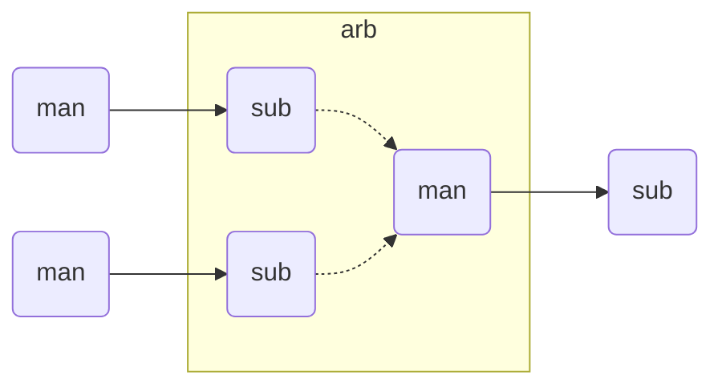
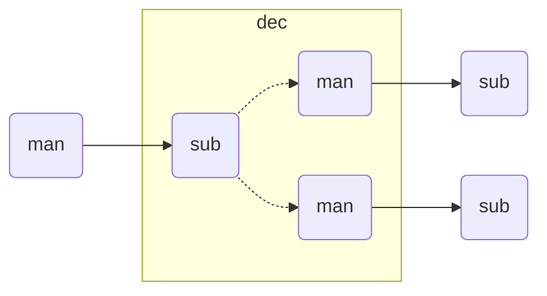
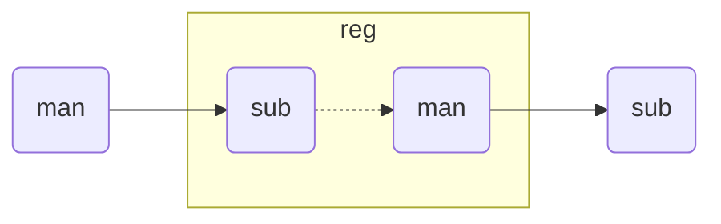
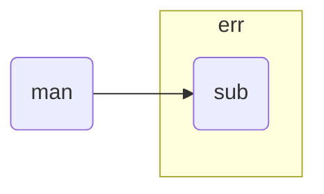
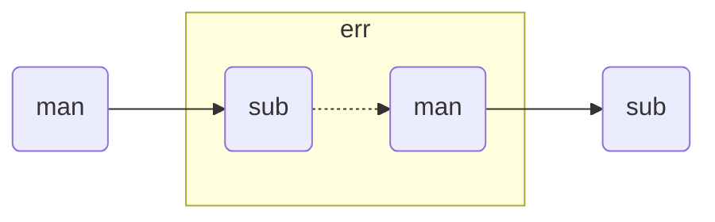

# Tightly Coupled Bus

Tightly Coupled Bus is a simple general purpose system bus based on FPGA/ASIC SRAM memory interfaces.

## Introduction

The idea and name comes from tightly coupled memories,
which require a simple interface to avoid complexity impact on timing and area,
and at the same time the full memory interface throughput must be achievable.
- Tightly Coupled Memory (TCM) used by [ARM](https://www.kernel.org/doc/Documentation/arm/tcm.txt),
  [Codasip](https://codasip.com/), and [Syntacore](https://syntacore.com/),
- Tightly Integrated Memory (TIM) used by [SiFive](https://www.sifive.com/),
- Local Memory (LM) used by [Andes](http://www.andestech.com/en/risc-v-andes/)

A processor native system bus is usually custom designed
to support exactly the features that are present in the processor itself.
This also means there are differences between the protocols
used by instruction fetch and load/store unit.

The TCB protocol is designed to fulfill the shared needs of simple CPU/SoC designs and can be used for:
- CPU instruction fetch interface,
- CPU load/store interface,
- SoC interconnect (crossbar),
- SoC peripheral interface.

The design is based on the following principles:
- Intended for closely coupled memories and caches, and therefore based on synchronous/static memory (SRAM) interfaces.
- Support pipelining for both writes and reads to minimize stalling overhead.
  Meaning the handshake is done during the arbitration phase (explained later).
- Handshake based on the AMBA AXI family of protocols (VALID/READY).
- Low power consumption should be considered by reducing signal toggling and other means.

What it is not intended for:
- It is not optimized for clock domain crossing (CDC), which has a large delay between the start of a request and the response, and the delay has some unpredictability.
- Does not provide out of order access functionality.
- It is not a good fit for managers with a variable pipeline length (variable expected delay) in the load/store unit.

## Terminology

TCB terminology is mostly based on Verilog and AMBA.

| Term | Description |
|------|-------------|
| period | The term _clock period_ is preferred over _clock cycle_ to avoid confusion with _access cycle_ which can be multiple clock periods long. |
| manager | Managers are modules driving requests toward a subordinate and receiving a response from it. This term is equivalent to _master_. |
| subordinate | Subordinates are module receiving requests from a manager and responding to it. This term is equivalent to _slave_. |
| handshake | Exchange of `valid` and `ready` signals during between manager and subordinate. |
| cycle | Or _access cycle_ is one or more clock periods long exchange between a master and a subordinate governed by a valid/ready handshake, and it ends with a transfer. TODO: clarify if the delayed response is also part of the access cycle. |
| transfer | Each access cycle ends in a single clock period long transfer where valid and ready handshake signals are both active. |
| request | The collective value of signals (address, write enable, byte enable, write data) driven by a manager toward a subordinate, while valid is active during an access cycle. |
| response |  TODO: clarify whether a response can be held multiple clock periods. |
| backpressure | A subordinate can delay the transfer by driving the ready signal low. |
| back-to-back | Performing transfers continuously in each clock period, without idling the bus by waiting the for a response before issuing e new request. |
| parameter | Static (compile time) configuration of a HDL/RTL module, `parameter` in Verilog or `generic` in VHDL. |
| quasi-static | Can change at runtime during initialization, bus is static (not changing) during system operation. |
| dynamic | Can change at runtime during system operation. |
| configuration | Peripheral register/field containing configuration information, they are usually quasi-static, never volatile. |
| control | Peripheral register/field used to control system operation at runtime, they are dynamic signals. |
| status | Peripheral register/field used to monitor system operation at runtime, they are volatile signals. |

## Naming conventions

Mostly for aesthetic reasons (vertical alignment) all signal names are
[three-letter abbreviations (TLA)](https://en.wikipedia.org/wiki/Three-letter_acronym).

Suffixes specifying the direction of module ports as input/output (`in`/`out`, `i`/`o`) can be avoided.
Instead the set of signals can have a prefix or is grouped into a SystemVerilog interface.
This set name shall use specifiers like manager/subordinate (`man`/`sub`, `m`/`s`).

## Signals and parameters

### Parameters

#### Signal width parameters

All TCB interfaces have parameters for defining the address and data signal widths.
There are few restrictions on the address width,
sometimes 12-bits, the size of load/store immediate is relevant.
Since TCB was designed with 32-bit CPU/SoC/peripherals in mind,
32-bit is the default data width and 4-bit is the default byte enable width.

| parameter | type | description |
|-----------|------|-------------|
| `AW`      | int unsigned | Address width. |
| `DW`      | int unsigned | Data width. |
| `BW=DW/8` | int unsigned | Byte select width. |

#### Protocol timing parameters

| parameter | type | description |
|-----------|------|-------------|
| `DLY`     | int unsigned | Response delay. |

### System signals

System signals are propagated globally from a system controller
to managers and subordinates.

| signal | description |
|--------|-------------|
| `clk`  | Clock. |
| `rst`  | Reset. |

### Bus signals

The SRAM signal chip select/enable is replaced with the AXI like handshake signal VALID `vld`.
Backpressure is supported by adding the AXI like handshake signal READY `rdy`.

Signals going from manager to subordinate are part of the request,
signals going in the opposite direction are part of the response.

Most signals are designed to directly interface with SRAM ports:
- address `adr`,
- write enable `wen` and byte enable `ben`,
- write data `wdt` and read data `rdt`.
The remaining signals were added to support SoC features:
- handshake signals `vld`/`rdy` are used to implement interconnect arbitration,
- repeat access `rpt` is used to reduce power consumption,
- error response `err` is used to enable clock/power gating support.

| signal | width  | direction      | description |
|--------|--------|----------------|-------------|
| `vld`  | `1`    | `man` -> `sub` | Handshake valid. |
| `wen`  | `1`    | `man` -> `sub` | Write enable. |
| `lck`  | `1`    | `man` -> `sub` | Arbitration lock (optional). |
| `rpt`  | `1`    | `man` -> `sub` | Repeat access (optional). |
| `adr`  | `AW`   | `man` -> `sub` | Address. |
| `ben`  | `DW/8` | `man` -> `sub` | Byte enable/select (optional). |
| `wdt`  | `DW`   | `man` -> `sub` | Write data. |
| `rdt`  | `DW`   | `sub` -> `man` | Read data. |
| `err`  | `1`    | `sub` -> `man` | Error response. |
| `rdy`  | `1`    | `sub` -> `man` | Handshake ready. |

Various implementations can add custom (user defined) signals to either the request or response,
some examples of custom signals would be:
- cache related signals,
- multiple types of error responses.

## Handshake protocol and signal timing

Handshake signals shall follow the basic principles defined for the AXI family of protocols.
- While valid is not active all other signals shall be ignored (`X` in timing/waveform diagrams).
- `vld` must be inactive during reset.
- Once the manager asserts `vld`, it must not remove it till the cycle is completed by an active `rdy` signal.
- The manager must not wait for `rdy` to be asserted before starting a new transfer by asserting `vld`.
- The subordinate can assert/remove the `rdy` signal without restrictions.
- There is no inherent timeout mechanism.
- TODO: clarify `rdy` behavior if part of the system is under reset.

This means once an access cycle is initiated, it must be completed with a transfer.
Since `rdy` can be asserted during reset (`rdy` can be a constant value),
`vld` must not be asserted, since this would indicate transfers while in reset state.
Since the subordinate is allowed to wait for `vld` before asserting `rdy` (no restrictions),
the manager shall not wait for `rdy` before asserting `vld`,
since this could result in a lockup or a combinational loop.

There is no integrated timeout abort mechanism,
although it would be possible to place such functionality
into a module placed between a manager and a subordinate.

### Reset

#### Reset assertion sequence 

A global reset can be asserted at any moment,
as long as it applies to the entire interconnect and all managers/subordinates connected to it.

A correct reset assertion sequence for just part of the system separated into multiple clock/reset domains
is explained later in the section about the bus separator module.

#### Reset release sequence

TODO

#### Reset sequence length

Ideally all devices would require the reset to be active for only a single clock period.
Long (multiple clock periods) reset sequences are sometimes required
so that reset values can propagate through flipflops without reset.
If a device requires a longer active reset, this must be documented.
A global reset shall be applied for the longest sequence required by eny devices in the same domain.
Requiring long active reset sequences just in case should be avoided,
the exact required reset sequence length shall be derived from the RTL.

#### Sequential logic without reset

It is allowed to use reset capable flipflops only for control signals (handshake signals in TCB),
while address, data and other signals use flipflops without a reset for example to reduce ASIC area.
While this approach does not affect functionality,
it affects reproducibility of power consumption tests.

### Access cycles

Read/write transfer cycles are shown with common response delays (parameter `DLY`) of 0, 1 and 2 clock periods.
- `DLY=0` is the case with a combinational response to a request.
  This can be used in case multiple simple subordinates are combined into an interconnect segment.
  Such a segment can then be combined with a TCB register `tcb_reg`
  to break long timing paths at either the request path, response path or both to improve timing.
  Such collections can be used to achieve better area timing compromises,
  compared to using subordinates with integrated registers.
- `DLY=1` is the most common delay for subordinates with SRAM as an example.
- `DLY=2` is the case where a single subordinate or a segment of the interconnect with `DLY=1`
  would have an extra register added to the request path (address decoder)
  or response path (read data multiplexer) to improve timing.

#### Write transfer

A write transfer is performed when both handshake signals `vld` and `rdy` are simultaneously active
and the write enable signal `wen` is also active.

Only bytes with an active corresponding byte enable bit in `ben` are written.
The other bytes can be optimized to unchanged value, zeros or just undefined,
depending what brings the preferred optimization for area timing, power consumption, ...
The same optimization principle can be applied to all signals when valid is not active.

There are no special pipelining considerations for write transfers,
all signals shall be propagated through a pipeline,
similar to a single direction data stream

The base protocol does not have a mechanism for confirming
write transfers reached their destination and were successfully applied.

### Read transfer

A read transfer is performed when both handshake signals `vld` and `rdy` are simultaneously active
and the write enable signal `wen` is not active.

The handshake is done during the arbitration phase, it is primarily
about whether the address `adr` from the manager can reach the subordinate.

Read data is available on `rdt` after a fixed delay of 1 clock cycle from the transfer.

#### Repeat access transfer

TODO: think this through.

The basic idea behind the repeat access transfer
is to avoid repeated reads from the same SRAM address.
During a pipeline stall the CPU instruction fetch interface
must remember the instruction by keeping it in a fetch register.
A fetch register affects area and timing (admittedly not very much).

The fetch register can be avoided by repeating the instruction read from the SRAM.
This redundant read can be avoided by taking advantage of SRAM functionality,
where the last data read remains available on the read data port
till the next read or a power cycle.

The repeat access signal `rpt` is intended to tell the SRAM
to not perform another read from the same address.
The interconnect would propagate the `rpt` as active only in case

## Reference implementation

The reference implementation is written in SystemVerilog.

### RTL components

#### Interface

#### Arbiter

#### Decoder

#### Register

#### Error

The error subordinate module `tcb_err` is used to close unused leaf interconnect manager ports.
The most common use case would be to replace a peripheral device disabled with a parameter.

It will provide an error response to any request.
It does not add backpressure.

#### Passthrough

#### Write buffer

#### Decoupler

#### Read hold

#### Prefetch

### Testbench components

NOTE: The testbench code is in an Alpha state.
The aim is for a fully UVM compatible implementation.
The current code just barely covers the documented functionality.

#### Manager

#### Subordinate

## RTL design recommendations

### Parameter validation

### Handling of reset transitions

### Peripherals

The reference TCB implementation is written in SystemVerilog,
therefore this document discusses Verilog parameters.
The VHDL equivalent would be generics,
and other HDL languages also have constructs with equivalent functionality.

| parameter     | type           | default | description |
|---------------|----------------|---------|-------------|
| `DLY`         | `int unsigned` | `'d1`   | Read delay. |
| `CFG_REQ_REG` | `bit`          | `1'b0`  | Configuration: enable REQest REGister. |
| `CFG_RSP_REG` | `bit`          | `1'b1`  | Configuration: enable ReSPonse REGister. |
| `CFG_ENR_CFG` | `bit`          | `1'b1`  | Configuration: ENable Read access to ConFiGuration registers. |

If both address and 

The [GPIO controller](GPIO.md) is a good example how this parameters can be used
to provide the desired area/timing optimizations for a specific design.

In the default configuration read/write data paths behave as follows:
- In the write path the address is not registered and the decoder delay falls on the request side.
- In the read path the address is not registered and the decoder delay falls on the request side.
  Since the read data bus is registered, there is no decoder delay at the response side.
- Since read access to configuration registers is enabled, it affects the timing on the request side.

## Limitations and undefined features

There are some generalizations and additional features that can be implemented,
but were not researched well enough to be fully defined.

### Data output hold

SRAM usually holds the data output from the last read request,
till a new request is processed.
In a similar fashion, the entire bus could hold the last read value,
this means read data multiplexers in decoder modules have to hold.
The held data can be lost if a subordinate is accessed by another manager.

Read data hold can be useful during CPU stalls.
Either there is no need to repeat a read or a temporary buffer
for read data can be avoided.

### Out of order transfers

Out of order reads are not supported.

### Generalized read delay

The delay of 0 would be an asynchronous read,
a delay of 1 is equal to a common SRAM read cycle,
longer delays can be caused by registers in the system bus interconnect.

### Integration with standard system busses

It is possible to translate between the processor native system bus and
standard system busses like APB, AHB, AXI4-Lite, Wishbone, ...

Such translation could compromise the performance,
so it might make sense to implement a standard bus interface unit (BIU)
separately inside the processor core,
instead of attaching translators to the optimized native bus.

### Write confirmation

Write confirmation could be returned with the same timing as read data.

In case the native system bus is only used for the intend purpose
of connecting tightly coupled memories, writes can be assumed to always succeed.

Write through cache access was not yet researched.

### Atomic access

TODO, on some implementations it might be possible
to simultaneously perform both read and write.