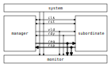

# Tightly Coupled Bus

Tightly Coupled Bus is a simple general purpose system bus based on FPGA/ASIC SRAM memory interfaces.

## Introduction

The idea and name comes from tightly coupled memories,
which require a simple interface to avoid complexity impact on timing and area,
and at the same time the full memory interface throughput must be achievable.

This are few alternative naming for tightly coupled memories:
- Tightly Coupled Memory (TCM) used by [ARM](https://www.kernel.org/doc/Documentation/arm/tcm.txt),
  [Codasip](https://codasip.com/), and [Syntacore](https://syntacore.com/),
- Tightly Integrated Memory (TIM) used by [SiFive](https://www.sifive.com/),
- Local Memory (LM) used by [Andes](http://www.andestech.com/en/risc-v-andes/)

A processor native system bus is usually custom designed
to support exactly the features that are present in the processor itself.
This also means there are differences between the protocols
used by instruction fetch and load/store unit.

The TCB protocol is designed to fulfill the shared needs of simple CPU/SoC designs and can be used for:
- CPU instruction fetch interface,
- CPU/DMA load/store interface,
- simple cache hierarchies,
- SoC interconnect (crossbar),
- SoC peripheral interface.

The design is based on the following principles:
- Intended for closely coupled memories and caches,
  and therefore based on synchronous/static memory (SRAM) interfaces.
- Minimize latency and maximize throughput.
- Support pipelining for both writes and reads to minimize stalling overhead.
  Meaning the handshake is done during the arbitration phase (explained later).
- Handshake based on the AMBA AXI family of protocols (VALID/READY).
- Low power consumption should be considered by reducing signal toggling and other means.
- Choice of common (half-duplex) or independent (full-duplex) read/write channels,
  allowing additional trade-off between throughput and complexity.

What it is not intended for:
- It is not optimized for clock domain crossing (CDC), which has a large delay (latency)
  between the start of a request and the response, and the delay has some unpredictability.
- Does not provide out of order access functionality.
- It is not a good fit for managers with a variable pipeline delay in the load/store unit.

## Terminology

TCB terminology and syntax is mostly based on:
- AMBA AXI family of protocols,
- Verilog/SystemVerilog HDL language.

### Interconnect terms

| module      | short | description |
|-------------|-------|-------------|
| manager     | `man` | Managers are modules driving requests toward a subordinate and receiving a response from it. This term is equivalent to _master_. |
| subordinate | `sub` | Subordinates are module receiving requests from a manager and responding to it. This term is equivalent to _slave_. |
| monitor     | `mon` | Monitors do not drive any protocol signals, they only observe them for error checking, statistics and logging. |

### Transfer level terms (protocol timing)

| term         | description |
|--------------|-------------|
| clock period | The term _clock period_ is preferred over _clock cycle_ to avoid confusion with _access cycle_ which can be multiple clock periods long. |
| handshake    | Exchange of `valid` and `ready` signals during between manager and subordinate. |
| cycle        | A _request cycle_ is one or more clock periods long exchange between a master and a subordinate governed by a valid/ready handshake, and it ends with a transfer. A _response cycle_ starts `DLY` clock periods after the request cycle and has the same length. |
| transfer     | Each access cycle ends in a single clock period long transfer when valid and ready handshake signals are both active. |
| request      | The collective value of signals (address, write enable, byte enable, write data) driven by a manager, while valid is active during an access cycle. And sampled by a subordinate during a transfer. |
| response     | In the current protocol version, a response is a single clock period delayed by a fixed number of clock periods from each transfer, in it read data and error status are driven by a subordinate and sampled by a manager. Future versions of the protocol might have responses encompassing multiple clock periods. |
| backpressure | A subordinate can delay the transfer by driving the ready signal low. |
| back-to-back | Performing transfers continuously in each clock period, without idling the bus by waiting the for a response before issuing e new request. |

### Transaction level terms

A transaction is the atomic exchange of a desired data length requiring one or more transfers.
The following words can be used to describe a transaction. 
**TODO: check for a TLM definition.**

| descriptor | description |
|------------|-------------|
| write      | Used for CPU store operations. |
| read       | Used for CPU load operations. |
| aligned    | Address and transaction size or byte enable signals follow CPU ISA alignment rules. |
| misaligned | A misaligned transaction can be a single misaligned transfer or be split into multiple aligned transfers. |
| split      | A transaction with a size exceeding the data bus width can be split into multiple transfers. |
| atomic     | In addition to CPU ISA atomic instructions, atomicity is desired in split transactions. |
| burst      | Bursts are intended for communication between cache levels and high latency memories. |

While the bus width and transaction sizes are not limited to a finite set,
the the following transaction sizes also have names.

| size   | description |
|--------|-------------|
| byte   |   8-bit wide data. |
| half   |  16-bit wide data. |
| word   |  32-bit wide data. |
| double |  64-bit wide data. |
| long   | 128-bit wide data. |

### Peripheral driver terms

_Parameters_ are used in HDL code.
Terms _quasi-static_, _dynamic_ and _volatile_ are used to describe properties of
_configuration_, _control_ and _status_ registers of a peripheral.

| term          | Description |
|---------------|-------------|
| parameter     | Static (compile time) configuration of a HDL/RTL module, `parameter` in Verilog or `generic` in VHDL. |
| quasi-static  | Can be driven at runtime during initialization, but is static (not changing) during system operation. |
| dynamic       | Can be driven at runtime during system operation, is expected to change. |
| volatile      | Can change at runtime during system operation. |
| configuration | Peripheral register/field containing configuration information, they are usually quasi-static, never volatile. |
| control       | Peripheral register/field used to control system operation at runtime, they are dynamic signals. |
| status        | Peripheral register/field used to monitor system operation at runtime, they are volatile signals. |

### Acronyms

| acronym | definition |
|---------|------------|
| TCB     | Tightly Coupled Bus |
| CRW     | Common Read/Write channel |
| IRW     | Independent Read/Write channels |
| RDC     | ReaD Channel |
| WRC     | WRite Channel |
| BFM     | [Bus Functional Model](https://en.wikipedia.org/wiki/Bus_functional_model) |
| TLM     | [Transaction-level modeling](https://en.wikipedia.org/wiki/Transaction-level_modeling) |
| LSB     | [Least Significant Bit/Byte](https://en.wikipedia.org/wiki/Bit_numbering) |
| MSB     | [Most Significant Bit/Byte](https://en.wikipedia.org/wiki/Bit_numbering) |

### Naming conventions

Mostly for aesthetic reasons (vertical alignment) all signal and names are
[three-letter abbreviations (TLA)](https://en.wikipedia.org/wiki/Three-letter_acronym).

Suffixes specifying the direction of module ports as input/output (`in`/`out`, `i`/`o`) can be avoided.
Instead signals can be organized into sets with a prefix or are grouped into a SystemVerilog interface.
Set names shall use specifiers like manager/subordinate (`man`/`sub`) or request/response (`req`/`rsp`).

## Base protocol

The TCB protocol base is comprised of a valid/ready handshake for the request
and a parameterized fixed delay (integer number of clock periods) for the response.
Special considerations should be made for signal values during reset
and reset release and assertion.

### System signals clock and reset

System signals are propagated globally from a system controller
to managers and subordinates.
Implementations with separate clock/reset/power domains can have
multiple independent system signal sets.

| signal | description |
|--------|-------------|
| `clk`  | Clock (active on rising edge). |
| `rst`  | Reset (active high) can be synchronous or asynchronous depending on implementation. |

TODO: define power domain functionality.

### Handshake amd request/response signal sets

The manager initiates a request with the handshake signal `vld` (valid).
Backpressure from the subordinate is supported by the handshake signal `rdy` (ready).

If no backpressure conditions are possible, the `rdy` signal can be omitted,
and the manager shall interpret it as always being active (`rdy==1'b1`).

NOTE: The handshake signals intentionally use names from the AMBA AXI family of protocols,
      since the handshake is governed by compatible (equivalent) rules.
      Otherwise the TCB protocol bears no relation to AMBA.

| signal | direction      | description |
|--------|----------------|-------------|
| `vld`  | `man` -> `sub` | Handshake valid. |
| `rdy`  | `sub` -> `man` | Handshake ready (can be omitted if there is no backpressure). |

Signals going from manager to subordinate are part of the request set,
signals going in the opposite direction are part of the response set.
This signal sets are used to provide transaction type details, addressing and data.

| signal | direction      | description |
|--------|----------------|-------------|
| `req`  | `man` -> `sub` | Request set. |
| `rsp`  | `sub` -> `man` | Response set. |

While the handshake defines the request transfer,
the response is always provided `DLY` clock periods after the handshake transfer.

| parameter | type           | description |
|-----------|----------------|-------------|
| `DLY`     | `int unsigned` | Response delay. |

### Handshake rules

Handshake signals shall follow the same basic principles as defined for the AMBA AXI family of protocols:
- `vld` shell be inactive during reset.
- While valid is not active all other signals shall be ignored (`X` in timing/waveform diagrams).
- Once the manager asserts `vld`, it must not remove it till the cycle is completed by an active `rdy` signal.
- The manager must not wait for `rdy` to be asserted before starting a new cycle by asserting `vld`.
- The subordinate can assert/remove the `rdy` signal without restrictions.
- There is no inherent timeout mechanism.
- TODO: clarify `rdy` behavior if only part of the system is under reset.

This means once a request cycle is initiated, it must be completed with a transfer.
Since `rdy` can be asserted during reset (`rdy` can be a constant value),
`vld` must not be asserted, since this would indicate transfers while in reset state.
Since the subordinate is allowed to wait for `vld` before asserting `rdy` (no restrictions),
the manager shall not wait for `rdy` before asserting `vld`,
since this could result in a lockup or a combinational loop.

There is no integrated timeout abort mechanism,
although it would be possible to place such functionality
into a module placed between a manager and a subordinate.
The required additional complexity is not discussed in this document.

### Transfer and request/response sequence

The manager shall drive a valid _request signal set_ `req` while the `vld` handshake signal is active.
The subordinate shell sample the _request signal set_ `req` at the rising clock edge while
both `vld` and `rdy` handshake signals are active indicating a transfer `trn` (local signal).

When the delay parameter is zero (`DLY=0`),
the subordinate shall provide the response `rsp` combinationally
in the same clock period as the transfer `trn` is active.
When the delay parameter is greater then zero (`DLY>0`),
the subordinate shall provide the response `rsp` sequentially
in `DLY` clock periods after the transfer `trn` is active.

### Reset release and assertion sequences

A global reset can be asserted at any moment,
as long as it applies to the entire interconnect and all managers/subordinates connected to it.

A correct reset assertion sequence for just part of the system
separated into multiple clock/reset/power domains
is explained separately in the reference interconnect library documentation.

The handshake valid `vld` must be inactive during reset.
After the reset signal `rst` is released there must be
at least one clock period before `vld` can be asserted.
The handshake ready signal can be active or inactive during reset,
but it is not allowed to toggle.
After the reset signal `rst` is released there must be
at least one clock period before `rdy` can toggle.
 
This timing is based on the assumption that reset is not used as a normal combinational signal.
In this case the `vld` signal depends on a register toggling after reset is released,
and this can only happen with the described timing.
The same explanation stands for `rdy` if it is not a constant value.

#### Reset sequence length

Ideally all devices would require the reset to be active for only a single clock period.
Long (multiple clock periods) reset sequences are sometimes required
so that reset values can propagate through flipflops without reset.
If a device requires a longer active reset, this must be documented.
A global reset shall be applied for the longest sequence required by eny devices in the same domain.
Requiring long active reset sequences just in case should be avoided,
the exact required reset sequence length shall be derived from the RTL.

#### Sequential logic without reset

It is allowed to use reset capable flipflops only for control signals (handshake signals in TCB),
while address, data and other signals use flipflops without a reset for example to reduce ASIC area.
While this approach does not affect functionality,
it affects reproducibility of power consumption tests.
It might also have some effect on the viability of side channel attacks.

## Memory mapped access protocol

For the protocol to support memories and memory mapped peripherals,
the request and response signal sets must be further defined
to contain the read/write control signal, the address, byte enable,
read/write data busses, and various optional extensions.

### Parameters

All TCB interfaces are parameterized.
In addition to the base protocol parameter `DLY` there are parameters for:
- defining the address/data/... signal widths,
- defining how data bytes are packed into the data bus.

#### Signal width parameters

| parameter | default          | type           | description |
|-----------|------------------|----------------|-------------|
| `PHY.SLW` | `8`              | `int unsigned` | Selection width (in most cases it should be 8, the size of a byte). |
| `PHY.ABW` | `32`             | `int unsigned` | Address bus width. |
| `PHY.DBW` | `32`             | `int unsigned` | Data bus width. |
| `PHY.ALW` | `clog2(DBW/SLW)` | `int unsigned` | Alignment width, number of least significant address bits which are zero. |
| `PHY_BEW` | `DBW/SLW`        | `int unsigned` | Byte enable width is the number of selection width units fitting into the data width. |

The selection width parameter `SLW` defines the number of bits in a byte,
for all standard use cases this defaults to 8.
TODO: research use cases where `SLW` is not the default.

There are few restrictions on the address bus width `ABW`.
Sometimes the size of the RISC-V load/store immediate (12-bit) is relevant.
Similarly ARM defines a 12-bit memory management page size.

Since TCB was designed with 32-bit CPU/SoC/peripherals in mind,
32-bit is the default data bus width `DBW` and 4-bit is the default byte enable width `BEW`.
Byte enable width `BEW` is a calculated local parameter,
it should not passed across module hierarchy.

Alignment width `ALW` defines what kind of data alignments are supported.
The values can be between `0` (no alignment requirements)
and `clog2(BEW)` (full alignment is required).
Values in between can be used for custom implementations.

#### Data packing parameters

Data packing parameters are listed here without details,
which are provided further in the document.

| parameter | default           | type              | description |
|-----------|-------------------|-------------------|-------------|
| `PHY.SIZ` | `TCB_LOGARITHMIC` | `tcb_par_size_t`  | Transfer size encoding, logarithmic or linear. |
| `PHY.MOD` | `TCB_REFERENCE`   | `tcb_par_mode_t`  | Byte/half/word/double/quad position inside data bus vector. |
| `PHY.ORD` | `TCB_DESCENDING`  | `tcb_par_order_t` | Byte order, ascending or descending. |

#### Custom extension signal type parameters

Data types for custom extension signals are listed here without details.
Further in the document there are definitions for some standard configurations.

| parameter       | description |
|-----------------|-------------|
| `tcb_req_cmd_t` | Custom request command signal `cmd` type. |
| `tcb_rsp_sts_t` | Custom response status signal `sts` type. |

### Signals

Most signals are designed to directly interface with SRAM (synchronous static RAM) ports:
- address `adr`,
- write enable `wen` and byte enable `ben`,
- write data `wdt` and read data `rdt`.

| signal    | width  | description |
|-----------|--------|-------------|
| `req.cmd` | custom | Custom request command protocol extensions. |
| `req.ndn` | `1`    | Read/write data endianness. |
| `req.wen` | `1`    | Write enable (can be omitted for read only devices). |
| `req.adr` | `ABW`  | Address. |
| `req.ben` | `BEW`  | Byte enable/select (can be omitted if only full width transfers are allowed). |
| `req.wdt` | `DBW`  | Write data (can be omitted for read only devices). |
| `rsp.rdt` | `DBW`  | Read data. |
| `rsp.sts` | custom | Custom response status protocol extensions, provides error responses... |

While data endianness `ndn` is not a SRAM interface signal,
it is a dynamic property of each data transfer
and therefore a standard signal and not a parameter.

#### Optional signal subsets and defaults

Custom implementations can use a subset of the full signal list.
Some rules are provided for handling the missing signals.

ROM would be an example of a device which only requires the read data bus.
When constructing subsets, please consider other protocols (AXI-Stream, ...) which might be more appropriate.

To connect a managers and a subordinates with a differing set of optional signals,
an adapter is needed which would provide:
- a default for outputs and
- a handler for inputs.
The output default shall be chosen to match the protocol subset.
(`wen=1'b0` and `wdt=DBW'bx` for ROM).
The input handler can either ignore the signal or cause an error condition.
Default output values can always be ignored by an input handler, or simply no handler is needed.

The following table defines some defaults and handlers.

| usecase      | signal    | default  | handler |
|--------------|-----------|----------|---------|
| ROM          | `req.wen` |   `1'b0` | Respond with error on write access to subordinate without write support. |
| ROM          | `req.wdt` | `DBW'bx` | Can be ignored, `wen` requires handling. |
| peripheral   | `req.ben` | `BEW'b1` | Access with less than the full width shall trigger an error. |
| interconnect | `rsp.sts` |    `'b0` | Can be ignored, if no error conditions are possible, otherwise requires and external handler (watchdog, ...). |

#### Standard and custom protocol extension signals

| signal        | width | description |
|---------------|-------|-------------|
| `req.cmd.lck` | `1`   | Arbitration lock. |
| `req.cmd.rpt` | `1`   | Repeat access. |
| `req.cmd.inc` | `1`   | Incrementing address access. |

| signal        | width | usage    | description |
|---------------|-------|----------|-------------|
| `rsp.sts.err` | `1`   | optional | Error response (can be omitted if there are no error conditions). |

The remaining signals were added to support SoC features:
- arbitration lock `lck` is used to implement interference with atomic accesses,
- repeat access `rpt` is used to reduce power consumption on repeated read accesses to the same address,
- incrementing address access `inc` is used to tell prefetch mechanisms whether the address is the expected one,
- error response `err` is used to enable clock/power gating support.

| signal        | default  | handler |
|---------------|----------|---------|
| `req.cmd.lck` |   `1'b0` | If another manager can access the same segment, respond with error, otherwise ignore. |
| `req.cmd.rpt` |   `1'b0` | Subordinates can ignore it. |
| `req.cmd.inc` |   `1'b0` | Subordinates can ignore it. |

Various implementations can add custom (user defined) signals to either the request or response,
some examples of custom signals would be:
- cache related signals,
- burst support,
- quality of service signals,
- multiple types of error responses,
- ...

### Access cycles

Read/write transfer cycles are shown with common response delays (parameter `DLY`) of 0, 1 and 2 clock periods.
- `DLY=0` is the case with a combinational response to a request.
  This can be used in case multiple simple subordinates are combined into an interconnect segment.
  Such a segment can then be combined with a TCB register `tcb_reg`
  to break long timing paths at either the request path, response path or both to improve timing.
  Such collections can be used to achieve better area timing compromises,
  compared to using subordinates with integrated registers.
- `DLY=1` is the most common delay for subordinates with SRAM as an example, this is also the **HDL default**.
- `DLY=2` is the case where a single subordinate or a segment of the interconnect with `DLY=1`
  would have an extra register added to the request path (address decoder)
  or response path (read data multiplexer) to improve timing.

#### Write transfer

A write transfer is performed when both handshake signals `vld` and `rdy` are simultaneously active
and the write enable signal `wen` is also active.

Only bytes with an active corresponding byte enable bit in `ben` are written.
The other bytes can be optimized to unchanged value, zeros or just undefined,
depending what brings the preferred optimization for area timing, power consumption, ...
The same optimization principle can be applied to all signals when valid is not active.

There are no special pipelining considerations for write transfers,
all signals shall be propagated through a pipeline,
similar to a single direction data stream

The base protocol does not have a mechanism for confirming
write transfers reached their destination and were successfully applied.

##### Write data byte enable

#### Read transfer

A read transfer is performed when both handshake signals `vld` and `rdy` are simultaneously active
and the write enable signal `wen` is not active.

The handshake is done during the arbitration phase, it is primarily
about whether the address `adr` from the manager can reach the subordinate.

Read data is available on `rdt` after a fixed delay of 1 clock cycle from the transfer.

**NOTE**: in contrast to most interconnect standards,
TCB specifies the use of byte enable signals `ben` to
enable or disable read from each byte.

##### Read data byte enable

##### Repeat access transfer

TODO: think this through.

The basic idea behind the repeat access transfer
is to avoid repeated reads from the same SRAM address.
During a pipeline stall the CPU instruction fetch interface
must remember the instruction by keeping it in a fetch register.
A fetch register affects area and timing (admittedly not very much).

The fetch register can be avoided by repeating the instruction read from the SRAM.
This redundant read can be avoided by taking advantage of SRAM functionality,
where the last data read remains available on the read data port
till the next read or a power cycle.

The repeat access signal `rpt` is intended to tell the SRAM
to not perform another read from the same address.
The interconnect would propagate the `rpt` as active only in case

#### Arbitration locking mechanism

Arbitration locking is used in the TCB reference implementation library to:
- Keep atomicity in data bus width conversion from a wider manager to a narrower subordinate.
  For example an atomic 64-bit read/write access over a 32-bit interconnect.
- Keep atomicity while converting a misaligned access into multiple aligned accesses.

It can also be used for read modify write, and similar operations and for QoS control.

### Endianness and data alignment

| `MOD`       | `ORD`        | `ALW`       | `ndn`   | desctiption |
|-------------|--------------|-------------|---------|-------------|
| `REFERENCE` | `DESCENDING` | any         | ignored | Packing used by CPU registers. |
| `REFERENCE` | `ASCENDING`  | any         | ignored | Not used. |
| `MEMORY`    | `DESCENDING` | `UNALIGNED` | both    | RISC-V memory model with misaligned access support. |
| `MEMORY`    | `DESCENDING` | `ALIGNED`   | both    | RISC-V memory model with only aligned accesses supported. |
| `MEMORY`    | `ASCENDING`  | `UNALIGNED` | both    | Not used. |
| `MEMORY`    | `ASCENDING`  | `ALIGNED`   | both    | OpenPOWER storage operands. |

The following table defines when an access is aligned depending on
data transfer size and byte address LSB bits.

| transfer size  | condition               |
|----------------|-------------------------|
| byte   (8-bit) | none                    |
| half  (16-bit) | `$clog2(adr[0:0]) == 0` |
| word  (32-bit) | `$clog2(adr[1:0]) == 0` |
| dble  (64-bit) | `$clog2(adr[2:0]) == 0` |
| quad (128-bit) | `$clog2(adr[2:0]) == 0` |

The protocol endianness can be either:
- endianness agnostic, only supporting aligned transfers,
- little endian,
- big endian,
- a special case is defined for RISC-V instruction fetch of compressed instructions.

#### Endianness agnostic (aligned)

The TCB protocol can be endianness agnostic,
as long as the address is aligned to the data width.

In this mode, address LSB bits `adr[$clog2(BEW)-1:0]` are
undefined while driven by a manager and ignored while sampled by a subordinate.
For consistency they should still be part of the address vector.

The manager encodes the address of data transfers smaller than
the full data bus width (`DBW`) using only byte enable (`BEN`).
The mapping of aligned accesses for little/big endian managers
is shown in the following chapters.

#### Little endian (any alignment)

| size | `adr[1:0]` | alignment  | `ben[3:0]` | `wdt[31:00]`/`rdt[31:00]` |
|------|------------|------------|------------|---------------------------|
| byte | `2'd0`     |    aligned | `4'b0001`  | `{  8'bXX,   8'bXX,   8'bXX, [07:00]}` |
| byte | `2'd1`     |    aligned | `4'b0010`  | `{  8'bXX,   8'bXX, [07:00],   8'bXX}` |
| byte | `2'd2`     |    aligned | `4'b0100`  | `{  8'bXX, [07:00],   8'bXX,   8'bXX}` |
| byte | `2'd3`     |    aligned | `4'b1000`  | `{[07:00],   8'bXX,   8'bXX,   8'bXX}` |
| half | `2'd0`     |    aligned | `4'b0011`  | `{  8'bXX,   8'bXX, [15:08], [07:00]}` |
| half | `2'd1`     | misaligned | `4'b0110`  | `{  8'bXX, [15:08], [07:00],   8'bXX}` |
| half | `2'd2`     |    aligned | `4'b1100`  | `{[15:08], [07:00],   8'bXX,   8'bXX}` |
| half | `2'd3`     | misaligned | `4'b1001`  | `{[07:00],   8'bXX,   8'bXX, [15:08]}` |
| word | `2'd0`     |    aligned | `4'b1111`  | `{[31:24], [23:16], [15:08], [07:00]}` |
| word | `2'd1`     | misaligned | `4'b1111`  | `{[23:16], [15:08], [07:00], [31:24]}` |
| word | `2'd2`     | misaligned | `4'b1111`  | `{[15:08], [07:00], [31:24], [23:16]}` |
| word | `2'd3`     | misaligned | `4'b1111`  | `{[07:00], [31:24], [23:16], [15:08]}` |

#### Big endian (any allignment)

| size | `adr[1:0]` | alignment  | `ben[0:3]` | `wdt[00:31]`/`rdt[00:31]` |
|------|------------|------------|------------|---------------------------|
| byte | `2'd0`     |    aligned | `4'b1000`  | `{[00:07],   8'bXX,   8'bXX,   8'bXX}` |
| byte | `2'd1`     |    aligned | `4'b0100`  | `{  8'bXX, [00:07],   8'bXX,   8'bXX}` |
| byte | `2'd2`     |    aligned | `4'b0010`  | `{  8'bXX,   8'bXX, [00:07],   8'bXX}` |
| byte | `2'd3`     |    aligned | `4'b0001`  | `{  8'bXX,   8'bXX,   8'bXX, [00:07]}` |
| half | `2'd0`     |    aligned | `4'b1100`  | `{[00:07], [08:15],   8'bXX,   8'bXX}` |
| half | `2'd1`     | misaligned | `4'b0110`  | `{  8'bXX, [00:07], [08:15],   8'bXX}` |
| half | `2'd2`     |    aligned | `4'b0011`  | `{  8'bXX,   8'bXX, [00:07], [08:15]}` |
| half | `2'd3`     | misaligned | `4'b1001`  | `{[08:15],   8'bXX,   8'bXX, [00:07]}` |
| word | `2'd0`     |    aligned | `4'b1111`  | `{[00:07], [08:15], [16:23], [24:31]}` |
| word | `2'd1`     | misaligned | `4'b1111`  | `{[24:31], [00:07], [08:15], [16:23]}` |
| word | `2'd2`     | misaligned | `4'b1111`  | `{[16:23], [24:31], [00:07], [08:15]}` |
| word | `2'd3`     | misaligned | `4'b1111`  | `{[08:15], [16:23], [24:31], [00:07]}` |

#### Misalignment handler

Two different implementations
1. Performs 2 accesses and stitches them together, optionally caches one or more unused parts of previous accesses.
2. Splits the bus into narrower busses, and increments the address.

### Signal timing

While timing is not strictly part of the protocol,
following recommendations allows for optimizing the compromise
between high clock speed and low latency.

https://gf180mcu-pdk.readthedocs.io/en/latest/IPs/SRAM/gf180mcu_fd_ip_sram/cells/gf180mcu_fd_ip_sram__sram512x8m8wm1/gf180mcu_fd_ip_sram__sram512x8m8wm1.html

## Limitations and undefined features

There are some generalizations and additional features that can be implemented,
but were not researched well enough to be fully defined.

### Data output hold

SRAM usually holds the data output from the last read request,
till a new request is processed.
In a similar fashion, the entire bus could hold the last read value,
this means read data multiplexers in decoder modules have to hold.
The held data can be lost if a subordinate is accessed by another manager.

Read data hold can be useful during CPU stalls.
Either there is no need to repeat a read or a temporary buffer
for read data can be avoided.

### Out of order transfers

Out of order reads are not supported.

### Generalized read delay

The delay of 0 would be an asynchronous read,
a delay of 1 is equal to a common SRAM read cycle,
longer delays can be caused by registers in the system bus interconnect.

### Integration with standard system busses

It is possible to translate between the processor native system bus and
standard system busses like APB, AHB, AXI4-Lite, Wishbone, ...

Such translation could compromise the performance,
so it might make sense to implement a standard bus interface unit (BIU)
separately inside the processor core,
instead of attaching translators to the optimized native bus.

### Write confirmation

Write confirmation is returned with the same timing as read data.

In case the native system bus is only used for the intend purpose
of connecting tightly coupled memories, writes can be assumed to always succeed.

Write through cache access was not yet researched.

### Atomic access

TODO, on some implementations it might be possible
to simultaneously perform both read and write.