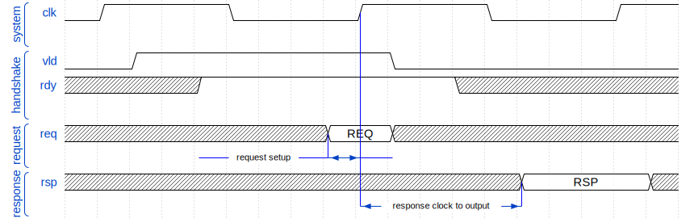
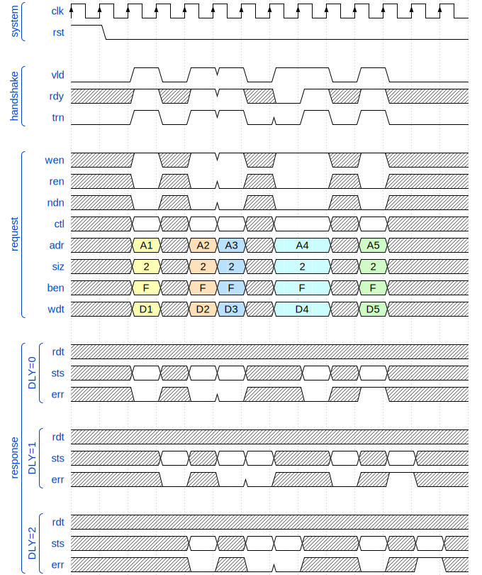
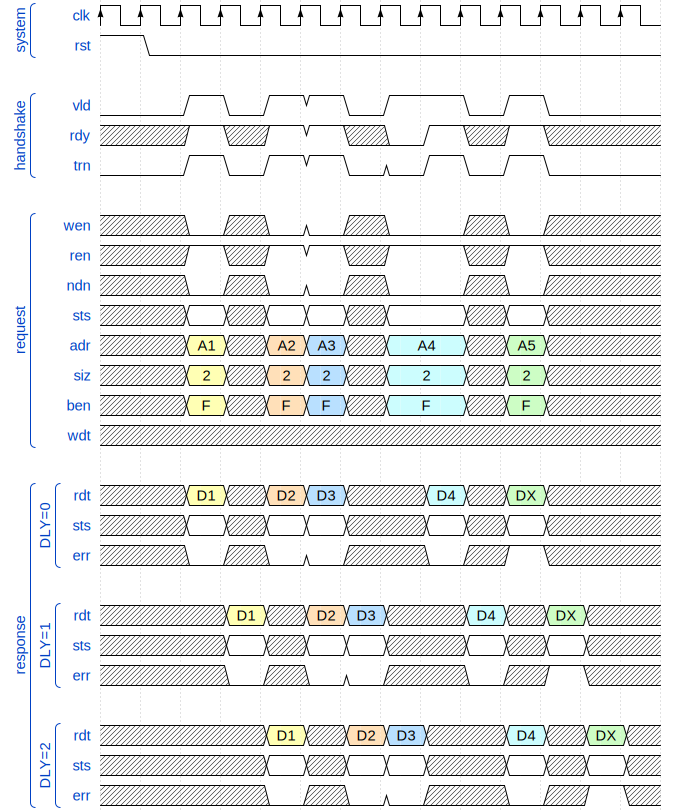
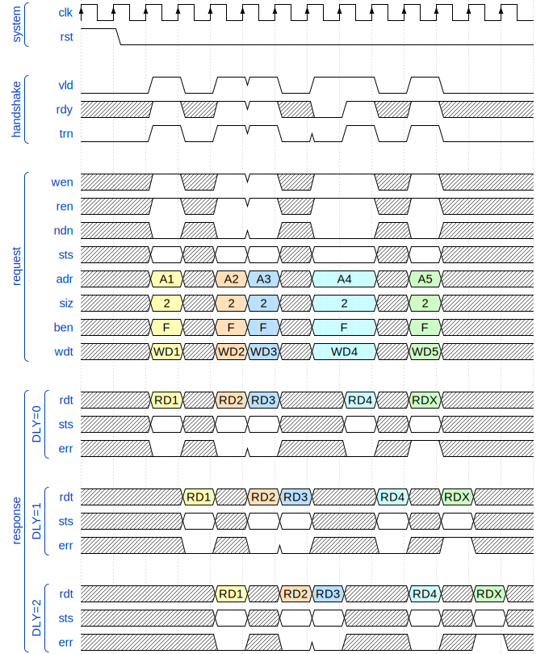

= TCB-Lite (Tightly Coupled Bus Lite)
:toc:
:toclevels: 5

Tightly Coupled Bus Lite is a simple general purpose system bus based on FPGA/ASIC SRAM memory interfaces.

== Introduction

The idea and name comes from tightly coupled memories,
which require a simple interface to avoid complexity impact on timing and area,
and at the same time the full memory interface throughput must be achievable.

This are few alternative naming for tightly coupled memories:

* Tightly Coupled Memory (TCM) used by https://www.kernel.org/doc/Documentation/arm/tcm.txt[ARM],
  https://codasip.com/[Codasip], and https://syntacore.com/[Syntacore],
* https://github.com/chipsalliance/Cores-VeeR-EL2/blob/main/docs/RISC-V_VeeR_EL2_PRM.pdf[Closely Coupled Memory (CCM)] used by https://www.chipsalliance.org/[CHIPS Alliance]
* Tightly Integrated Memory (TIM) used by https://www.sifive.com/[SiFive],
* Local Memory (LM) used by http://www.andestech.com/en/risc-v-andes/[Andes]

A processor native system bus is usually custom designed
to support exactly the features that are present in the processor itself.
This also means there are differences between the protocols
used by instruction fetch and load/store units.

The TCB-Lite protocol is designed to fulfill the shared needs of simple CPU/SoC designs and can be used for:

* CPU instruction fetch interface,
* CPU/DMA load/store interface,
* simple cache hierarchies,
* SoC interconnect (crossbar),
* SoC peripheral interface.

The design is based on the following principles:

* Intended for closely coupled memories and caches,
  and therefore based on synchronous/static memory (SRAM) interfaces.
* Minimize latency and maximize throughput.
* Support pipelining for both writes and reads to minimize stalling overhead.
  Meaning the handshake is done during the arbitration phase (explained later).
  Support back to back transfers regardless of transfer type.
* Standard handshake based on the AMBA AXI family of protocols (VALID/READY).
* Minimizing the control logic complexity by using ony a pair of handshake signals
  to fully define the timing of both request and response.
  NOTE: future versions might further restrict the behavior of the response
  during bus idle time.
* Low power consumption should be considered by reducing signal toggling and other means.
* Simplex protocol for read/write transfers, duplex for atomic transfers.

What it is not intended for:

* It is not optimized for clock domain crossing (CDC), which has a large delay (latency)
  between the start of a request and the response, and the delay has some unpredictability.
* Does not provide out of order access functionality.
* It is not a good fit for managers with a variable pipeline delay in the load/store unit.

The protocol description is split into layers:

* handshake layer,
* bus layer,
* packeting layer.

Except for the handshake layer, the standard gives users the freedom to customize.
Still, the standard attempts to document as many common use cases as possible
to avoid unnecessary non standard customizations.
The basic flexibility provided to implementers
is to only use a subset of features,
or they can create a superset using provided user defined signals.

== Terminology

TCB protocol family terminology and syntax is mostly based on:

* AMBA AXI family of protocols,
* Verilog/SystemVerilog HDL language.

=== Terms

.Interconnect terms
[%autowidth]
|===
| module      | short | description

| manager     | `man` | Managers are modules driving requests toward a subordinate and receiving a response from it. This term is equivalent to _master_.
| subordinate | `sub` | Subordinates are module receiving requests from a manager and responding to it. This term is equivalent to _slave_.
| monitor     | `mon` | Monitors do not drive any protocol signals, they only observe them for error checking, statistics and logging.
| device      | `dev` | Devices are modules on the edges of the system bus interconnect, they can be either managers or subordinates or have both manager and subordinate interfaces. Interconnect components that just route and modify datapath signals are not devices.
|===

.Transfer level terms (protocol timing)
[%autowidth]
|===
| term         | description

| clock period | The term _clock period_ is preferred over _clock cycle_ to avoid confusion with _access cycle_ which can be multiple clock periods long.
| handshake    | Exchange of `valid` and `ready` signals during between manager and subordinate.
| cycle        | A _request cycle_ is one or more clock periods long exchange between a master and a subordinate
                 governed by a valid/ready handshake, and it ends with a transfer.
                 A _response cycle_ starts `HSK.DLY` clock periods after the request cycle and has the same length.
| transfer     | Each access cycle ends in a single clock period long transfer when valid and ready handshake signals are both active.
| request      | The collective value of signals (address, write enable, byte enable, write data) driven by a manager,
                 while valid is active during an access cycle.
                 And sampled by a subordinate during a transfer.
| response     | In the current protocol version, a response is a single clock period delayed by a fixed number of clock periods from each transfer,
                 in it read data and error status are driven by a subordinate and sampled by a manager.
                 Future versions of the protocol might have responses encompassing multiple clock periods.
| backpressure | A subordinate can delay the transfer by driving the ready signal low.
| stall        | Manager provides a valid request, while the subordinate is not yet ready to accept it.
| back-to-back | Performing transfers continuously in each clock period, without idling the bus by waiting the for a response before issuing e new request.
|===

A transaction is the atomic exchange of a desired data length requiring one or more transfers.
The following words can be used to describe a transaction.

**TODO: check for a TLM definition.**

.Transaction level terms
[%autowidth]
|===
| descriptor | description

| write      | Used for CPU store operations.
| read       | Used for CPU load operations.
| aligned    | Address and transaction size or byte enable signals follow CPU ISA alignment rules.
| misaligned | Transfer/transaction not following alignment rules (term used by the RISC-V ISA standards).
| unaligned  | Synonym for misaligned (term used by the AMBA standards).
| split      | A misaligned transaction or transaction with a size exceeding the data bus width can be split into multiple transfers.
| atomic     | In addition to CPU ISA atomic instructions, atomicity is desired in split transactions.
| burst      | Bursts are intended for communication between cache levels and high latency memories. They can also be used by DMA engines.
|===

While the bus width and transaction sizes are not limited to a finite set,
the the following transaction sizes also have names.

.Transaction size terms
[%autowidth]
|===
| size   | description

| byte   |   8-bit wide data.
| half   |  16-bit wide data.
| word   |  32-bit wide data.
| double |  64-bit wide data.
| long   | 128-bit wide data.
|===

.Peripheral driver terms
[%autowidth]
|===
| term          | Description

| parameter     | Static (compile time) configuration of a HDL/RTL module, `parameter` in Verilog or `generic` in VHDL.
| quasi-static  | Can be driven at runtime during initialization, but is static (not changing) during system operation.
| dynamic       | Can be driven at runtime during system operation, is expected to change.
| volatile      | Can change at runtime during system operation.
| configuration | Peripheral register/field containing configuration information, they are usually quasi-static, never volatile.
| control       | Peripheral register/field used to control system operation at runtime, they are dynamic signals.
| status        | Peripheral register/field used to monitor system operation at runtime, they are volatile signals.
|===

_Parameters_ are used in HDL code.
Terms _quasi-static_, _dynamic_ and _volatile_ are used to describe properties of
_configuration_, _control_ and _status_ registers of a peripheral.

.Acronyms
[%autowidth]
|===
| acronym | definition

| TLA     | https://en.wikipedia.org/wiki/Three-letter_acronym[Three-Letter Abbreviations]

| TCB     | Tightly Coupled Bus
| BFM     | https://en.wikipedia.org/wiki/Bus_functional_model[Bus Functional Model]
| TLM     | https://en.wikipedia.org/wiki/Transaction-level_modeling[Transaction-level modeling]

| LSB     | https://en.wikipedia.org/wiki/Bit_numbering[Least Significant Bit/Byte]
| MSB     | https://en.wikipedia.org/wiki/Bit_numbering[Most Significant Bit/Byte]

| HDL     | https://en.wikipedia.org/wiki/Hardware_description_language[Hardware Description Language]
| RTL     | https://en.wikipedia.org/wiki/Register-transfer_level[Register-transfer level]

| ROM     | https://en.wikipedia.org/wiki/Read-only_memory[Read-only memory]
| RAM     | https://en.wikipedia.org/wiki/Random-access_memory[Random-access memory]
|===

=== Naming conventions

Mostly for aesthetic reasons (vertical alignment) all signal names are
https://en.wikipedia.org/wiki/Three-letter_acronym[three-letter abbreviations (TLA)].

Suffixes specifying the direction of module ports as input/output (`in`/`out`, `i`/`o`) can (should) be avoided.
Instead signals can be organized into groupings with a prefix
or are grouped into a SystemVerilog interface of VHDL-2019 record views.
Grouping names shall use specifiers like manager/subordinate (`man`/`sub`) or request/response (`req`/`rsp`).
Within interface definitions input/output suffixes do not make sense,
since they can be used for both manager and subordinate ports.

=== History

TCB-Lite is based on the [QMEM](https://somuch.guru/2016/06/28/qsoc-the-qmem-bus/) bus used in OpenRisc OR1200,
which is itself based on SRAM interface with added backpressure.

Compared to QMEM, TCB-Lite has the following changes:

* The handshake signals `cs`/`ack` are replaced with
  a more formal, standard and intuitive VALID/READY handshake.
* The response (read data, ...) delay was generalized from a fixed value of 1.
* The reset sequence is better defined.
* Byte enable signals are used in both write and read accesses.
* The separation of write and read enable control signals
  allows for RISC-V AMO operations.
* A logarithmic size mode is added to the existing byte enable mode.
* In QMEM the error signal is returned with the same timing as handshake backpressure,
  TCB-Lite instead provides the error status as part of the delayed response.
  Future versions of TCB-Lite might support both options.
* Bus locking is formalized (was used with QMEM but not documented).

== System bus topology

TODO: define the distinction between device and interconnect component,
      manager and subordinate interfaces.

image::tcb_lite_manager_subordinate_monitor.svg[Manager, subordinate and monitor]

== Handshake layer

The TCB protocol family most basic layer is comprised of a valid/ready handshake for the request
and a parameterized fixed delay (unsigned integer number of clock periods) for the response.
Special considerations should be made for signal values during reset
and reset release and assertion transitions.

=== System signals clock and reset

System signals are propagated globally from a system controller to managers and subordinates.
Implementations with separate clock/reset/power domains can have
multiple independent system signal sets.

.System signals
[%autowidth]
|===
| signal | description

| `clk`  | Clock (active on rising edge).
| `rst`  | Reset (active high) can be synchronous or asynchronous depending on implementation.
|===

TODO: define clock/reset/power domain functionality.

=== Handshake amd request/response signal groups

The manager initiates a request with the handshake signal `vld` (valid).
Backpressure from the subordinate is supported by the handshake signal `rdy` (ready).

If no backpressure conditions are possible,
the `rdy` signal shall be hardwired to active (`rdy==1'b1`).

NOTE: The handshake signals intentionally use names from the AMBA AXI family of protocols,
      since the handshake is governed by compatible (equivalent) rules.
      Otherwise the TCB-Lite protocol bears no relation to AMBA.

.Handshake signals
[%autowidth]
|===
| signal | type    | direction      | description

| `vld`  | `logic` | `man` -> `sub` | Handshake valid.
| `rdy`  | `logic` | `sub` -> `man` | Handshake ready.
|===

Signals going from manager to subordinate are part of the request group,
signals going in the opposite direction are part of the response group.
This signal groups are used to provide transaction type details, addressing and data.

.Base protocol signal groups
[%autowidth]
|===
| signal | type    | direction      | description

| `req`  | `req_t` | `man` -> `sub` | Request group.
| `rsp`  | `rsp_t` | `sub` -> `man` | Response group.
|===

While the handshake defines the request transfer,
the response is always provided `CFG.HSK.DLY` clock periods after the handshake transfer.

.Base protocol parameter
[%autowidth]
|===
| parameter     | type           | description

| `CFG.HSK.DLY` | `int unsigned` | Response delay.
|===

=== Handshake rules

Handshake rules and reset sequencing are described in details (with source code)
in a link:../submodules/synthesis-primitives/doc/handshake.adoc[separate document about the VALID/READY handshake].

Handshake signals shall follow the same basic principles as defined for the AMBA AXI family of protocols:

* `vld` shell be inactive during reset.
* While valid is not active all other signals shall be ignored (`X` in timing/waveform diagrams).
* Once the manager asserts `vld`, it must not remove it till the cycle is completed by an active `rdy` signal.
* The manager must not wait for `rdy` to be asserted before starting a new cycle by asserting `vld`.
* The subordinate can assert/remove the `rdy` signal without restrictions.
* There is no inherent timeout mechanism.

TODO: clarify `rdy` behavior if only part of the system is under reset.

This means once a request cycle is initiated, it must be completed with a transfer.
Since `rdy` can be asserted during reset (`rdy` can be a constant value),
`vld` must not be asserted, since this would indicate transfers while in reset state.
Since the subordinate is allowed to wait for `vld` before asserting `rdy` (no restrictions),
the manager shall not wait for `rdy` before asserting `vld`,
since this could result in a lockup or a combinational loop.

There is no integrated timeout abort mechanism,
although it would be possible to place such functionality
into a module placed between a manager and a subordinate.
The required additional complexity is not discussed in this document.

==== Transfer and request/response sequence

The manager shall drive a valid _request signal set_ `req` while the `vld` handshake signal is active.
The subordinate shell sample the _request signal set_ `req` at the rising clock edge while
both `vld` and `rdy` handshake signals are active indicating a transfer `trn` (local signal).

When the delay parameter is zero (`CFG.HSK.DLY=0`),
the subordinate shall provide the response `rsp` combinationally
at the same clock period as the transfer `trn` is active.
When the delay parameter is greater then zero (`CFG.HSK.DLY>0`),
the subordinate shall provide the response `rsp` sequentially
at `CFG.HSK.DLY` clock periods after the transfer `trn` is active.
As a power consumption consideration, the response can remain unchanged
till a new one becomes active.

image::tcb_lite_handshake.svg[Handshake transfer and request/response]

==== Reset release and assertion sequences

A global system reset `rst` can be asserted at any moment,
as long as it applies to the entire interconnect and all managers/subordinates connected to it.

TODO: A correct reset assertion sequence for just part of the system
separated into multiple clock/reset/power domains is (will be)
explained separately in the reference interconnect library documentation.

The handshake valid `vld` must be inactive during reset.
After the reset signal `rst` is released there must be
at least one clock period before `vld` can be asserted.
The handshake ready signal can be active or inactive during reset,
but it is not allowed to toggle.
After the reset signal `rst` is released there must be
at least one clock period before `rdy` can toggle.

This timing is based on the assumption that reset is not used as a normal combinational signal.
In this case the `vld` signal depends on a register toggling after reset is released,
and this can only happen with the described timing.
The same explanation stands for `rdy` if it is not a constant value.

image::tcb_lite_reset.svg[Reset sequence]

==== Reset sequence length

Ideally all devices would require the reset to be active for only a single clock period.
Long (multiple clock periods) reset sequences are sometimes required
so that reset values can propagate through flipflops without reset.
If a device requires a longer active reset, this must be documented.
A global reset shall be applied for the longest sequence required by eny devices in the same domain.
Requiring long active reset sequences __just in case__ should be avoided,
the exact required reset sequence length shall be derived from the RTL.

==== Sequential logic without reset

It is allowed to use reset capable flipflops only for control signals
(handshake signals in TCB-Lite), while address, data and other signals
use flipflops without a reset (primarily to example to reduce ASIC area).
While this approach does not affect functionality,
it affects reproducibility of power consumption tests.

WARNING: Datapath registers without reset might have some effect on security
         (viability of side channel attacks).

=== Signal timing

While timing is not strictly part of the protocol,
following recommendations across the entire design
allows for optimizing the compromise
between high clock speed and low latency.

[NOTE]
====
It is important to note the recommended timing
is somehow opposite to what is usually recommended for RTL modules.
The common recommendation is to place registers at
module (hierarchical boundary) output ports
and optionally at module input ports.

* link:https://docs.xilinx.com/r/en-US/ug1387-acap-hardware-ip-platform-dev-methodology/Register-Data-Paths-at-Logical-Boundaries[Xilinx recommendations],
* TODO: link more.
====

For TCB it is recommended to
**place registers on the request signal path and keep the response path combinational**.

The recommendation is intended to match the timing of SRAM memories common in FPGA and ASIC designs.
SRAM memories usually have registers on all input signals (TCB request),
giving inputs a low _setup time_.
The read data output path is a mixed signal (analog+digital) combinational logic
with a high _clock to output_ delay.

This are a few SRAM examples:

* Xilinx 7 Series FPGAs link:https://docs.xilinx.com/v/u/en-US/ug473_7Series_Memory_Resources[Memory Resources],
* GlobalFoundries GF180MCU PDK link:https://gf180mcu-pdk.readthedocs.io/en/latest/IPs/SRAM/gf180mcu_fd_ip_sram/cells/gf180mcu_fd_ip_sram__sram512x8m8wm1/gf180mcu_fd_ip_sram__sram512x8m8wm1.html[SRAM macro].
* IHP 130nm BiCMOS Open Source PDK link:https://github.com/IHP-GmbH/IHP-Open-PDK/tree/main/ihp-sg13g2/libs.ref/sg13g2_sram[SRAM macros]

An example would be a TCB-Lite peripheral placed in the same address space as a SRAM block.
Placing a register at the peripheral request inputs matches the low setup time of SRAM.
On the peripheral response output combinational logic can add as much clock to output delay
as specified for SRAM, without affecting overall interconnect timing.



== Bus layer

For the protocol to support memories and memory mapped peripherals,
the request and response signal groups must be further defined
to contain the read/write control signals, the address, transfer size or byte enable,
write/read data busses, and response status.

=== Parameters

All TCB-Lite interfaces are parameterized.
In addition to the handshake layer parameter `CFG.HSK.DLY`
there are parameters defining operation mode and signal widths.

==== Signal width parameters

.Signal width parameters
[%autowidth]
|===
| parameter     | default | type           | description

| `CFG.BUS.MOD` | `1'b0`  | `bit`          | Mode: `1'b0` - logarithmic size, `1'b1` - byte enable.

| `CFG.BUS.CTL` | `0`     | `int unsigned` | Request control signal width.
| `CFG.BUS.ADR` | `32`    | `int unsigned` | Request address bus width.
| `CFG.BUS.DAT` | `32`    | `int unsigned` | Request/response data bus width.
| `CFG.BUS.STS` | `0`     | `int unsigned` | Response status signal width.
|===

.Signal width derived local parameters
[%autowidth]
|===
| parameter     | default                 | type           | description

| `CFG_BUS_BYT` | `CFG.BUS.DAT/8`         | `int unsigned` | Byte enable width is the number of bytes fitting into the data width.
| `CFG_BUS_MAX` | `$clog2(CFG_BUS_BYT)`   | `int unsigned` | Maximum transfer logarithmic size, also width of 'off' (unit offset within data width) part of address.
| `CFG_BUS_SIZ` | `$clog2(CFG_BUS_MAX+1)` | `int unsigned` | Width of logarithmic size signal.
|===

[NOTE]
====
When it comes to the address bus width, two constants should be considered:

- size of the RISC-V load/store immediate (12-bit),
- size of the ARM memory management page (4kB or 12-bit address).
====

Since TCB was designed with 32-bit CPU/SoC/peripherals in mind (RISC-V `XLEN=32`),
32-bit is the default data bus width `CFG.BUS.DAT` and
4-bit is the default byte enable width `CFG_BUS_BYT`.

=== Signals

Most signals are designed to directly interface with ASIC/FPGA SRAM memories:

* chip select `vld` (backpressure can be a constant `rdy=1`),
* address `adr`,
* write enable `wen` (read enable `ren` can be ignored),
* byte enable `byt`,
* write data `wdt` and read data `rdt`.

.Request/reponse signals
[%autowidth]
|===
| signal    | width         | description

| `req.lck` | `1`           | Transaction lock.
| `req.wen` | `1`           | Write enable.
| `req.ren` | `1`           | Read enable.
| `req.ndn` | `1`           | Read/write data endianness (only used in logarithmic size mode).
| `req.ctl` | `CFG.BUS.CTL` | User defined control protocol extensions.
| `req.adr` | `CFG.BUS.ADR` | Address.
| `req.siz` | `CFG_BUS_SIZ` | Transfer logarithmic size (only used in logarithmic size mode).
| `req.byt` | `CFG_BUS_BYT` | Byte enable/select (only used in byte enable mode).
| `req.wdt` | `CFG.BUS.DAT` | Write data.

| `rsp.rdt` | `CFG.BUS.DAT` | Read data.
| `rsp.sts` | `CFG.BUS.STS` | User defined response status protocol extensions.
| `rsp.lck` | `1`           | Transfer error.
|===

==== Transaction lock

Most transactions take a single transfer,
for those the lock signal should be low (`lck=0`)

By setting the lock signal high `lck=1` during a transfer,
the manager indicates this transfer will be followed
by one or more transfers to the same subordinate device.
And that any other managers are prohibited from accessing
the same subordinate device, till the lock is released,
by manager requesting a transfer with lock signal low (`lck = 0`).

The transaction lock `lck` can be used for:

* implementing atomic read-modify-write accesses (RISC-V AMO extension)
  by combining read/write transfers into a single transaction,
* splitting/combining transactions larger than data bus/transfer size,
* splitting/combining transactions for misaligned access,
* uninterruptible burst transactions,
* ...

[NOTE]
====
The lock signal `lck` has a similar functionality to AXI-Stream `LAST` signal,
but with an inverted active state (`lck = ~LAST`).
While with AXI-Stream the common case are long packets ending with a LAST pulse,
for a system bus single transfer transactions are more common than large transactions.
The `lck` signal polarity is selected to be inactive by default.
====

==== Write/read control

Write enable `wen` and read enable `ren` function as
control signals indicating the write/read access
and as data enable (can be used as clock enable for data path registers):
- active `wen` signals request write data `wdt` content is valid,
- active `ren` signals response read data `rdt` will be valid.

The use of separate write/read enable signals allows for
two additional access types (dataless and read-modify-write)
for a total of 4 access types.

Dataless access does not have specific usecase,
it can be used to control caches, ...
Read-modify-write is intended for things like
support for RISC-V AMO instructions.

.Read/write access types
[%autowidth]
|===
| `wen`  | `ren`  | access type

| `1'b0` | `1'b0` | Dataless access.
| `1'b1` | `1'b0` | Write access.
| `1'b0` | `1'b1` | Read access.
| `1'b1` | `1'b1` | Read-modify-write access.
|===

When connecting TCB-Lite to a SRAM memory,
where simultaneous read/write operations are not possible
the read enable signal can be ignored and
the write enable `wen` can be connected directly to a corresponding SRAM port.

==== Data size and address

The offset `off` are the LSB bits of the address
which account for the offset of the addressed data within the data bus width.

```
logic [CFG_BUS_OFF-1:0] off = adr[CFG_BUS_OFF-1:0];
```

The endianness selection signal `ndn` might not be directly used by a peripheral device.
Its primary purpose is to enable bi-endian conversion between the two modes.

The appendix TODO provides tables documenting
the relation between signals for aligned/misaligned accesses
in both logarithmic size and byte enable mode.

===== Logarithmic size mode

This mode is intended for use with manager/subordinate devices that are not memories.
It can still be used to access memory controllers that support it.

When accessing peripheral devices, it is recommended to only support
accesses aligned with the full data bus width (`off=0`).
Accesses smaller than the full data width are allowed.

The valid read/write data `wdt`\`rdt` size
is defined by the `siz` signal as `2**siz` bytes.
Within the data bus the valid data is always aligned to the right (LSB) side.
The remaining data bytes can be undefined.

Byte enable signals `byt` are undefined and must be unused.

The endianness `ndn` must be defined, but it can be unused.
While it does not have any affect on the interpretation of data byte positions,
it can be used to convert the mode to byte enable further in the request path
(when connecting to memories).

For an access to be considered aligned,
`int'(siz)` offset `off[CFG_BUS_OFF-1:0]` LSB bits must be zero.
If the transfer is of the full width of the data bus,
an aligned access requires all offset `off` bits to be zero.
For misaligned accesses there are no such restrictions.

==== Byte enable mode

This mode is intended for connecting directly to SRAM memories.

In case the byte enable mode is used to access peripheral devices,
it is recommended to only support aligned access with the full data bus width.

The valid read/write data `wdt`\`rdt` size
is defined by the number of active byte enable `ben` bits.
Since not all combinations are valid, there is some redundancy.
Within the data bus the valid data must be aligned with the active bytes.

The logarithmic size signal `siz` can undefined,
if it is defined and correct it can be used for mode conversion
further in the request path.

The endianness `ndn` must be defined, but it can be unused.
While it does not have any affect on the processing of data byte positions on memories,
it can be used for mode conversion further in the request path.

For aligned accesses, the byte enable signals define the offset,
so the address offset bits `off` are redundant and can be ignored.
In the rare case misaligned accesses are supported,
the address offset bits `off` must be defined.

==== Response error

The response status error signal `err` is used for handling error conditions:

* access to inactive subsystem with clock/power gating support,
* address decoder errors while accessing undefined regions,
* unsupported transfer size/alignment.

In case an error is returned, the state of the device at the target address
should not change (no write to memory/registers, no read/write side effects).

[WARNING]
====
Since the error status is only provided during the response,
a manager must have a delay line of access addresses to be able to handle the errors.
This delay line consumes area (logic resources in FPGA) and consumes power.

Future versions of the protocol might provide an alternative approach,
where an error signal is combinationally related to the request,
see appendix TODO.
====

==== User defined protocol extension signals

The custom protocol extension signals, request control `ctl` and response status `sts`,
do not directly affect the content of the data transfer.
They are described in the next section.

See appendix TODO for, ... move the below code to an appendix

=== Access cycles

Read/write transfer cycles are shown with common response delays (parameter `CFG.HSK.DLY`) of 0, 1 and 2 clock periods.

* `CFG.HSK.DLY=0` is the case with a combinational response to a request.
  This can be used in case multiple simple subordinate devices
  are combined into an interconnect segment.
  Such a segment can then be combined with a TCB register slice
  to break long timing paths at either the request path, response path or both.
  Such collections can be used to achieve better area timing compromises,
  compared to using subordinates with integrated registers.
* `CFG.HSK.DLY=1` is the most common delay for subordinates with SRAM as an example,
  this is also the **HDL default**.
* `CFG.HSK.DLY=2` is the case where a single subordinate or a segment of the interconnect with `CFG.HSK.DLY=1`
  would have an extra register added to the request path (address decoder)
  or response path (read data multiplexer) to improve timing.

The handshake is done during the arbitration phase,
While the primary reason for backpressure,
would be whether the interconnect is occupied with another transfer,
subordinate devices can also stall the transfer if read data is not ready yet.

==== Write transfer

A write transfer is performed when both handshake signals `vld` and `rdy` are simultaneously active
and the write enable signal `wen` is also active.

In **logarithmic size mode** only `2**siz` bytes aligned with LSB of `wdt` are written.

In **byte enable mode** only bytes with an active corresponding byte enable bit in `byt` are written.
The other bytes can be undefined, and shall be ignored.

Response data is undefined and shall be ignored.
The returned response error `err` shall be `1'b0` if the write operation succeeded.
In case the write was unsuccessful the returned response error `err` shall be `1'b1`.
In case of a write error, the addressed subordinate should not modify
the target memory location or peripheral register,
also there should be no write side effects.



==== Read transfer

A read transfer is performed when both handshake signals `vld` and `rdy` are simultaneously active
and the write enable signal `ren` is active.

Read data is available on `rdt` after a fixed delay of `CFG.HSK.DLY` clock cycles from the transfer.

In **logarithmic size mode** `2**siz` bytes aligned with LSB of `rdt` are available in the response.

In **byte enable mode** bytes at positions with an active corresponding byte enable bit in `byt`
are available in the response. The other bytes can be undefined, and shall be ignored.

NOTE: in contrast to most interconnect standards,
      TCB explicitly specifies the use of byte enable signals `byt` to
      enable or disable read from each byte.
      While subordinates can ignore the byte enable signal and read the full data bus width,
      this read should not trigger any read side effects on bytes that are not enabled.



==== Atomic read-modify-write transfer

A single cycle atomic read-modify-write transfer is performed
when both handshake signals `vld` and `rdy` are simultaneously active
and both the read enable `ren` and write enable `wen` signals are active.

Since the current protocol does not define any modify operations,
only a swap operation is supported by default.
Support for other operations (RISC-V AMO instructions) can be implemented
by adding the encoded bits to the user defined control signal `ctl`.



==== Arbitration locking mechanism

Arbitration locking is used in the TCB-Lite reference implementation library to:

* Implement atomic read-modify-write access as separate read and write cycles.
* Keep atomicity in data bus width conversion from a wider manager to a narrower subordinate.
  For example an atomic 64-bit read/write access over a 32-bit interconnect.
* Keep atomicity while converting a misaligned access into multiple aligned accesses.

Further examples can be found in the documentation for the reference library implementation.


== Appendix A: Data packing examples

Examples are given for the next data packing configurations:

* logarithmic size mode, fixed of variable size transfers with and without misaligned access support,
* byte enable mode, with and without misaligned access support, for both little and big endianness.

The examples list all supported read/write transfers in a table.
Unsupported transfers can be handled by ignoring the request and responding with an error.
Alternatively unsupported transfers can just cause undefined behavior.

.32-bit data bus vector
[source,SystemVerilog]
----
logic [3:0][7:0] dat;
logic      [1:0] siz;
logic [3:0]      ben;
logic      [1:0] off = adr[1:0];
----

.64-bit data bus vector
[source,SystemVerilog]
----
logic [7:0][7:0] dat;
logic      [1:0] siz;
logic [7:0]      ben;
logic      [2:0] off = adr[2:0];
----

=== Logarithmic size mode

Examples for the following logarithmic size mode configurations are provided:

* data bus width sized transfers with size aligned address,
* any size transfers with size aligned address,
* any size transfers with no address alignment restrictions,
* instruction fetch for RISC-V with C extension.

==== RISC-V with C extension instruction fetch

This case would specify the following parameter values and signal restrictions:

* logarithmic size mode `CFG.BUS.MOD=1'b0`,
* misaligned accesses are supported
* always attempt to fetch a 32-bit instruction `siz=2'd2`,
* address aligned to 2-byte size (`adr[0]==1'b0`),
* only little endian support `ndn=1'b0`.

The following table lists such transfers.

.TODO
[%autowidth]
|===
| size | alignment  | `off`  | `siz`  | `dat`

| word |    aligned | `2'd0` | `2'd2` | `{[3],[2],[1],[0]}`
| word | misaligned | `2'd2` | `2'd2` | `{[3],[2],[1],[0]}`
|===

==== Full data width, aligned address

It is common to only allow full data bus width and aligned transfers when accessing peripherals.

This case would specify the following parameter values and signal restrictions:

TODO

The following table lists such transfers for a 32-bit data bus.

.32-bit full data width, aligned address
[%autowidth]
|===
| size | `off`  | `siz`  | dat

| word | `2'd0` | `2'd2` | `{[3],[2],[1],[0]}`
|===

.64-bit full data width, aligned address
[%autowidth]
|===
| size | `off`  | `siz`  | dat

| word | `3'd0` | `2'd3` | `{[7],[6],[5],[4],[3],[2],[1],[0]}`
|===

==== Variable data width, zero offset

.32-bit variable data width, zero offset
[%autowidth]
|===
| size | `off`  | `siz`  | `dat`

| byte | `3'd0` | `2'd0` | `{   ,    ,    , [0]}`
| half | `3'd0` | `2'd1` | `{   ,    , [1], [0]}`
| word | `3'd0` | `2'd2` | `{[3], [2], [1], [0]}`
|===

.64-bit variable data width, zero offset
[%autowidth]
|===
| size   | `off`  | `siz`  | `dat`
| byte   | `3'd0` | `2'd0` | `{   ,   ,   ,   ,   ,   ,   ,[0]}`
| half   | `3'd0` | `2'd1` | `{   ,   ,   ,   ,   ,   ,[1],[0]}`
| word   | `3'd0` | `2'd2` | `{   ,   ,   ,   ,[3],[2],[1],[0]}`
| double | `3'd0` | `2'd3` | `{[7],[6],[5],[4],[3],[2],[1],[0]}`
|===

==== Variable data width, aligned address

If transfer size restrictions are relaxed down to a single byte,
small registers can be arranged into a more compact structure,
thus reducing the address space.
This case would specify the following parameter values and signal restrictions:

* logarithmic size mode `MOD=LOG_SIZE`,
* full alignment required `ALN=$clog2(DAT/UNT)=clog2(BEN)`
* transfer size from byte to data bus width `0<=siz<=$clog2(ALN)`,
* address aligned to transfer size `adr[siz-1:0]=='0`,
* the transfer endianness `ndn` is ignored.

The following table lists such transfers for a 32-bit data bus.

.32-bit variable data width, aligned address
[%autowidth]
|===
| size | `off`  | `siz`  | `dat`

| byte | `3'd0` | `2'd0` | `{   ,    ,    , [0]}`
| byte | `3'd1` | `2'd0` | `{   ,    ,    , [0]}`
| byte | `3'd2` | `2'd0` | `{   ,    ,    , [0]}`
| byte | `3'd3` | `2'd0` | `{   ,    ,    , [0]}`

| half | `3'd0` | `2'd1` | `{   ,    , [1], [0]}`
| half | `3'd2` | `2'd1` | `{   ,    , [1], [0]}`

| word | `3'd0` | `2'd2` | `{[3], [2], [1], [0]}`
|===

.64-bit variable data width, aligned address
[%autowidth]
|===
| size   | `off`  | `siz`  | `dat`
| byte   | `3'd0` | `2'd0` | `{   ,   ,   ,   ,   ,   ,   ,[0]}`
| byte   | `3'd1` | `2'd0` | `{   ,   ,   ,   ,   ,   ,   ,[0]}`
| byte   | `3'd2` | `2'd0` | `{   ,   ,   ,   ,   ,   ,   ,[0]}`
| byte   | `3'd3` | `2'd0` | `{   ,   ,   ,   ,   ,   ,   ,[0]}`
| byte   | `3'd4` | `2'd0` | `{   ,   ,   ,   ,   ,   ,   ,[0]}`
| byte   | `3'd5` | `2'd0` | `{   ,   ,   ,   ,   ,   ,   ,[0]}`
| byte   | `3'd6` | `2'd0` | `{   ,   ,   ,   ,   ,   ,   ,[0]}`
| byte   | `3'd7` | `2'd0` | `{   ,   ,   ,   ,   ,   ,   ,[0]}`

| half   | `3'd0` | `2'd1` | `{   ,   ,   ,   ,   ,   ,[1],[0]}`
| half   | `3'd2` | `2'd1` | `{   ,   ,   ,   ,   ,   ,[1],[0]}`
| half   | `3'd4` | `2'd1` | `{   ,   ,   ,   ,   ,   ,[1],[0]}`
| half   | `3'd6` | `2'd1` | `{   ,   ,   ,   ,   ,   ,[1],[0]}`

| word   | `3'd0` | `2'd2` | `{   ,   ,   ,   ,[3],[2],[1],[0]}`
| word   | `3'd4` | `2'd2` | `{   ,   ,   ,   ,[3],[2],[1],[0]}`

| double | `3'd0` | `2'd3` | `{[7],[6],[5],[4],[3],[2],[1],[0]}`
|===

Such a configuration is also appropriate for a load/store CPU interface,
since it covers all aligned memory accesses.
An actual connection to a memory would require a conversion module
from `LOG_SIZE` to `BYTE_ENA` mode,
such a conversion module would have to also handle the endianness signal `ndn`.

A further generalization would entirely remove the alignment restriction to
enable access to memories which support unaligned accesses.

==== Variable data width, misalignment support

This case would specify the following parameter values and signal restrictions:

* logarithmic size mode `MOD=LOG_SIZE`,
* relaxed alignment `ALN=0`
* transfer size from byte to data bus width `0<=siz<=$clog2(ALN)`,
* address aligned to transfer size `adr[siz-1:0]=='0`,
* the transfer endianness `ndn` is ignored.

.32-bit variable data width, misalignment support
[%autowidth]
|===
| size | alignment  | `off`  | `siz`  | `dat`

| byte |    aligned | `2'd0` | `2'd0` | `{   ,   ,   ,[0]}`
| byte |    aligned | `2'd1` | `2'd0` | `{   ,   ,   ,[0]}`
| byte |    aligned | `2'd2` | `2'd0` | `{   ,   ,   ,[0]}`
| byte |    aligned | `2'd3` | `2'd0` | `{   ,   ,   ,[0]}`

| half |    aligned | `2'd0` | `2'd1` | `{   ,   ,[1],[0]}`
| half | misaligned | `2'd1` | `2'd1` | `{   ,   ,[1],[0]}`
| half |    aligned | `2'd2` | `2'd1` | `{   ,   ,[1],[0]}`
| half | misaligned | `2'd3` | `2'd1` | `{   ,   ,[1],[0]}`

| word |    aligned | `2'd0` | `2'd2` | `{[3],[2],[1],[0]}`
| word | misaligned | `2'd1` | `2'd2` | `{[3],[2],[1],[0]}`
| word | misaligned | `2'd2` | `2'd2` | `{[3],[2],[1],[0]}`
| word | misaligned | `2'd3` | `2'd2` | `{[3],[2],[1],[0]}`
|===

.64-bit variable data width, misalignment support
[%autowidth]
|===
| size   | alignment  | `off`  | `siz`  | `dat`

| byte   |    aligned | `3'd0` | `2'd0` | `{   ,   ,   ,   ,   ,   ,   ,[0]}`
| byte   |    aligned | `3'd1` | `2'd0` | `{   ,   ,   ,   ,   ,   ,   ,[0]}`
| byte   |    aligned | `3'd2` | `2'd0` | `{   ,   ,   ,   ,   ,   ,   ,[0]}`
| byte   |    aligned | `3'd3` | `2'd0` | `{   ,   ,   ,   ,   ,   ,   ,[0]}`
| byte   |    aligned | `3'd4` | `2'd0` | `{   ,   ,   ,   ,   ,   ,   ,[0]}`
| byte   |    aligned | `3'd5` | `2'd0` | `{   ,   ,   ,   ,   ,   ,   ,[0]}`
| byte   |    aligned | `3'd6` | `2'd0` | `{   ,   ,   ,   ,   ,   ,   ,[0]}`
| byte   |    aligned | `3'd7` | `2'd0` | `{   ,   ,   ,   ,   ,   ,   ,[0]}`

| half   |    aligned | `3'd0` | `2'd1` | `{   ,   ,   ,   ,   ,   ,[1],[0]}`
| half   | misaligned | `3'd1` | `2'd1` | `{   ,   ,   ,   ,   ,   ,[1],[0]}`
| half   |    aligned | `3'd2` | `2'd1` | `{   ,   ,   ,   ,   ,   ,[1],[0]}`
| half   | misaligned | `3'd3` | `2'd1` | `{   ,   ,   ,   ,   ,   ,[1],[0]}`
| half   |    aligned | `3'd4` | `2'd1` | `{   ,   ,   ,   ,   ,   ,[1],[0]}`
| half   | misaligned | `3'd5` | `2'd1` | `{   ,   ,   ,   ,   ,   ,[1],[0]}`
| half   |    aligned | `3'd6` | `2'd1` | `{   ,   ,   ,   ,   ,   ,[1],[0]}`
| half   | misaligned | `3'd7` | `2'd1` | `{   ,   ,   ,   ,   ,   ,[1],[0]}`

| word   |    aligned | `3'd0` | `2'd2` | `{   ,   ,   ,   ,[3],[2],[1],[0]}`
| word   | misaligned | `3'd1` | `2'd2` | `{   ,   ,   ,   ,[3],[2],[1],[0]}`
| word   | misaligned | `3'd2` | `2'd2` | `{   ,   ,   ,   ,[3],[2],[1],[0]}`
| word   | misaligned | `3'd3` | `2'd2` | `{   ,   ,   ,   ,[3],[2],[1],[0]}`
| word   |    aligned | `3'd4` | `2'd2` | `{   ,   ,   ,   ,[3],[2],[1],[0]}`
| word   | misaligned | `3'd5` | `2'd2` | `{   ,   ,   ,   ,[3],[2],[1],[0]}`
| word   | misaligned | `3'd6` | `2'd2` | `{   ,   ,   ,   ,[3],[2],[1],[0]}`
| word   | misaligned | `3'd7` | `2'd2` | `{   ,   ,   ,   ,[3],[2],[1],[0]}`

| double |    aligned | `3'd0` | `2'd3` | `{[7],[6],[5],[4],[3],[2],[1],[0]}`
| double | misaligned | `3'd1` | `2'd3` | `{[7],[6],[5],[4],[3],[2],[1],[0]}`
| double | misaligned | `3'd2` | `2'd3` | `{[7],[6],[5],[4],[3],[2],[1],[0]}`
| double | misaligned | `3'd3` | `2'd3` | `{[7],[6],[5],[4],[3],[2],[1],[0]}`
| double | misaligned | `3'd4` | `2'd3` | `{[7],[6],[5],[4],[3],[2],[1],[0]}`
| double | misaligned | `3'd5` | `2'd3` | `{[7],[6],[5],[4],[3],[2],[1],[0]}`
| double | misaligned | `3'd6` | `2'd3` | `{[7],[6],[5],[4],[3],[2],[1],[0]}`
| double | misaligned | `3'd7` | `2'd3` | `{[7],[6],[5],[4],[3],[2],[1],[0]}`
|===

=== Byte enable mode

Examples for the following byte enable mode configurations are provided:

* any size transfers with size aligned address,
* any size transfers with no alignment restrictions address.

Both configurations are documented for big and little endianness.

The configuration with data bus width sized transfers with size aligned address,
is functionally identical to the logarithmic size mode with the same configuration.

==== Endianness and data alignment

The following table defines when an access is aligned depending on
data transfer size and byte address LSB bits.

.TODO
[%autowidth]
|===
| transfer size    | condition              

| `byte`   (8-bit) | none                   
| `half`  (16-bit) | `$clog2(adr[0:0]) == 0`
| `word`  (32-bit) | `$clog2(adr[1:0]) == 0`
| `dble`  (64-bit) | `$clog2(adr[2:0]) == 0`
| `quad` (128-bit) | `$clog2(adr[2:0]) == 0`
|===

The protocol endianness can be either:

* RISC-V instruction fetch of compressed instructions,
* endianness agnostic, only supporting aligned transfers,
* little endian,
* big endian.

==== RISC-V with C extension instruction fetch

This case would specify the following parameter values and signal restrictions:

* logarithmic size mode `CFG.BUS.MOD=1'b0`,
* misaligned accesses are supported
* always attempt to fetch a 32-bit instruction `siz=2'd2`,
* address aligned to 2-byte size (`adr[0]==1'b0`),
* only little endian support `ndn=1'b0`.

The following table lists such transfers.

.TODO
[%autowidth]
|===
| size | alignment  | `off`  | `siz`  | `dat`

| word |    aligned | `2'd0` | `2'd2` | `{[3],[2],[1],[0]}`
| word | misaligned | `2'd2` | `2'd2` | `{[3],[2],[1],[0]}`
|===

==== Endianness agnostic (aligned)

The TCB protocol can be endianness agnostic,
as long as the address is aligned to the data width.

TODO: review paragraph.
In this mode, address LSB bits `adr[$clog2(BEN)-1:0]` are zero
while driven by a manager and ignored while sampled by a subordinate.
For consistency they should still be part of the address vector.

The manager encodes the address of data transfers smaller than
the full data bus width (`DAT`) using only byte enable (`BEN`).
The mapping of aligned accesses for little/big-endian managers
is shown in the following chapters.

The endianness implementation is RISC-V ISA compliant
link:https://riscv.github.io/riscv-isa-manual/snapshot/unprivileged/#ldst[byte-address invariant].
Meaning: if a byte is stored to memory at some address in some endianness,
then a byte-sized load from that address in any endianness returns the stored value.

==== Little-endian

.32-bit byte enable mode little-endian data alignment
[%autowidth]
|===
| size | alignment  | `off`  | `ben`     | `dat`

| byte |    aligned | `2'd0` | `4'b0001` | `{   ,   ,   ,[0]}`
| byte |    aligned | `2'd1` | `4'b0010` | `{   ,   ,[0],   }`
| byte |    aligned | `2'd2` | `4'b0100` | `{   ,[0],   ,   }`
| byte |    aligned | `2'd3` | `4'b1000` | `{[0],   ,   ,   }`

| half |    aligned | `2'd0` | `4'b0011` | `{   ,   ,[1],[0]}`
| half | misaligned | `2'd1` | `4'b0110` | `{   ,[1],[0],   }`
| half |    aligned | `2'd2` | `4'b1100` | `{[1],[0],   ,   }`
| half | misaligned | `2'd3` | `4'b1001` | `{[0],   ,   ,[1]}`

| word |    aligned | `2'd0` | `4'b1111` | `{[3],[2],[1],[0]}`
| word | misaligned | `2'd1` | `4'b1111` | `{[3],[1],[0],[3]}`
| word | misaligned | `2'd2` | `4'b1111` | `{[1],[0],[3],[2]}`
| word | misaligned | `2'd3` | `4'b1111` | `{[0],[3],[2],[1]}`
|===

.64-bit byte enable mode little-endian data alignment
[%autowidth]
|===
| size   | alignment  | `off`  | `ben`         | `dat`

| byte   |    aligned | `3'd0` | `8'b00000001` | `{   ,   ,   ,   ,   ,   ,   ,[0]}`
| byte   |    aligned | `3'd1` | `8'b00000010` | `{   ,   ,   ,   ,   ,   ,[0],   }`
| byte   |    aligned | `3'd2` | `8'b00000100` | `{   ,   ,   ,   ,   ,[0],   ,   }`
| byte   |    aligned | `3'd3` | `8'b00001000` | `{   ,   ,   ,   ,[0],   ,   ,   }`
| byte   |    aligned | `3'd4` | `8'b00010000` | `{   ,   ,   ,[0],   ,   ,   ,   }`
| byte   |    aligned | `3'd5` | `8'b00100000` | `{   ,   ,[0],   ,   ,   ,   ,   }`
| byte   |    aligned | `3'd6` | `8'b01000000` | `{   ,[0],   ,   ,   ,   ,   ,   }`
| byte   |    aligned | `3'd7` | `8'b10000000` | `{[0],   ,   ,   ,   ,   ,   ,   }`

| half   |    aligned | `3'd0` | `8'b00000011` | `{   ,   ,   ,   ,   ,   ,[1],[0]}`
| half   | misaligned | `3'd1` | `8'b00000110` | `{   ,   ,   ,   ,   ,[1],[0],   }`
| half   |    aligned | `3'd2` | `8'b00001100` | `{   ,   ,   ,   ,[1],[0],   ,   }`
| half   | misaligned | `3'd3` | `8'b00011000` | `{   ,   ,   ,[1],[0],   ,   ,   }`
| half   |    aligned | `3'd4` | `8'b00110000` | `{   ,   ,[1],[0],   ,   ,   ,   }`
| half   | misaligned | `3'd5` | `8'b01100000` | `{   ,[1],[0],   ,   ,   ,   ,   }`
| half   |    aligned | `3'd6` | `8'b11000000` | `{[1],[0],   ,   ,   ,   ,   ,   }`
| half   | misaligned | `3'd7` | `8'b10000001` | `{[0],   ,   ,   ,   ,   ,   ,[1]}`

| word   |    aligned | `3'd0` | `8'b00001111` | `{   ,   ,   ,   ,[3],[2],[1],[0]}`
| word   | misaligned | `3'd1` | `8'b00011110` | `{   ,   ,   ,[3],[2],[1],[0],   }`
| word   | misaligned | `3'd2` | `8'b00111100` | `{   ,   ,[3],[2],[1],[0],   ,   }`
| word   | misaligned | `3'd3` | `8'b01111000` | `{   ,[3],[2],[1],[0],   ,   ,   }`
| word   |    aligned | `3'd4` | `8'b11110000` | `{[3],[2],[1],[0],   ,   ,   ,   }`
| word   | misaligned | `3'd5` | `8'b11100001` | `{[2],[1],[0],   ,   ,   ,   ,[3]}`
| word   | misaligned | `3'd6` | `8'b11000011` | `{[1],[0],   ,   ,   ,   ,[3],[2]}`
| word   | misaligned | `3'd7` | `8'b10000111` | `{[0],   ,   ,   ,   ,[3],[2],[1]}`

| double |    aligned | `3'd0` | `8'b00001111` | `{[7],[6],[5],[4],[3],[2],[1],[0]}`
| double | misaligned | `3'd1` | `8'b00011110` | `{[6],[5],[4],[3],[2],[1],[0],[7]}`
| double | misaligned | `3'd2` | `8'b00111100` | `{[5],[4],[3],[2],[1],[0],[7],[6]}`
| double | misaligned | `3'd3` | `8'b01111000` | `{[4],[3],[2],[1],[0],[7],[6],[5]}`
| double | misaligned | `3'd4` | `8'b11110000` | `{[3],[2],[1],[0],[7],[6],[5],[4]}`
| double | misaligned | `3'd5` | `8'b11100001` | `{[2],[1],[0],[7],[6],[5],[4],[3]}`
| double | misaligned | `3'd6` | `8'b11000011` | `{[1],[0],[7],[6],[5],[4],[3],[2]}`
| double | misaligned | `3'd7` | `8'b10000111` | `{[0],[7],[6],[5],[4],[3],[2],[1]}`
|===

==== Big-endian (descending byte order)

.32-bit byte enable mode big-endian data alignment
[%autowidth]
|===
| size | alignment  | `off`  | `ben`     | `dat`

| byte |    aligned | `2'd0` | `4'b0001` | `{   ,   ,   ,[0]}`
| byte |    aligned | `2'd1` | `4'b0010` | `{   ,   ,[0],   }`
| byte |    aligned | `2'd2` | `4'b0100` | `{   ,[0],   ,   }`
| byte |    aligned | `2'd3` | `4'b1000` | `{[0],   ,   ,   }`

| half |    aligned | `2'd0` | `4'b0011` | `{   ,   ,[1],[0]}`
| half | misaligned | `2'd1` | `4'b0110` | `{   ,[1],[0],   }`
| half |    aligned | `2'd2` | `4'b1100` | `{[1],[0],   ,   }`
| half | misaligned | `2'd3` | `4'b1001` | `{[0],   ,   ,[1]}`

| word |    aligned | `2'd0` | `4'b1111` | `{[3],[2],[1],[0]}`
| word | misaligned | `2'd1` | `4'b1111` | `{[3],[1],[0],[3]}`
| word | misaligned | `2'd2` | `4'b1111` | `{[1],[0],[3],[2]}`
| word | misaligned | `2'd3` | `4'b1111` | `{[0],[3],[2],[1]}`
|===

.32-bit byte enable mode big-endian data alignment
[%autowidth]
|===
| size   | alignment  | `off`  | `ben`         | `dat`

| byte   |    aligned | `3'd0` | `8'b00000001` | `{   ,   ,   ,   ,   ,   ,   ,[0]}`
| byte   |    aligned | `3'd1` | `8'b00000010` | `{   ,   ,   ,   ,   ,   ,[0],   }`
| byte   |    aligned | `3'd2` | `8'b00000100` | `{   ,   ,   ,   ,   ,[0],   ,   }`
| byte   |    aligned | `3'd3` | `8'b00001000` | `{   ,   ,   ,   ,[0],   ,   ,   }`
| byte   |    aligned | `3'd4` | `8'b00010000` | `{   ,   ,   ,[0],   ,   ,   ,   }`
| byte   |    aligned | `3'd5` | `8'b00100000` | `{   ,   ,[0],   ,   ,   ,   ,   }`
| byte   |    aligned | `3'd6` | `8'b01000000` | `{   ,[0],   ,   ,   ,   ,   ,   }`
| byte   |    aligned | `3'd7` | `8'b10000000` | `{[0],   ,   ,   ,   ,   ,   ,   }`

| half   |    aligned | `3'd0` | `8'b00000011` | `{   ,   ,   ,   ,   ,   ,[0],[1]}`
| half   | misaligned | `3'd1` | `8'b00000110` | `{   ,   ,   ,   ,   ,[0],[1],   }`
| half   |    aligned | `3'd2` | `8'b00001100` | `{   ,   ,   ,   ,[0],[1],   ,   }`
| half   | misaligned | `3'd3` | `8'b00011000` | `{   ,   ,   ,[1],[0],   ,   ,   }`
| half   |    aligned | `3'd4` | `8'b00110000` | `{   ,   ,[0],[1],   ,   ,   ,   }`
| half   | misaligned | `3'd5` | `8'b01100000` | `{   ,[0],[1],   ,   ,   ,   ,   }`
| half   |    aligned | `3'd6` | `8'b11000000` | `{[0],[1],   ,   ,   ,   ,   ,   }`
| half   | misaligned | `3'd7` | `8'b10000001` | `{[0],   ,   ,   ,   ,   ,   ,[1]}`

| word   |    aligned | `3'd0` | `8'b00001111` | `{   ,   ,   ,   ,[0],[1],[2],[3]}`
| word   | misaligned | `3'd1` | `8'b00011110` | `{   ,   ,   ,[0],[1],[2],[3],   }`
| word   | misaligned | `3'd2` | `8'b00111100` | `{   ,   ,[0],[1],[2],[3],   ,   }`
| word   | misaligned | `3'd3` | `8'b01111000` | `{   ,[0],[1],[2],[3],   ,   ,   }`
| word   |    aligned | `3'd4` | `8'b11110000` | `{[0],[1],[2],[3],   ,   ,   ,   }`
| word   | misaligned | `3'd5` | `8'b11100001` | `{[1],[2],[3],   ,   ,   ,   ,[0]}`
| word   | misaligned | `3'd6` | `8'b11000011` | `{[2],[3],   ,   ,   ,   ,[0],[1]}`
| word   | misaligned | `3'd7` | `8'b10000111` | `{[3],   ,   ,   ,   ,[0],[1],[2]}`

| double |    aligned | `3'd0` | `8'b00001111` | `{[0],[1],[2],[3],[4],[5],[6],[7]}`
| double | misaligned | `3'd1` | `8'b00011110` | `{[1],[2],[3],[4],[5],[6],[7],[0]}`
| double | misaligned | `3'd2` | `8'b00111100` | `{[2],[3],[4],[5],[6],[7],[0],[1]}`
| double | misaligned | `3'd3` | `8'b01111000` | `{[3],[4],[5],[6],[7],[0],[1],[2]}`
| double | misaligned | `3'd4` | `8'b11110000` | `{[4],[5],[6],[7],[0],[1],[2],[3]}`
| double | misaligned | `3'd5` | `8'b11100001` | `{[5],[6],[7],[0],[1],[2],[3],[4]}`
| double | misaligned | `3'd6` | `8'b11000011` | `{[6],[7],[0],[1],[2],[3],[4],[5]}`
| double | misaligned | `3'd7` | `8'b10000111` | `{[7],[0],[1],[2],[3],[4],[5],[6]}`
|===

==== Misalignment handler

Two different implementations:

1. Performs 2 accesses and stitches them together, optionally caches one or more unused parts of previous accesses.
2. Splits the bus into narrower busses, and increments the address.


== Appendix B: PMA (physical memory attributes)

[WARNING]
====
PMA was not researched enough,
and not easy enough to implement to make it into this version of the protocol.

The following text is just a collection of unorganized ideas.
====

A combination of parameters and runtime signals define how
bytes (smallest data units) are organized inside the read/write data bus,
and across transfers for multi transfer transactions.

To a degree data packing rules are a generalization of endianness rules.

This section will first document the parameters
and then provide examples of packing with some parameter configurations.

=== PMA parameters

NOTE: The current choice of PMA parameters can be confusing.
      This might remain or change in future TCB standard releases, depending on user feedback.

.PMA parameters
[%autowidth]
|===
| parameter     | type (enumeration) | range (options)   | default       | description

| `CFG.PMA.MAX` | `int unsigned`     | `0`~`CFG_BUS_MAX` | `0`           | Maximum transfer logarithmic size.
| `CFG.PMA.MIN` | `int unsigned`     | `0`~`CFG_BUS_MAX` | `0`           | Minimum transfer logarithmic size.
| `CFG.PMA.OFF` | `int unsigned`     | `0`~`CFG_BUS_MAX` | `0`           | Number of LSB address bits (the offset of unit/byte inside the data bus) tied to zero.
| `CFG.PMA.ALN` | `int unsigned`     | `0`~`CFG_BUS_MAX` | `CFG_BUS_MAX` | Alignment width, number of least significant address bits which are zero.
|===

Only a small subset of all parameter value combinations configurations from all parameter combinations
results in practical and useful setup (RISC-V RV32/64 access patterns are a large part of the subset).
The rest are reserved with no intention to be documented and implemented.

.Relevant PMA combinations
[%autowidth]
|===
| `MOD`      | `CFG.BUS.DAT` | `CFG.BUS.MIN`   | `CFG.BUS.OFF`   | `BUS.ALN`       | `ndn`   | description

| `LOG_SIZE` | `32`/`64`     | `0`             | `0`             | 0               | ignored | RISC-V RV32/64 GPR load/store (no sign extension) with misaligned access support.
| `LOG_SIZE` | `32`/`64`     | `0`             | `0`             | `CFG_BUS_MAX`   | ignored | RISC-V RV32/64 GPR load/store (no sign extension) with only aligned access support.
| `BYTE_ENA` | `32`/`64`     | `0`             | `0`             | 0               | both    | RISC-V RV32/64 memory load/store with misaligned access support.
| `BYTE_ENA` | `32`/`64`     | `0`             | `CFG_BUS_MAX`   | `CFG_BUS_MAX`   | both    | RISC-V RV32/64 memory load/store with only aligned access support.
| `BYTE_ENA` | `32`          | `CFG_BUS_MAX=2` | `CFG_BUS_MAX=2` | `CFG_BUS_MAX=2` | both    | Peripheral bus with only 4-byte (word) aligned access support.
| `BYTE_ENA` | `64`          | `CFG_BUS_MAX=3` | `CFG_BUS_MAX=3` | `CFG_BUS_MAX=3` | both    | Peripheral bus with only 8-byte (double) aligned accesses support.
| `BYTE_ENA` | `64`          | `2`             | `2`             | `CFG_BUS_MAX=3` | both    | Peripheral bus with mixed 4/8-byte aligned accesses support.
|===

TODO: Boundary

* `PMA.BND` = 0
  There are no boundaries, any transfer can cross any boundary.
* `PMA.BND` =CFG_BUS_MAX
  Transfer must be within the data bus width, otherwise it must be split.
* `PMA.BND` =CFG_BUS_MAX + 1
  For example a 32-bit CPU with a TCB `BUS.DAT=32`` (`CFG_BUS_MAX=2``).
  Connected to a 64-bit wide memory controller,
  TCB can realign transfers not crossing the 64-bit boundary,
  transfers crossing it must be split. So `PMA.BND=3`.
* `PMA.BND` = $clog2(64) = 6
  Accessing a cache with line size of 64 bytes.
  Crossing the cache line boundary requires a split.
* `PMA.BND` = $clog2(4k) = 12
  Crossing the 4k page boundary (ARM).

=== Supported size and alignment checking

Alignment width `ALN` defines what kind of data alignments are supported.
The values can be between `0` (no alignment requirements)
and `clog2(BEN)` (full alignment is required).
Only this two values are documented,
other values in between can be used for custom implementations.

=== Transfer logarithmic size encoding

Interface signal `siz` encodes the logarithmic size of a transfer.
The linear size (number of units/bytes) of the transfer is calculated as `2**siz`.

The number bits required to encode sizes from 1 to `BUS_BYT` (unit/byte enable width) is
`BUS_SIZ = $clog2(CFG_BUS_MAX+1)` where the largest transfer logarithmic size is `CFG_BUS_MAX`.
Depending on the data bus width, some logarithmic size values encoded with `BUS_SIZ` bits
can be invalid and are thus reserved.

.Logarithmic size encoding
[%autowidth]
|===
| `BUS.DAT` | `BUS.BYT` | `$clog2(BUS.BYT) = BUS_MAX =    siz` | `$clog2(BUS_MAX+1) = BUS_SIZ` | comment
|       `8` |       `1` | `$clog2(      1) =       0 =    'b0` | `$clog2(      0+1) =       0` | The size is a constant, there is no need for `siz`.
|      `16` |       `2` | `$clog2(      2) =       1 =    'b1` | `$clog2(      1+1) =       1` |
|      `32` |       `4` | `$clog2(      4) =       2 =   'b10` | `$clog2(      2+1) =       2` |
|      `64` |       `8` | `$clog2(      8) =       3 =   'b11` | `$clog2(      3+1) =       2` |
|     `128` |      `16` | `$clog2(     16) =       4 =  'b100` | `$clog2(      4+1) =       3` |
|     `256` |      `32` | `$clog2(     32) =       5 =  'b101` | `$clog2(      5+1) =       3` |
|     `512` |      `64` | `$clog2(     64) =       6 =  'b110` | `$clog2(      6+1) =       3` |
|    `1024` |     `128` | `$clog2(    128) =       7 =  'b111` | `$clog2(      7+1) =       3` |
|    `2096` |     `256` | `$clog2(    256) =       8 = 'b1000` | `$clog2(      8+1) =       4` |
|===

NOTE: A linear size mode was initially considered, but later discarded,
since the logarithmic size covers all functionality (power of 2 sized load/store transfers)
documented in the RISC-V ISA and similar standards .
One example of non power of 2 transfer would be 24-bit RGB data.
A CPU could perform single cycle non aligned 24-bit accesses to memory,
instead of performing a 32-bit access and masking the data with `0x00ffffff`.
Another example would be a FIFO with a `BUS.DAT` wide interface accessed with a CPU or DMA.
When writing/reading an arbitrarily long stream of bytes to/from the FIFO,
the reminder at the end of the stream can be of a size which is not a power of 2
(3 bytes o a 32-bit interface, 3/5/6/7 bytes on a 64-bit interface).
A CPU with only logarithmic sized accesses, must split this reminder into multiple accesses (7=4+2+1).
The difference in performance due to this overhead is in most use cases
not worth the additional instruction encoding space in an ISA.
Users are free to write custom TCB implementations with linear size support.

=== Data position mode

The `MOD` parameter encoding defines the following options.

* `LOG_SIZE`,
* `BYTE_ENA`.

The name _reference_ is based on the idea,
that if a monitor was placed on multiple points of a mixed configuration interconnect,
all data would be translated to a common reference before being compared.

The `BYTE_ENA` mode defines the same PMA scheme as memories.

In byte enable mode the the byte enable signal `ben`
provides the information about the transfer size,
which is the number of active bits in the `ben` vector.

The `LOG_SIZE` mode is based on how ISAs define the placement of
byte/half/word/double into its general purpose registers.
In registers data of any size is always stored aligned to the right.
In logarithmic size mode data is always aligned to the right,
regardless of the address, address alignment, endianness, ...

In logarithmic size mode the transfer size signal `siz`
provides the information about the transfer size.

The main purpose of this mode is to connect peripherals to the CPU or DMA.
without the need for byte reordering logic between the two.

Another use case would be a RISV-V instruction fetch interface with C extension support,
where the instruction is always aligned the same way, regardless on whether
the instruction is 32-bit or 16-bit aligned in the memory.
In this case a multiplexer for aligning the instruction would still be needed,
but it would be placed in the interconnect instead of the CPU.


=== Appendix C: Read data hold

[WARNING]
====
Read data hold is a property of the protocol that was not researched enough,
and not easy enough to implement to make it into this version of the protocol.

The following text is just a collection of unorganized ideas.
====

SRAM usually holds the data output from the last read request,
till a new request is processed.
In a similar fashion, the entire bus could hold the last read value,
this means read data multiplexers in decoder modules have to hold.
The held data can be lost if a subordinate is accessed by another manager.

Read data hold can be useful during CPU stalls.
Either there is no need to repeat a read or a temporary buffer
for read data can be avoided.

==== Repeat access transfer

TODO: think this through.

The basic idea behind the repeat access transfer
is to avoid repeated reads from the same SRAM address.
During a pipeline stall the CPU instruction fetch interface
must remember the instruction by keeping it in a fetch register.
A fetch register affects area and timing (admittedly not very much).

The fetch register can be avoided by repeating the instruction read from the SRAM.
This redundant read can be avoided by taking advantage of SRAM functionality,
where the last data read remains available on the read data port
till the next read or a power cycle.

The repeat access signal `rpt` is intended to tell the SRAM
to not perform another read from the same address.
The interconnect would propagate the `rpt` as active only in case

The request command signals `cmd` are used to:

* extend the protocol into multi transfer transactions and
* to provide performance (latency, power, ...) optimizations.

.Command signals
[%autowidth]
|===
| signal        | width | description

| `req.ctl.rpt` | `1`   | Repeat address access.
| `req.ctl.inc` | `1`   | Incrementing address access.
|===

The repeat address access `rpt` is used to reduce power consumption on repeated read accesses to the same address.
The incrementing address access `inc` is used to tell prefetch mechanisms whether the address is the expected one.

Various implementations can add custom (user defined) signals to either the request or response,
some examples of custom signals would be:

* cache related signals,
* burst support,
* quality of service signals,
* multiple types of error responses,
* ...

=== Integration with standard system busses

It is possible to translate between the processor native system bus and
standard system busses like APB, AHB, AXI4-Lite, Wishbone, ...

Such translation could compromise the performance,
so it might make sense to implement a standard bus interface unit (BIU)
separately inside the processor core,
instead of attaching translators to the optimized native bus.
