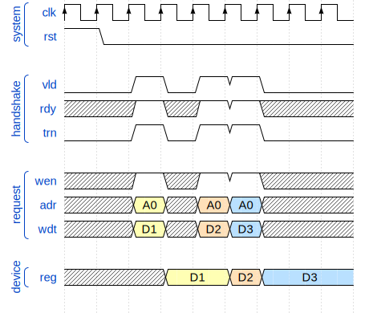
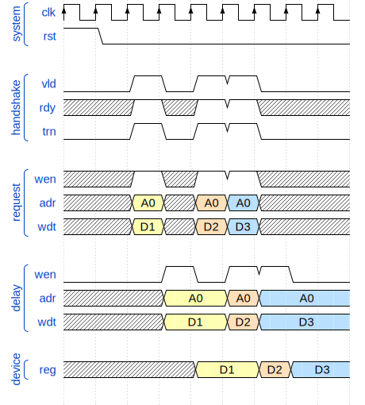
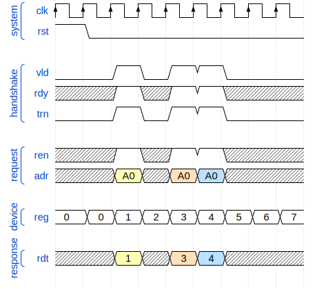
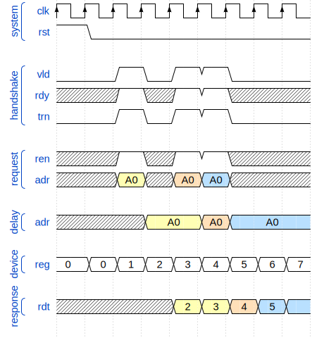
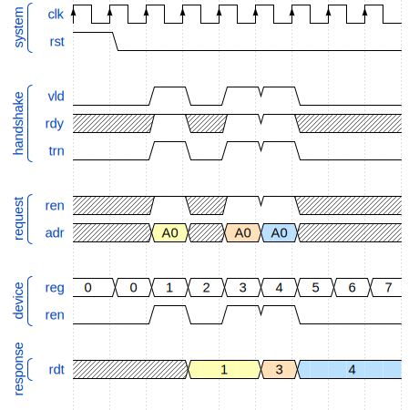
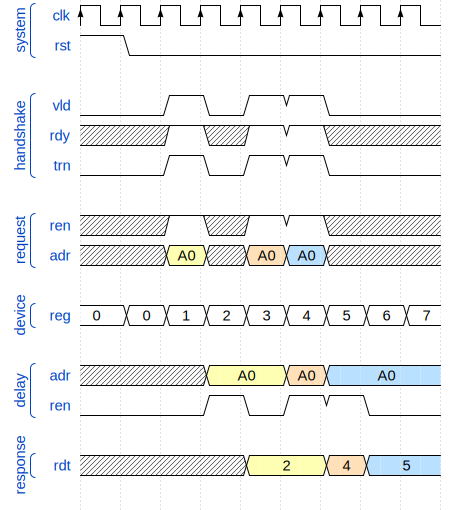

# Subordinate implementation considerations

The aim of this recommendations is to optimize
Power, Performance, and Area (PPA) for subordinate implementations.

1. Power:
   - minimize toggling, with some focus on high fanout signals,
   - take advantage of smaller transfer size options,
   - minimize power consumption effects crossing write and read logic boundary.
2. Performance (timing):
   - minimize setup time for request signals,
   - minimize clock to output time for response signals.
3. Area:
   - compromise between shared and split resources (address and control registers),
   - take advantage of partial decoding of the address space,
     additionally taking into account the transfer size.

## Response delay and memory ordering

There are a few different ways how to implement subordinates
with typical response delays (0, 1, 2) so that accesses
to memory-mapped I/O registers is properly ordered.

The ordering requirements for a simple register (non-volatile, no side effects) are:
1. every read reflects the value last written into the register,
2. for read modify write transactions, the read must reflect the value before the write.

### Write access

The following write access implementations will be analyzed:
1. write on transfer,
2. write after transfer (`1` clock cycle delay).

WHile an even larger delay between write transfer and register change
can have practical applications, this would be outside the scope of this document.

#### Write on transfer

Write data is written into the addressed register
at the rising clock edge during the handshake transfer cycle.

```SystemVerilog
assign rsp.rdt = reg[req_adr];
```




#### Write after transfer

The request is registered and thus delayed by one clock cycle compared to the handshake transfer.
Write data is written into the addressed register
at the rising clock edge one clock period after the handshake transfer cycle.

```SystemVerilog
always
assign rsp.rdt = reg[req_adr];
```




### Read access

The following read access implementations will be analyzed:
1. combinational read,
2. registered request read,
3. registered response read,
4. registered request and response read.

#### Combinational read

The read data multiplexer is driven directly (combinationally) from the request address.

```SystemVerilog
assign rsp.rdt = reg[req.adr];
```




#### Registered request read

```SystemVerilog
always @(posedge clk, posedge rst)
if (rst)                      dly_adr <= '0;
else if (vld & rdy & req.ren) dly_adr <= req_adr;

assign rsp.rdt = reg[dly_adr];
```




#### Registered response read

```SystemVerilog
always @(posedge clk, posedge rst)
if (rst)                      rsp.rdt <= '0;
else if (vld & rdy & req.ren) rsp.rdt <= reg[req.adr];
```




#### Registered request and response read

```SystemVerilog
always @(posedge clk, posedge rst)
if (rst) dly_ren <= '0;
else     dly_ren <= vld & rdy & req.ren;

always @(posedge clk, posedge rst)
if (rst)                      dly_adr <= '0;
else if (vld & rdy & req.ren) dly_adr <= req_adr;

always @(posedge clk, posedge rst)
if (rst)          rsp.rdt <= '0;
else if (dly_ren) rsp.rdt <= reg[dly_adr];
```




### Response delay 0 (`DLY=0`)

The smallest possible response delay is `0`.


A read response delay of `0` is only possible
if there is only combinational logic between the request and response.


### Response delay 1 (`DLY=1`)

Response delay of `1` is typical of SRAM memories.

### Response delay 2 (`DLY=2`)

An example of response delay of `2` would be a SRAM with an additional read data register.

## Memory-mapped I/O register types

The recommendations will be based on a generic example peripheral
containing some memory mapped registers common in many peripherals.

| reg. type     | writable | readable | sizable | volatile | quasi-static | toggling frequently |
|---------------|----------|----------|---------|----------|--------------|---------------------|
| configuration | yes      | usually  | no      | no       | yes          | no                  |
| control       | yes      | no       | no      | no       | no           | no                  |
| status        | no       | yes      | no      | yes      | no           | no                  |
| timer/counter | no       | yes      | no      | yes      | no           | yes                 |
| data output   | yes      | usually  | no      | no       | no           | possibly            |
| data input    | no       | yes      | no      | yes      | no           | possibly            |
| FIFO write    | yes      | no       | yes     | no       | no           | no                  |
| FIFO read     | no       | yes      | yes     | yes      | no           | no                  |

## Configuration

Configuration registers are quasi-static,
meaning they are rarely written to,
usually only while the peripheral FSM are in an idle state.

Reading a configuration is rarely useful,
since the SW driver is already aware of the contents.

A typical example would be UART baudrate.

## Control and status

Control registers are typically used to initiate
a transition of a FSM from the IDLE state.
Status registers are used to check (polling) whether a FSM
has finished processing and is back in the IDLE state.

Control registers are usually write-only and
Status registers are usually read-only,
but it is common for them to share the same address,
thus resulting in a combined control status register.

A typical example would be SPI/I2C/1-wire peripherals,
where the control signal starts the FSM initiating a data transaction.
and the status signal is used to check whether the transaction has completed.

Access frequency depends on how long it takes
for the transaction FSM to complete (depends on data rate and packet size).
Status register access frequency further depends on whether the peripheral
uses interrupts or it relies on polling.
Use of DMA to handle large packets can further reduce access frequency.

## Timer and counter

Timer and counter registers show the state of a timer or counter.
For the purpose of this example we assume the values change
approximately at the same rate as the system clock.

While some implementations would have read-only access,
others might use the same address to load the timer or counter value.

A typical example would be a high precision timer or a performance counter.

## Data input/output

Output registers are usually read/write,
but if software does not use read modify write to modify them,
they can be read only.

Input registers are read-only and volatile.

A typical example would be GPIO output, output enable and input registers.

## FIFO write/read

Similar to data input/output registers,
but they are generally accessed in packet bursts.

During an access burst they can have high activity,
but otherwise FIFO read registers only change
when data is loaded into an empty register.

## Generic example peripheral

## Trivial implementation

```SystemVerilog
module device (
    // TCB-lite subordinate interface
    tcb_lite_if.sub tcb_sub,
    // generic I/O signals
    output logic [32-1:0] dev_config,
    output logic [32-1:0] dev_control,
    input  logic [32-1:0] dev_status,
    output logic [32-1:0] dev_timer,
    output logic [32-1:0] dev_data_out,
    input  logic [32-1:0] dev_data_in
    output logic [32-1:0] dev_fifo_wr,
    input  logic [32-1:0] dev_fifo_rd
);
```

## Optimizations